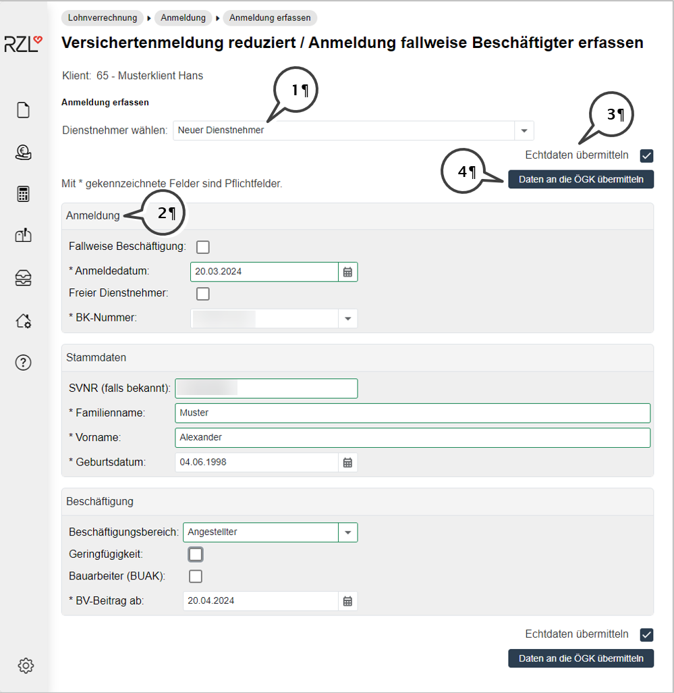
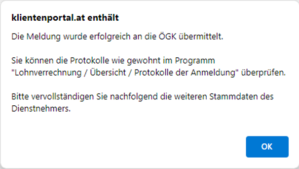
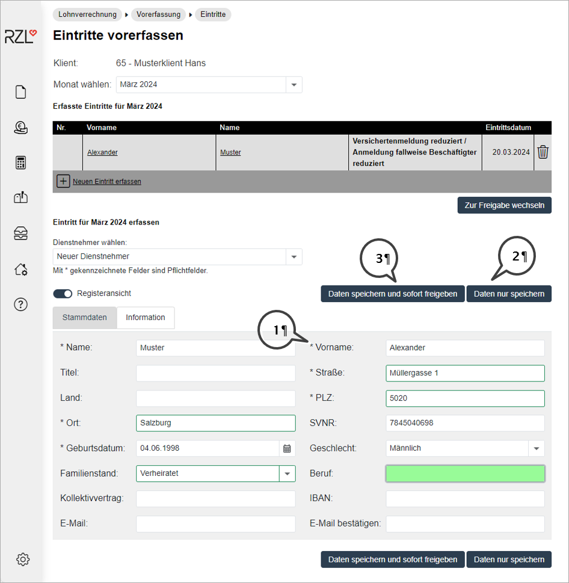
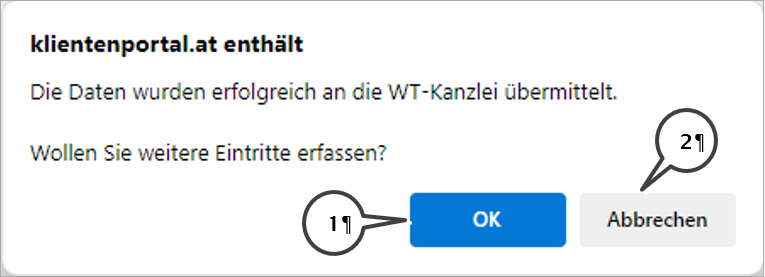
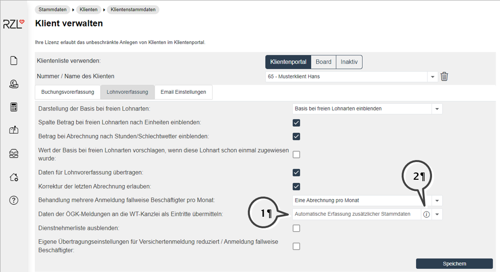
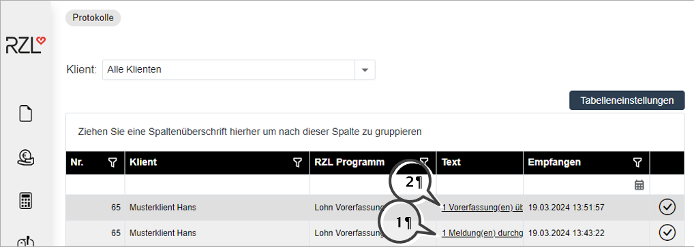
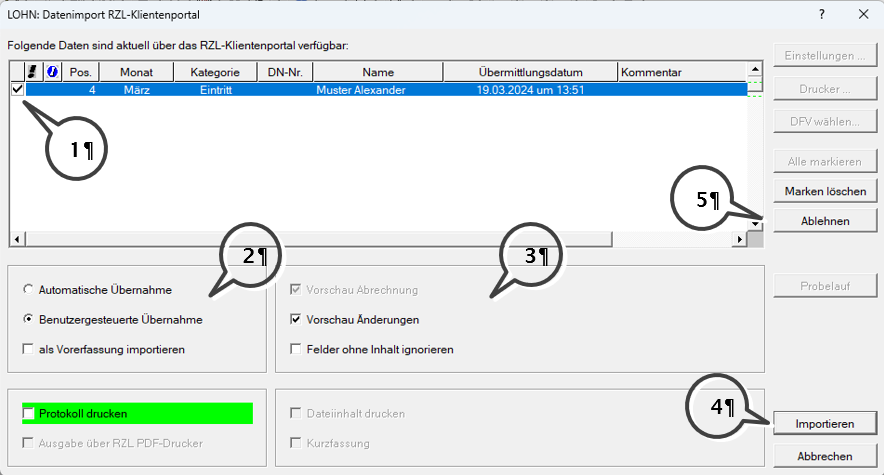
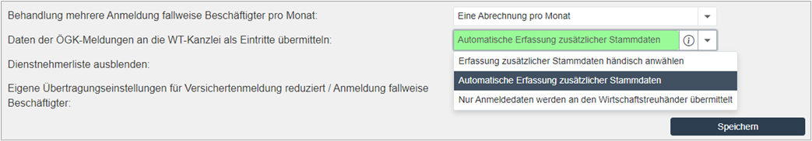
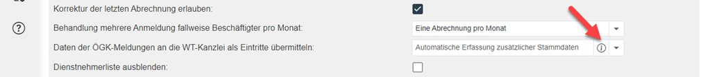
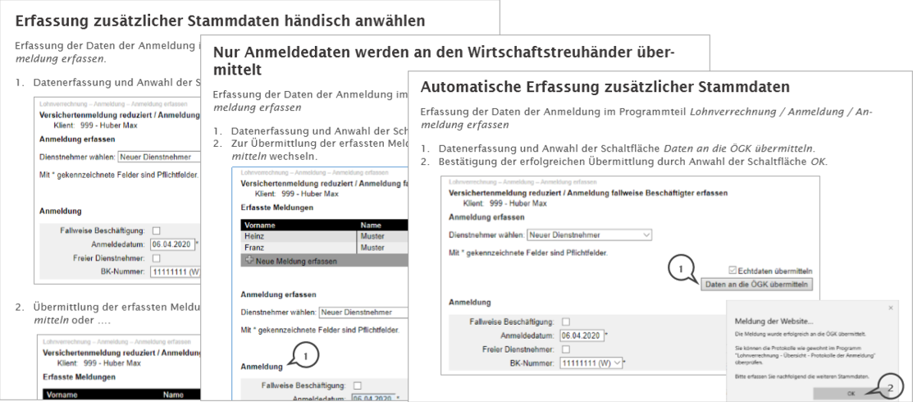

# Automatische Erfassung zusätzlicher Stammdaten nach Anmeldungen

Unterhalb werden die verschiedenen Möglichkeiten der Stammdatenvorerfassung nach einer Anmeldung durch einen Klientenbenutzer beschrieben.
Die Option „Automatische Erfassung zusätzlicher Stammdaten“ bietet die Möglichkeit

- die Erfassung der Daten der Versichertenmeldung, 
- das Versenden dieser Daten an die Österreichische Gesundheitskasse,
- die Erfassung zusätzlicher Daten für die Lohnverrechnung (IBAN, Beruf, Wochenstunden, usw.),
- und die Freigabe der erfassten Daten an die Wirtschaftstreuhandkanzlei
  
für einen Dienstnehmer Schritt für Schritt ohne Unterbrechung durchzuführen. 
In dieser Kurzanleitung können Sie zu Beginn den Ablauf für den Klientenbenutzer und nachfolgend die dazu notwendigen Einstellungen im Kanzleibereich des Portals nachlesen. Im Kapitel "Weitere Einstellungsmöglichkeiten" dieser Anleitung finden Sie eine kurze Beschreibung der weiteren Möglichkeiten.

## Anmeldung und Stammdatenvorerfassung – Klientenbereich des Portals

Sie erfassen die Daten der Anmeldung und die Vorerfassung der weiteren Stammdaten der Dienstnehmer in zwei aufeinanderfolgenden Schritten.
Nach dem Login in den Klientenbereich des RZL Klientenportals wählen Sie den Programmteil Lohnverrechnung / Anmeldung / Anmeldungen erfassen an. Sie können in diesem Programmteil die sogenannte Versichertenmeldung reduziert und die Anmeldung fallweise Beschäftigter erfassen. 

  
1.	Die Daten für die Versichertenmeldung können für neue Dienstnehmer erfasst oder für ausgetretene Dienstnehmer ausgewählt werden.
2.	Erfassen bzw. korrigieren Sie in den Bereichen Anmeldung, Stammdaten und Beschäftigung die Daten. Der Bereich Wohnort ist nur notwendig für die Anforderung einer Versicherungsnummer. Die Erfassung der Ver-sicherungsnummer im Bereich Stammdaten blendet daher den Bereich Wohnort automatisch aus. 
3.	In Ausnahmefällen können Sie das Häkchen im Feld Echtdaten übermitteln deaktivieren. Die versendeten Da-ten gelten dann lediglich als Testübermittlung.
4.	Wählen Sie die Schaltfläche Daten an die ÖGK übermitteln an, um die Daten an die Österreichische Gesundheitskasse zu übermitteln. Sollten die erfassten Daten fehlerhaft oder unvollständig sein, erhalten Sie eine Fehlermeldung und die Daten werden nicht übermittelt.
Nachfolgende Meldung wird nach Anwahl der Schaltfläche Daten an die ÖGK übermitteln angezeigt. Der zuständige Mitarbeiter in der WT-Kanzlei erhält eine E-Mail-Benachrichtigung, dass eine Meldung an die ÖGK erfolgt ist. Im Kanzleibereich des Portals steht ein Protokolleintrag für die durchgeführte Meldung zur Verfügung.

{width="400"}
 
Wählen Sie die Schaltfläche OK für die weitere Stammdatenerfassung des Dienstnehmers an. Nachfolgend sehen Sie die Felder, die Sie zusätzlich für die Lohnverrechnung beim Wirtschaftstreuhänder erfassen dürfen.

 
Die Anzahl der Felder und deren Eigenschaften werden von Ihrer Wirtschaftstreuhandkanzlei festgelegt.
 
1.	Findet sich am Anfang des Eingabefelds ein Sternchen, handelt es sich um ein „Pflichtfeld“. Sie müssen solche Pflichtfelder ausfüllen, um die nachfolgenden Schritte ausführen zu können.
2.	Stehen Ihnen noch nicht alle notwendigen Daten zur Verfügung, können Sie die erfassten Daten zunächst nur speichern und später im Programmteil Lohnvorerfassung / Eintritte ergänzen und freigeben.
3.	Die Anwahl der Schaltfläche Daten speichern und sofort freigeben beendet den Workflow mit folgenden Aktionen: 
    * Die Daten werden im Klientenportal gespeichert und für die Wirtschaftstreuhandkanzlei freige-geben (Datenimport in das Lohn-Programm ist möglich). 
    * Der zuständige Mitarbeiter in der WT-Kanzlei erhält eine E-Mail-Benachrichtigung für die Daten der Vorerfassung und sieht im Kanzleibereich des Portals den entsprechenden Protokolleintrag. 
    * Sie erhalten nachfolgende Frage.

{width="400"} 

4.	Die Schaltfläche OK öffnet automatisch den Programmteil Lohnverrechnung / Anmeldung / Anmeldung erfassen und Sie können einen weiteren Dienstnehmer anmelden und Eintrittsdaten vorerfassen.
5.	Die Schaltfläche Abbrechen ermöglicht Ihnen den Aufruf der Protokolle der Meldungen. Sie können diese Protokolle immer auch durch Anwahl des Programmteils Lohnverrechnung / Übersicht / Protokolle der Anmeldungen aufrufen und bei Bedarf ausdrucken.
 
## Grundeinstellungen – Kanzleibereich des Portals

Damit Ihr Klientenbenutzer die oben beschriebene Erfassungsmöglichkeit verwenden kann, wählen Sie im Programmteil Stammdaten / Klienten / Klientenstammdaten die Option Automatische Erfassung zusätzlicher Stammdaten aus.

 
1.	Wählen Sie die Option Automatische Erfassung zusätzlicher Stammdaten an. Diese Option wird bei der Neuanlage eines Klienten im Portal automatisch vorgeschlagen.
2.	Das Symbol neben der Option ermöglicht den Aufruf einer kurzen Prozessbeschreibung der angewählten Option. Neben der hier beschriebenen Erfassungsmöglichkeit gibt es zwei weitere Einstellungsmöglichkeiten (vgl. Kapitel "Weitere Erfassungsmöglichkeiten").

## Workflows und Informationen in der Wirtschaftstreuhand-Kanzlei

### Kanzleibereich des Portals

Im Kanzleibereich des Portals werden für die Meldung an die ÖGK (1) und die Freigabe der Vorerfassung (2) zwei Protokolleinträge für die jeweils berechtigten Mitarbeiter angezeigt.

 
Wählen Sie den Text der Meldung mit Mausklick in der Spalte Text an, um die Detaildaten direkt aufzurufen.
Eine Liste mit den freigegebenen Vorerfassungen finden Sie im Programmteil Lohnverrechnung / Vom Klienten freigegebene Daten. Der Programmteil Lohnverrechnung / Übermittelte Anmeldungen zeigt Ihnen die Liste mit den an die ÖGK übermittelten Meldungen. Nicht zuletzt sehen Sie im Programmteil Lohnverrechnung / Protokolle der Anmeldungen die Liste der ÖGK-Übermittlungsprotokolle.
In jeder der angeführten Listen rufen Sie die Detaildaten der Zeile durch Mausklick auf die Zeile auf.

### Import der Stammdaten in das Lohnverrechnungsprogramm

Der zuständige Mitarbeiter in der Wirtschaftstreuhand-Kanzlei erhält eine E-Mail-Benachrichtigung nach Freigabe der Daten und kann den Import in das Lohnverrechnungsprogramm durchführen. Der nachfolgende Bildschirm wird beim Öffnen des Lohnklienten automatisch aufgerufen. Innerhalb eines bereits geöffneten Lohnklienten können Sie für den Datenimport den Programmteil Bearbeiten / Klientenportal / Daten verarbeiten anwählen.

 
1.	Im oberen Bereich des Datenimports sehen Sie die Dienstnehmer, deren Daten Sie übernehmen können. Sie können nur Dienstnehmer importieren, die Sie mit einem Häkchen in der ersten Spalte der Tabelle gekenn-zeichnet haben.
2.	Wählen Sie die Option Automatische Übernahme an, wenn Sie die Daten ohne Bearbeitungsmöglichkeit über-nehmen möchten. Die Option Benutzergesteuerte Übernahme ermöglicht Ihnen die Bearbeitung der Daten im Rahmen des Imports. Beide Übernahmemöglichkeiten können als Vorerfassung importiert werden. Der Import als Vorerfassung ist nur möglich, wenn Sie in der Lohnverrechnung für das (Import)-Monat noch keine Abrechnung gespeichert haben.
3.	Wenn Sie die Option Automatische Übernahme verwenden, können Sie durch Anwahl des Felds Vorschau Abrechnung die Abrechnungen der Dienstnehmer am Bildschirm (ohne Änderungsmöglichkeit) prüfen. Wir empfehlen, das Feld Vorschau Änderungen zu aktivieren. Sie werden pro Dienstnehmer über die Änderungen/Erfassungen durch den Klientenportal-Benutzer informiert.
4.	Durch Anwahl der Schaltfläche Importieren werden die Daten der Dienstnehmer mit einem Häkchen in der ersten Spalte in das Lohnverrechnungsprogramm importiert.
5.	Wenn Sie die Daten durch Anwahl der Schaltfläche Ablehnen nicht übernehmen, müssen Sie nachfolgend zwingend den Grund für die Ablehnung eintragen.

## Weitere Einstellungsmöglichkeiten

 
Nur Anmeldedaten werden an den Wirtschaftstreuhänder übermittelt
Diese Option ermöglicht nur die Erfassung der Daten der Anmeldung durch den Klientenbenutzer. Diese Daten werden automatisch für den Wirtschaftstreuhänder freigegeben. Der Klientenbenutzer kann keine zusätzlichen Daten erfassen. Natürlich wird die Meldung an die ÖGK übermittelt.
Erfassung zusätzlicher Stammdaten händisch anwählen
Zunächst werden auch nur die Daten der Anmeldung erfasst und die Anmeldung übermittelt. Nachfolgend kann der Klientenbenutzer im Programmteil Lohnverrechnung / Vorerfassung / Eintritte weitere Stammdaten erfassen und an den Wirtschaftstreuhänder freigeben. Die Freigabe der Daten an den Wirtschaftstreuhänder erfolgt nicht automatisch.
 
## Exkurs: Prozessüberblick innerhalb der Klientenstammdaten

Im Kanzleibereich des Portals innerhalb der Klientenstammdaten finden Sie neben dem Auswahlfeld ein kleines Symbol.

 
Sie erhalten durch Anwahl des kleinen Symbols eine kurze Prozessbeschreibung der jeweils ausgewählten Option.

Wir empfehlen die Verwendung der Automatischen Erfassung zusätzlicher Stammdaten. Die Klientenbenutzer können die Erfassung der Anmeldedaten, das Senden der Meldung, die Erfassung weiterer Stammdaten und die Freigabe an den Wirtschaftstreuhänder ohne Unterbrechung mit einem vorgegebenen Workflow durchführen.
