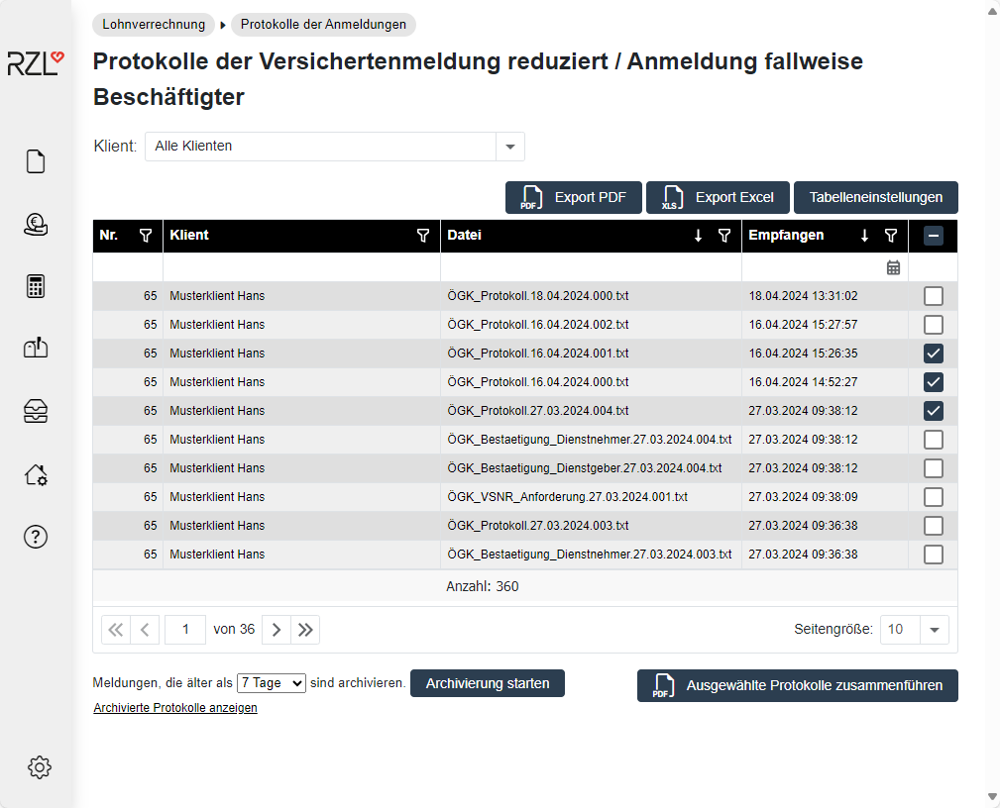

# ÖGK-Anmeldung

## ÖGK-Anmeldungen / Stornomeldungen

Nachdem der Klient die ÖGK-Meldungen übermittelt hat, können Sie als Kanzleisachbearbeiter diese Meldungen über den Menüpunkt *Lohnverrechnung / Übermittelte Anmeldungen* prüfen.

Wählen Sie dazu den gewünschten Klienten, Zeitraum und Typ in den Drop-Down Menüs aus. Durch Anwahl in der folgenden Auflistung werden die Details aufgerufen.

### ÖGK-Protokolle aufrufen und ausgeben

Der Programmteil *Lohnverrechnung / Protokolle der Anmeldungen* bietet Ihnen die Möglichkeit die ÖGK-Protokolle der Meldungen aufzurufen und auszudrucken.

In der Spalte Datei können Sie durch Anwahl des Dateinamens die ÖGK-Protokolle aufrufen und mit der Schaltfläche *Druckvorschau* ausdrucken.

### ÖGK-Protokolle archivieren

Die Eintragungen in dieser Liste können archiviert werden. Sie können die Archivierung für Meldungen die älter als sieben bzw. 30 Tage sind durchführen, in dem Sie die Schaltfläche *Archivierung starten* anwählen. Die archivierten Protokolle lassen sich jederzeit durch Anwahl des Eintrags *Archivierte Protokolle* anzeigen aufrufen.

### Ausgewählte Protokolle zusammenführen

Nach Anwahl der Schaltfläche *Ausgewählte Protokolle zusammenführen* werden die Protokolle - die mit einem Hackerl gekennzeichnet sind - in eine PDF-Datei ausgegeben.