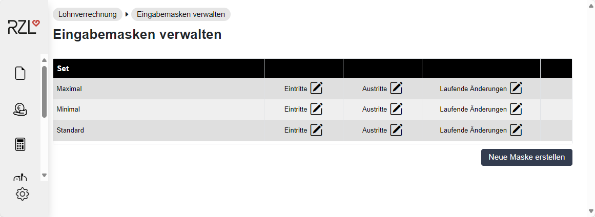
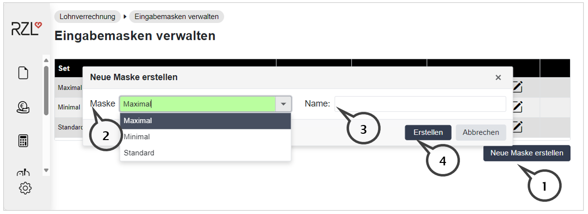
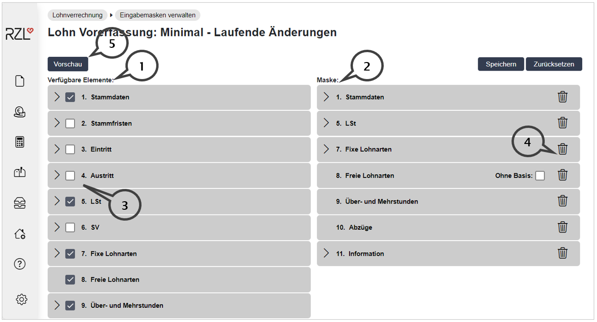
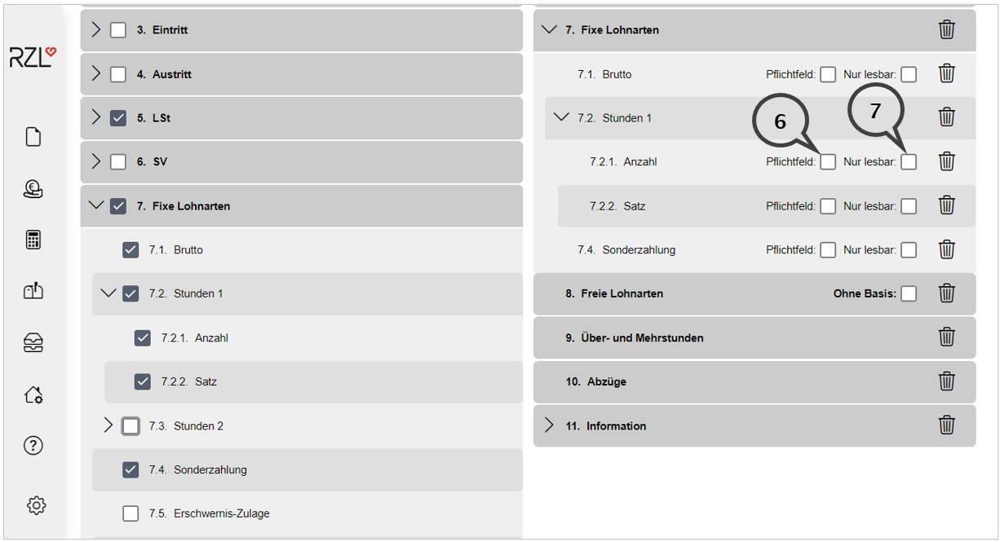
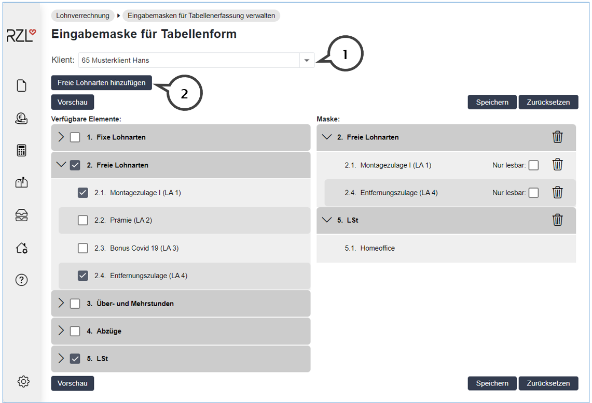
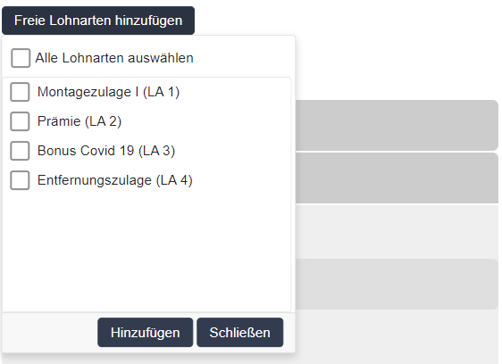

# Eingabemasken für Klienten konfigurieren

Im Klientenbereich des Portals können die Benutzer Daten für die Lohnverrechnung vorerfassen und der Lohnverrechnung zur Verfügung stellen. Die Felder (Lohnarten, Überstunden, Homeoffice-Tage, usw.) werden im Kanzleibereich festgelegt.

## Eingabemasken (Vorerfassungen gesamt)

Die in diesem Kapitel beschriebenen Eingabemasken werden für die Vorerfassungen *laufende Änderungen*, *Eintritte* und *Austritte* verwendet. Die Eingabemasken können bei mehreren Benutzern gleichzeitig verwendet werden. Sie können die passende Eingabemaske in den Stammdaten des Klienten (*Stammdaten / Klienten*) pro Benutzer zuordnen.

!!! warning "Hinweis"
    Beachten Sie, dass die Eingabemasken nur von Kanzleibenutzern mit der Berechtigung *Lohnvorerfassung* erstellt und verändert werden können.Diese Änderungen gelten für den gesamten Kanzleibereich.

Wählen Sie das Menü *Lohnverrechnung / Eingabemasken verwalten* aus.

Sie können hier für *Eintritte*, *Austritte* und *Laufende Änderungen* Eingabemasken bearbeiten bzw. neue Eingabemasken erstellen. Drei Vorschläge „Maximal", „Minimal" und „Standard" stehen im RZL Klientenportal bereits zur Verfügung. Diese Vorschläge können jederzeit abgeändert und angepasst werden.

### Bestehende Eingabemaske ändern 

Wählen Sie dazu im jeweiligen Set die gewünschte Maske durch Anwahl der Maskenbezeichnung aus. Sie gelangen anschließend in den Bearbeitungsdialog.

### Neue Eingabemaske anlegen 

Wenn Sie die Schaltfläche *Neue Maske erstellen* (**1**) anwählen, wird nachfolgender Dialog geöffnet.

Im Feld Maske (**2**) wählen Sie den gewünschten Eintrag aus. Vergeben Sie einen Namen (**3**) für die neue Eingabemaske und klicken Sie auf die Schaltfläche *Erstellen* (**4**).

Sie können jetzt die neue Eingabemaske bearbeiten und innerhalb der Klientenbenutzer zuordnen.

### Bearbeiten der Eingabemasken 

Im Änderungsmodus sind die Eingabefelder zunächst zu Gruppen zusammengefasst.

Im rechten Bereich werden die verfügbaren Elemente (**1**) als Überschriften angezeigt. Diese Bereiche entsprechen den Abrechnungsbildschirmen im Lohnverrechnungsprogramm. 
Im linken Bereich sehen Sie die Elemente (**2**), die der Klientenbenutzer in der Eingabemaske verwenden kann. 
Die Elemente im linken Bereich können durch Drag & Drop nach oben oder unten verschoben werden. 
In dem Sie ein Hackerl (**3**) vor die Überschrift setzen, können Sie eine Gruppe aktivieren. Sie können eine Gruppe auch durch Drag & Drop nach rechts verschieben.
Die Gruppen können durch Entfernen des Hackerls bei der Überschrift (**3**), durch Anwahl des Papierkorb-Symbols (**4**) und durch Drag & Drop wieder deaktiviert und nach rechts verschoben werden.
Sie erhalten einen genauen Überblick über die verwendeten Felder durch Anwahl der Schaltfläche *Vorschau* (**5**) rechts oben.

Innerhalb der Gruppen können die Felder wie die Überschriften aktiviert und deaktiviert werden. 
Im linken Bereich können die Felder mit Drag & Drop nach oben oder unten verschoben werden.
Einzelne Datenfelder können als *Pflichtfelder* (**6**) oder als *Nur lesbar* (**7**) definiert werden. Ein Pflichtfeld muss zwingend ausgefüllt werden. Nur lesbar bedeutet, dass das Feld angezeigt aber nicht bearbeitet werden kann.

### Zuteilung der Eingabemasken zu den Klientenbenutzern 

Die gewünschten Eingabemasken werden in den Klientenstammdaten in den Berechtigungen der Benutzer mit der Option *Lohn Vorerfassung* zugeteilt (Kapitel 2.2.4, Seite [16](#benutzerdaten-und-berechtigungen)).

## Eingabemasken für die Tabellenerfassung (laufende Änderungen)

Im Klientenbereich besteht die Möglichkeit laufende Änderungen nur für bestimmte Lohnarten (Fixe Lohnarten, freie Lohnarten, Über- und Mehrstunden, Abzüge, Lohnsteuertage) in Tabellenform zu erfassen.

Innerhalb dieser Form der Vorerfassung werden die freien Lohnarten direkt in der Eingabemaske zugeordnet. Die Eingabemaske für die Tabellenerfassung wird für jeden Klienten einzeln angelegt.

Die Erstellung und Bearbeitung von Eingabemasken für die Tabellenerfassung ist nur mit der Berechtigung *Lohnvorerfassung in Tabellenform* möglich.

Wählen Sie das Menü *Lohnverrechnung / Eingabemasken für Tabellenerfassung verwalten* aus.

Die allgemeine Bedienung dieser Eingabemaske entspricht der Beschreibung im vorhergehenden Kapitel mit zwei Ausnahmen:

(**1**) Eingabemasken für die Tabellenerfassung werden für jeden Klienten (**1**) einzeln angelegt. Ist der Klient nicht in der Liste enthalten -- aber im Klientenportal angelegt, fehlt Ihnen als Kanzleibenutzer vermutlich die Berechtigung *Lohnvorerfassung in Tabellenform* (vgl. Kap 1 Einstellungen in den Stammdaten eines Kanzleimitarbeiters). „Normale" Eingabemasken können bei verschiedenen Klienten verwendet werden.

(**2**) Die freien Lohnarten können nach Anwahl der Schaltfläche *Freie Lohnarten hinzufügen* (**2**) durch ein Hackerl ins Kästchen und *Hinzufügen* in die Eingabemaske übernommen werden.

 {width="300"}