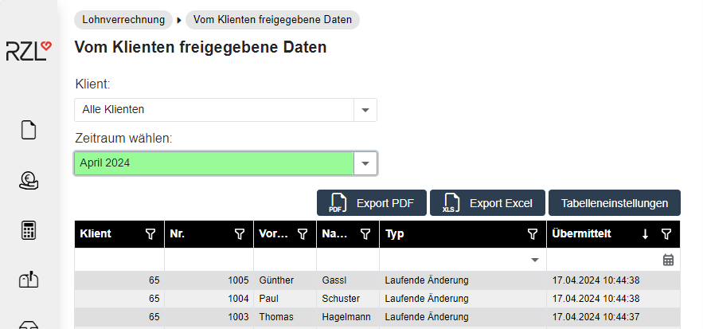

# Vom Klienten freigegebene Daten der Vorerfassung

Im Klientenbereich werden vom Klientenbenutzer Daten für die Lohnverrechnung vorerfasst. Je nach Einstellung in den Klientenstammdaten des Klientenportals können
Mindestangaben-Anmeldungen/Versichertenmeldungen reduziert als Eintritte an den Wirtschaftstreuhänder übermittelt werden. Ebenfalls ist die Erfassung von Austritten, laufenden Änderungen, Urlauben, Krankenständen und Zeitausgleich durch den Klienten im Portal möglich.

## Import in die RZL Lohnverrechnung

Der in den Stammdaten hinterlegte Klientensachbearbeiter erhält nach der Freigabe durch den Klienten zunächst eine E-Mail-Benachrichtigung. Voraussetzung für die E-Mail-Benachrichtigung ist die Aktivierung im Programmteil *Stammdaten/Portal/E-Mail Einstellungen* Wird der Klient anschließend in der RZL Lohnverrechnung geöffnet, können die
Vorerfassungen automatisch übernommen werden. Eine detaillierte Beschreibung dazu finden Sie im Handbuch RZL Lohn-/Gehaltsverrechnung.

## Abruf am RZL Klientenportal

Beim nächsten Login in das Klientenportal werden die Erfassungen auch im Startbildschirm (Protokoll) des Kanzleisachbearbeiters angedruckt. Die Vorerfassungen können auch jederzeit im Programmteil *Lohnverrechnung / Vom Klienten freigegebene Daten* abgerufen werden.

Wählen Sie im Drop-Down Menü den gewünschten Klienten aus. Im Bereich *Zeitraum wählen* können Sie einzelne Monate auswählen oder nach dem Typ der Meldung (Eintritt, Laufende Änderung, usw.) filtern. Wenn Sie den Eintrag *Alle Erfassungen* anwählen, erhalten Sie eine vollständige Liste der freigegebenen Daten. Durch Klick auf eine Vorerfassung werden
die Details angezeigt.
