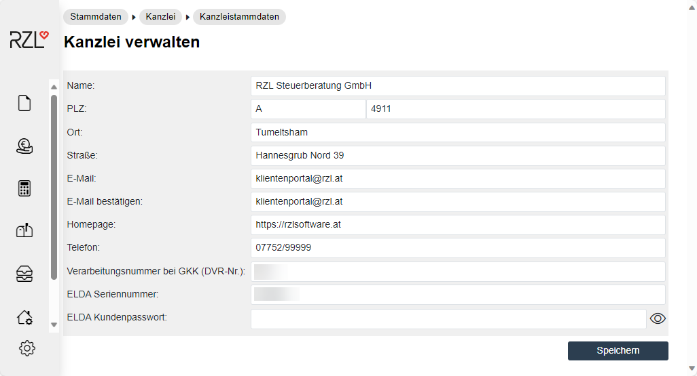

# Stammdaten der Kanzlei

Im Menü *Stammdaten / Kanzlei / Kanzleistammdaten* können Sie die Stammdaten der Kanzlei hinterlegen.

Diese Eingaben werden als Absenderstammdaten für die GKK-Übermittlungen verwendet, wenn die Klienten für die Übermittlung nicht die eigene Verarbeitungsnummer bei der GKK und den eigenen Lizenzschlüssel verwenden. Die Felder in diesem Programmteil müssen zur korrekten Nutzung vollständig ausgefüllt werden.
