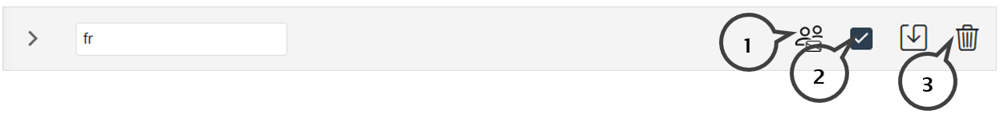

# Stammdaten der Kanzleibenutzer

Im Programmteil *Stammdaten / Kanzlei / Benutzer* werden Kanzleibenutzer angelegt und verwaltet.

### Benutzerdaten 

Für die Anlage eines Kanzleibenutzers im RZL Klientenportal sind zwingend Benutzername und Passwort zu vergeben. Optional können Sie den Nachnamen und den Vornamen des Benutzers eintragen.

Im Feld *E-Mail* sollte die E-Mail Adresse des Kanzleimitarbeiters eingetragen werden. Eine Benachrichtigung an diese E-Mail Adresse erfolgt beim Absenden von Daten bzw. Bereitstellen von Dokumenten aus dem\ Klientenbereich des Portals. Der Kanzleimitarbeiter erhält nur E-Mails bezüglich Klienten - die mit den entsprechenden Berechtigungen -
zugeordnet sind.

### Stammdaten 

Für die Anlage eines Kanzleibenutzers im RZL Klientenportal sind zwingend Benutzername und Passwort zu vergeben.

*WT-Mitarbeiter verwalten*

Wird bei einem Kanzleimitarbeiter die Option *Keine* gesetzt, ist für diesen Benutzer der Programmteil *Stammdaten / Kanzlei / Benutzer* ausgeblendet. Mit der Option *Nur sich selbst* kann der Mitarbeiter die eigenen Einstellungen und Zuweisungen bearbeiten. Die Option *Alle* ermöglich die Anlage und Bearbeitung von Kanzleibenutzern ohne Einschränkungen.

*Klienten verwalten*

Dieses Feld ermöglicht dem Kanzleimitarbeiter die Stammdaten der Klienten und Dienstnehmer zu bearbeiten (Neuanlage und Bearbeiten).

*Portaldaten verwalten*

Die Berechtigung *Portaldaten verwalten* umfasst die Programmteile *Stammdaten / Portal / E-Mail Texte, E-Mail Einstellungen, Passwort Einstellungen, Farben, Logo, Sonstige Einstellungen* und *Stammdaten /Kanzlei / Kanzleistammdaten*.

*Informationen an alle Klienten übermitteln*

Diese Option ermöglicht es dem Kanzleimitarbeiter, Dokumente und/oder Nachrichten an alle im Klientenportal angelegten Klienten zu übermitteln - unabhängig von den sonstigen Berechtigungen des Kanzleimitarbeiters.

*Berechtigung und E-Mail-Benachrichtigung entkoppeln*

Wenn Sie diese Option aktivieren, können Sie pro Berechtigung und Klient entscheiden, ob Sie eine E-Mail-Benachrichtigung wünschen oder nicht.

### Dokumentbereiche 

Die Dokumentbereiche werden für die Bereitstellung von Dokumenten benötigt. Der Kanzleimitarbeiter erhält eine E-Mail-Benachrichtigung,wenn die -- beim Versenden - vom Klienten ausgewählte Berechtigung, beim Kanzleimitarbeiter aktiviert ist.

### Lohnverrechnung 

*Lohn Vorerfassung* 

Wurden im Klientenbereich Erfassungen für die Lohnverrechnung oder GKK Meldungen gemacht, erhält der Kanzleimitarbeiter eine E-Mail-Benachrichtigung und kann die Daten in das
Lohnverrechnungsprogramm übernehmen.

*Lohn Vorerfassung Verwaltung*

Die Option *Lohn Vorerfassung Verwaltung* ermöglicht die Neuanlage und Bearbeitung von Eingabemasken

### Finanzbuchhaltung/EA-Rechnung 

*Fibu/EA-Rechnung Auswertungen*

Sie können Ihren Klienten aus der RZL FIBU bzw. EA-Rechnung Auswertungen zur Verfügung stellen. Durch diese Einstellung erhält der Kanzleibenutzer die Berechtigung, die Auswertungen für die zugeordneten Klienten hochzuladen.

*Fibu/EA-Rechnung Vorerfassung*

Werden im Klientenbereich FIBU bzw. EA-Vorerfassungen freigegeben, dann erhält der Kanzleimitarbeiter eine E-Mail, wenn dieses Feld aktiviert und der Klient zugeordnet ist. Weiters kann ein Kanzleimitarbeiter mit dieser Berechtigung Kassa- und Bankbücher, Buchungsregeln, Vorlagen für Buchungsregeln anlegen und die Vorerfassungen aufrufen.

*Fibu/EA-Rechnung Verwaltung*

Diese Option ermöglicht das Bearbeiten der Stammdaten der Kassa/Bankbücher, der Kostenrechnung, der Registrierkassen, der Buchungsregeln und der Vorlagen Buchungsregeln (kanzleiweit).

### Belegbox 

*Hochgeladene Belege abholen / Verbuchte Belege hochladen*

Im Klientenbereich des Portals können die Benutzer Belege einscannen und/oder hochladen. Diese Belege können im RZL-Board abgeholt werden. Wenn bei einem Kanzleimitarbeiter dieses Feld nicht aktiviert ist, kann dieser Mitarbeiter keine Belege vom Klientenportal herunterladen. Zusätzlich kann der Kanzleibenutzer durch diese Einstellung auf die verbuchten (automatisch synchronisierten) Belege zugreifen.

### Klientensicherungen austauschen

Die Berechtigung ermöglicht die Datenaustausch der FIBU bzw. EA-Daten über das RZL-Klientenportal.

## Mehrfachzuweisung

In der Übersicht können im linken Feld die gewünschten Klienten und im Feld *Berechtigungen wählen* die benötigte Dokumentbereiche und Berechtigungen zugeordnet werden. Mit den Schaltflächen *Hinzufügen* und *Entfernen* werden die ausgewählten Klienten und Berechtigungen in den darunter angeführten Dokumentbereichen und Berechtigungen angefügt bzw.
gelöscht.

## Vertretungen verwalten/Inaktiv-Setzen und Löschen von Kanzleibenutzern

Die Anwahl des ersten Symbols (**1**) ermöglicht die Eingabe der E-Mail-Adresse und des Zeitraums für Vertretungen. Innerhalb des eingetragenen Zeitraums werden die E-Mails an den Benutzer **UND** die hier eingetragene E-Mail versendet.

Der Kanzleibenutzer kann durch Anwahl des zweiten Symbols (**2**) inaktiv gesetzt werden. Der Benutzer bleibt mit seinen Stammdaten erhalten, kann aber nicht mehr ins Klientenportal einsteigen. Der Zugang im PlugIn der RZL Programme ist ebenfalls inaktiv und kann nicht verwendet werden.

Kanzleibenutzer werden durch Anwahl des dritten Symbols (**3**) gelöscht.
