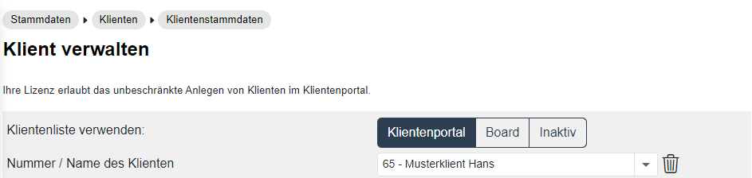
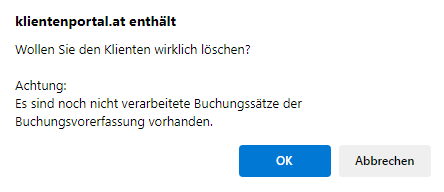
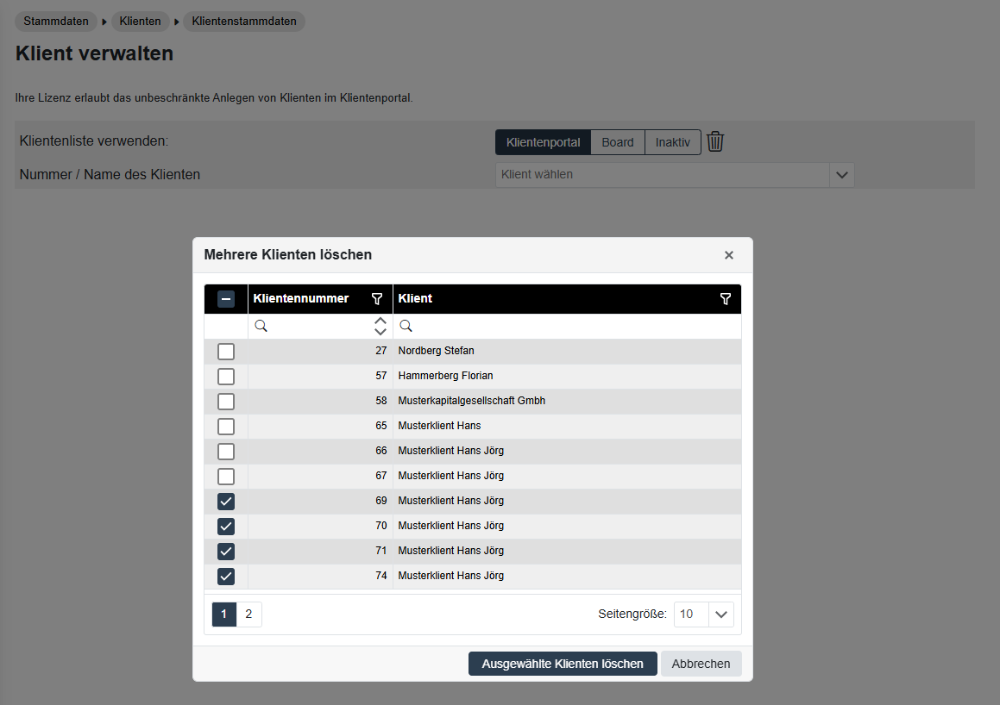
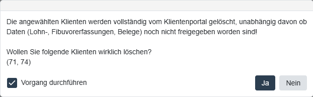

# Klienten aus dem RZL Klientenportal löschen

## Löschen von einzelnen Klienten als Kanzlei-Mitarbeiter

Wenn Sie Klienten aus dem RZL Klientenportal löschen wollen, tragen Sie zunächst die Klientennummer ein und wählen anschließend das Papierkorb-Symbol neben dem Feld *Klientennummer* an.

Nach Anwahl des Papierkorb-Symbols erhalten Sie noch folgende Abfrage vom Programm:

{width="400"}

Wenn Sie die Schaltfläche OK anwählen, wird der Klient im RZL Klientenportal gelöscht. Im Board, KIS und im Rest der RZL-Programme bleiben die Daten natürlich erhalten.

## Mehrere Klienten gleichzeitig löschen als Klientenportal-Administrator

Ein Admin kann für die Listen *Klientenportal* oder *Inaktiv* durch Anwahl des Papierkorbsymbols mehrere Klienten gleichzeitig löschen. 

Bei dieser Vorgehensweise erfolgt keine Prüfung, ob Daten noch nicht übernommen wurden. Die Klienten werden ohne Prüfung endgültig gelöscht.

