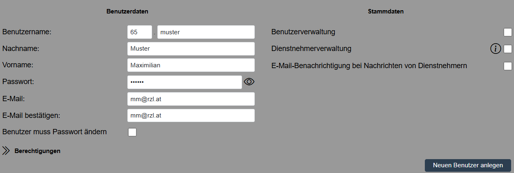
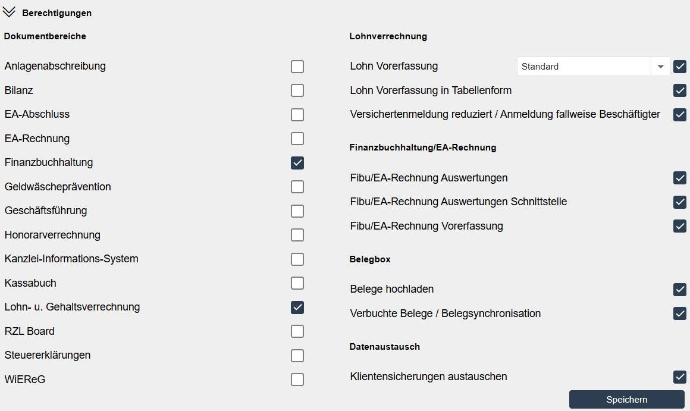
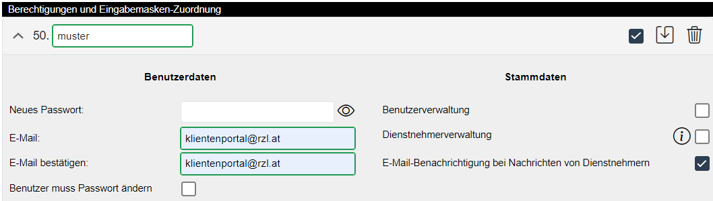
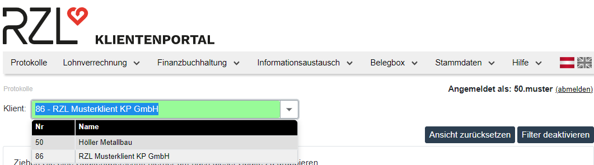
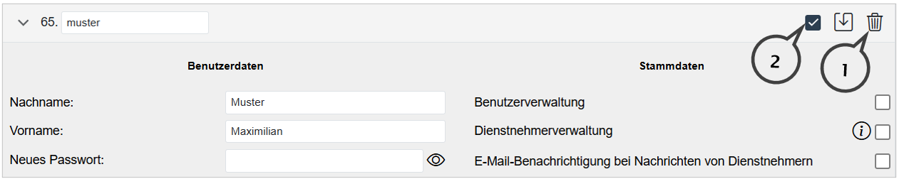

# Klientenbenutzerdaten und Berechtigungen 

In diesem Bereich vergeben Sie die Berechtigungen für einen oder mehrere Benutzer des ausgewählten Klienten. 

Zuerst bezeichnen Sie den Klientenbenutzer im Feld Benutzername. 
Nachfolgend können optional der Name und der Vorname des Benutzers eingetragen werden. 

Anschließend vergeben Sie das Passwort für den Einstieg des Benutzers ins RZL Klientenportal. Ist das
Feld *Benutzer muss Passwort ändern* aktiviert, muss der Benutzer beim erstmaligen Einstieg in das RZL Klientenportal das Passwort zwingend abändern. Wird das Feld nicht aktiviert, bleibt das hier eingetragene Passwort bestehen.

Die E-Mail- Adresse kann benutzerbezogen eingetragen werden. Auf diese E-Mail- Adresse werden Nachrichten gesendet, wenn im Kanzleibereich Dokumente für den Klienten hochgeladen werden. Der Benutzer erhält nur dann ein E-Mail, wenn die Berechtigung *E-Mail Benachrichtigung aktivieren* in den Stammdaten unter *Stammdaten / Portal / E-Mail
Einstellungen* aktiviert ist (Kapitel 2.4.2, Seite [23](#e-mail-einstellungen)).

Wenn Sie bei einem Klientenbenutzer das Feld *Inaktiv* aktivieren, kann der Benutzer nicht mehr in das RZL Klientenportal einsteigen und ist somit gesperrt.

## Stammdaten
### Benutzerverwaltung

Wird bei der Anlage des Benutzers dieses Feld aktiviert, kann dieser Benutzer im Klientenbereich selbst Benutzer anlegen, Benutzer löschen, Passwörter ändern und Berechtigungen vergeben.

### Dienstnehmerverwaltung

Sie können die Klientenportal Dienstnehmer-Stammdaten im Kanzleibereich des Portals im Programmteil *Stammdaten / Klienten / Dienstnehmer* bearbeiten bzw. löschen (Kapitel 6.2, Seite [66](#stammdaten-dienstnehmer-im-rzl-klientenportal)). Wenn Sie das Feld *Dienstnehmerverwaltung* aktivieren, kann der Klientenbenutzer die Klientenportal Dienstnehmer-Stammdaten ebenfalls bearbeiten.

Wenn Sie die Info-Schaltfläche rechts neben der ausgewählten Option drücken, erhalten Sie eine detaillierte Beschreibung der Möglichkeiten innerhalb der Dienstnehmerverwaltung.

## Berechtigungen 

Im unteren Bereich legen Sie die Berechtigungen des jeweiligen Benutzers fest.

### Dokumente 

Die Felder im Bereich *Dokumentbereiche* werden verwendet, damit der Klientenbenutzer Dokumente für unterschiedliche Bereiche hochladen kann. Der Klientenbenutzer im Klientenbereich kann auch nur Dokumente einsehen, die mit einer Berechtigung versendet worden sind, über die er verfügt.

Wenn zB. ein Kanzleimitarbeiter ein Dokument mit der Berechtigung *Bilanz* bereitgestellt hat und beim Benutzer im Klientenbereich diese Berechtigung nicht aktiviert ist, kann der Benutzer im Klientenbereich das Dokument nicht sehen. Aus dem Kanzleibereich können keine Dokumente an Klienten übermittelt werden, die beim Klienten kein Benutzer einsehen
kann.

### Lohnverrechnung 

*Lohn Vorerfassung*

Die Berechtigung Lohn Vorerfassung ermöglicht Dienstnehmerdaten zu erfassen und in den Kanzleibereich zu laden (Kapitel 4, Seite [45](#lohnverrechnung-2)).

Sie können hier für die Lohn Vorerfassung festlegen, welche Eingabemaske für den Benutzer zur Verfügung gestellt wird. Sie können diese Eingabemasken bearbeiten bzw. auch neue Masken definieren (Kapitel 4.2, Seite [45](#eingabemasken-für-klienten-konfigurieren)).

*Lohn Vorerfassung in Tabellenform*

Die Berechtigung *Lohn Vorerfassung in Tabellenform* ermöglicht die Erfassung von bestimmten Lohnarten (Fixe und freie Lohnarten, Über- und Mehrstunden, Abzüge, Lohnsteuertage) in Tabellenform. Die Dienstnehmer werden in den Zeilen dargestellt. Für diese Form der Erfassung müssen eigene Eingabemasken je Klient eingerichtet werden (Kap. 4.2.2, Seite
[47](#eingabemasken-für-die-tabellenerfassung-laufende-änderungen)).

*Mindestangaben Anmeldung / Versichertenmeldung reduziert*

Durch Anwahl der Option hat der Benutzer des Klientenbereichs die Möglichkeit, die ÖGK-Meldungen über ELDA zu übermitteln.

### Finanzbuchhaltung/EA-Rechnung 

*Fibu/EA-Rechnung Auswertungen*

Aus der RZL FIBU bzw. EA-Rechnung können Auswertungen (Saldenliste, Konten, Journal) zur Verfügung gestellt werden. Durch Aktivierung dieser Berechtigung kann der Benutzer auf diese Auswertungen zugreifen.

*Fibu /EA-Rechnung Auswertungen Schnittstelle*

Mit dieser Berechtigung kann der Benutzer die Salden der Konten und das Journal pro Wirtschaftsjahr in einem Fremdprogramm über die API-Schnittstelle abfragen. Die Swagger-Dokumentation finden Sie, wenn sie im unten angeführten Link die Anwendernummer der Steuerberatungskanzlei bei RZL Software eintragen. Die Dokumentation
enthält alle verfügbaren Methoden, die in der Schnittstelle aufgerufen werden können.

[https://klientenportal.at/\<AnwenderNr\>/api/swagger/fibuausw](https://klientenportal.at/%3cAnwenderNr%3e/api/swagger/fibuausw)/

*Fibu /EA-Rechnung Vorerfassung*

Wenn Sie dieses Feld aktivieren, können im Klientenbereich des RZL Klientenportals die Bewegungen der Kassa/Bankbücher vorerfasst werden. Diese Einnahmen-Ausgaben werden vom Benutzer erfasst und freigegeben. Anschließend kann eine Übernahme in die Finanzbuchhaltung oder EA-Rechnung erfolgen).

### Belegbox 

*Hochgeladene Belege*

Dieses Feld ermöglicht das Hochladen von Belegen (Rechnungen) im Klientenbereich des Portals. Diese Belege können nach Freigabe im RZL Board in der Finanzbuchhaltung bzw. EA-Rechnung mit den Buchungssätzen verknüpft werden. Zusätzlich steht im Klientenbereich des Portals der Belegscanmanager zum Download bereit. Mit Hilfe dieses Managers kann der
Klient Belege einscannen, bearbeiten und hochladen.

*Verbuchte Belege / Belegsynchronisation*

Durch diese Einstellung hat der Benutzer die Berechtigung, auf die verbuchten Belege zuzugreifen. Diese Berechtigung ist auch notwendig, wenn die Buchhaltung/EA-Rechnung inklusive Belege mit der Steuerberatungskanzlei synchronisiert werden soll.

### Datenaustausch 

Die Option *Klientensicherungen austauschen* ist für den Datenaustausch von FIBU/EA-Dateien zwischen Klienten und Kanzlei notwendig.

## Ein Benutzer für mehrere Klienten 

Sie haben die Möglichkeit einen Benutzer anzulegen, der mit dem gleichen Login mehrere Klienten bearbeiten kann. Zunächst muss der Benutzer -- wie oberhalb beschrieben -- mit Name, Passwort und Berechtigungen bei einem Klienten angelegt werden.

Damit dieser Benutzer auch bei anderen Klienten mit denselben Login-Daten einsteigen kann (gleichzeitige Anzeige der Klienten im Klientenbereich des Portals), muss der Benutzer beim nächsten Klienten mit der **Nummer** des ersten Klienten und dem ursprünglichen **Benutzernamen** eingetragen werden.

Im Beispiel oben wird beim Klienten mit der Nummer 86, der bereits beim Klienten mit der Nummer 50 gespeicherte Benutzer eingetragen. Wenn der Benutzer 50.muster mit seinem Passwort in den Klientenbereich des Portals einsteigt, kann er alle Klienten anwählen und bearbeiten, bei denen sein Benutzer eingetragen ist. Es ist ausreichend den Benutzername einzutragen, das Passwort und die E-Mail Adresse werden automatisch ergänzt.

## Klientenbenutzer löschen

Wenn bei einem Klienten mehr als ein Benutzer angelegt ist, kann ein Benutzer durch Anwahl des Papierkorbs (**1**) gelöscht werden. Existiert nur ein Benutzer kann dieser *Inaktiv* (**2**) geschaltet werden oder der Klient vollständig aus dem RZL Klientenportal herausgelöscht werden.

