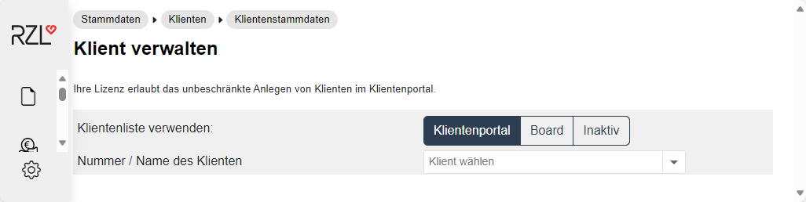
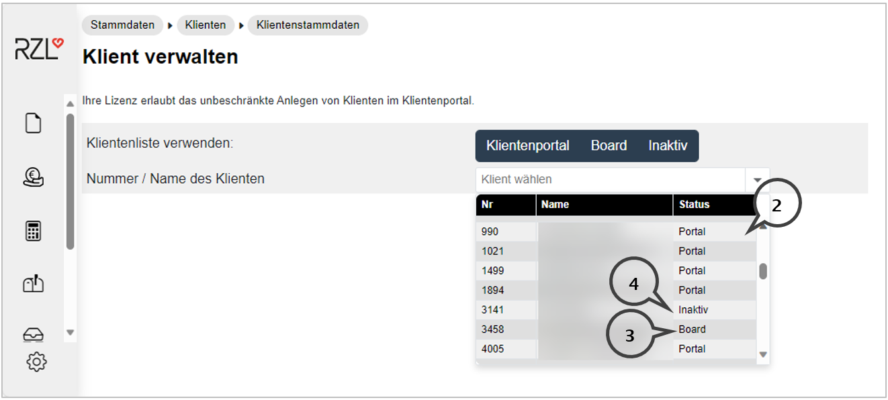
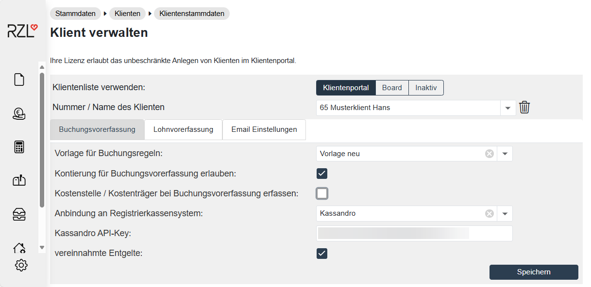
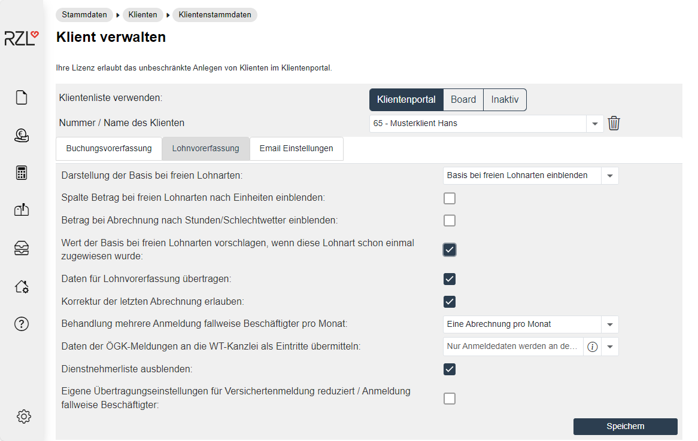
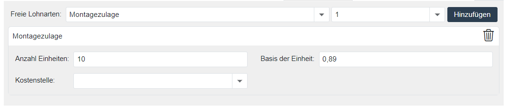

# Klientenstammdaten am RZL Klientenportal

Im RZL Klientenportal können Sie im Programmteil *Stammdaten / Klienten / Klientenstammdaten* die im RZL Board bzw. in der ZMV angelegten und freigegebenen Klienten übernehmen und im Klientenportal anlegen

## Klientenliste verwenden

Hier legen Sie fest, welche Klientenliste(n) angezeigt werden sollen. Sie können mehrere Listen gleichzeitig auswählen. Die Klientenliste wird durch Anwahl des Pfeilsymbols (**1**) aufgeschlagen.

Die Klienten können in drei unterschiedliche Listen aufscheinen.

Klienten, die in der dritten Spalte (**2**) als *Portal*-Klienten (**2**) bezeichnet sind, sind bereits im RZL Klientenportal angelegt. Das bedeutet, dass es zumindest einen Klientenbenutzer mit bestimmten Berechtigungen gibt.

Die Eigenschaft *Board* (**3**) im Bereich *Klientenliste verwenden* zeigt jene Klienten, die für das RZL Klientenportal bereitgestellt worden sind. Diese Kennzeichnung erfolgt wie vorher beschrieben im RZL Board oder in der ZMV. Diese Klienten sind im RZL Klientenportal noch nicht angelegt und können nach Auswahl aus der Liste angelegt und gespeichert werden.

Für Klienten mit der Eigenschaft *Inaktiv* (**4**) sind im Klientenportal (noch) Daten gespeichert. Der Klient ist allerdings nicht (mehr) im Portal aktiv bzw. in Verwendung. konkret bedeutet das, dass die Kennzeichnung als Klientenportal-Klient in der ZMV oder im RZL Board entfernt wurde.

Der Name des Klienten wird aus dem RZL Board bzw. der ZMV übernommen und kann im RZL Klientenportal nicht geändert werden.

## Buchungsvorerfassung

#### Vorlage für Buchungsregeln

Für die Buchungsvorerfassung können Buchungsregeln angelegt werden. Sie können Buchungsregeln auch in einer allgemeinen Vorlage speichern, die bei mehreren Klienten verankert werden kann. Die Zuordnung erfolgt in den Klientenstammdaten durch Anwahl der benötigten Vorlage. [siehe Buchungsregeln](../../Finanzbuchhaltung/FibuVorerfassung/Buchungsregeln.md)

#### Kontierung für Buchungsvorerfassung erlauben

Wenn Sie dieses Feld aktivieren, kann Ihr Klient im Rahmen der Vorerfassung Kontonummern eintragen. Wird dieses Feld nicht aktiviert, kann der Klient nur Ausgaben und Einnahmen erfassen und die Vorkontierung kann nur mehr über Buchungstexte erfolgen. [siehe Buchungsregeln](../../Finanzbuchhaltung/FibuVorerfassung/Buchungsregeln.md)

#### Kostenstelle/Kostenträger bei Buchungsvorerfassung erfassen

Wenn Sie diese Option aktivieren, kann der Klient bei der Vorerfassung der Buchungszeilen auch Kostenstellen und Kostenträger miterfassen. [siehe Stammdaten Kostenrechnung](../../Finanzbuchhaltung/FibuVorerfassung/VorerfassungKST.md)

#### Anbindung an Registrierkassensystem

Im Bereich *Anbindung an Registrierkassen* können Sie den Eintrag *Kassandro* auswählen. Anschließend öffnet sich das Feld *Kassandro API-Key*. Hier können Sie den im my.Kassandro.at generierten API-Key eintragen.

#### vereinnahmte Entgelte

Wenn der Klient nach vereinnahmten Entgelten (Ist-Versteuerung) gebucht wird, ist dieses Feld zu aktivieren. Diese Einstellung wird -- wenn zutreffend -- für die Buchungsvorerfassung benötigt.

## Lohnvorerfassung

#### Darstellung der Basis bei freien Lohnarten

Für die Erfassung der freien Lohnarten kann hier festgelegt werden, ob die Basis der freien Lohnarten nur angezeigt, eingeblendet oder ausgeblendet werden soll. Wird die Basis eingeblendet, kann sie während der Eingabe geändert werden.

#### Spalte Betrag bei freien Lohnarten nach Einheiten einblenden

Sie können hier für die Lohnvorerfassungen festlegen, ob bei freien Lohnarten nach Einheiten die Betragsspalte (Summenspalte) eingeblendet wird.

#### Betrag bei Abrechnung nach Stunden/Schlechtwetter einblenden

Sie können hier für die Lohnvorerfassungen festlegen, ob bei der Abrechnung nach Stunden bzw. bei der Abrechnung von Schlechtwetter die Betragsspalte (Summenspalte) eingeblendet werden soll.

#### Wert der Basis bei freien Lohnarten vorschlagen, wenn diese Lohnart schon einmal zugewiesen wurde

Bei der Erfassung von Lohnarten nach Einheiten wird die bereits einmal erfasste Basis bei der nächsten Erfassung vorgeschlagen, wenn Sie dieses Feld aktivieren.

#### Daten für Lohnvorerfassung übertragen

Wenn Sie dieses Feld deaktivieren, werden keine Daten aus der Lohnverrechnung des Klienten auf das Klienten-Portal hochgeladen.

Dieses Feld sollte nur dann deaktiviert werden, wenn Sie lediglich die Abrechnungen der Dienstnehmer ins Klienten-Portal hochladen wollen. [siehe Dienstnehmerbereich](../../Dienstnehmerbereich/index.md)

#### Korrektur der letzten Abrechnung erlauben

Hier legen Sie fest, ob für einzelne Dienstnehmer pro Monat mehr als einmal Daten an die Lohnverrechnung freigegeben werden können.

#### Behandlung mehrerer Mindestangaben-Anmeldungen pro Monat für fallweise Beschäftigte

Die Mindestangaben-Anmeldungen eines Monats für fallweise Beschäftigten können innerhalb einer Abrechnung eines Monat gespeichert werden. Wenn innerhalb eines Monats beispielsweise drei Tage gemeldet werden, sind in diesem Monat die drei Tage innerhalb nur einer Abrechnung gespeichert. Diese Variante wird von RZL empfohlen.

Wahlweise könnten Sie auch pro Mindestangaben-Anmeldung eine Abrechnung speichern. Für drei Mindestangaben-Anmeldungen sind das drei Abrechnungen in einem Monat.

#### Daten der ÖGK-Meldungen an die WT-Kanzlei als Eintritte weiterleiten

Für die Weiterleitung der Daten der Versichertenmeldung/Meldung fallweise Beschäftigte an die ÖGK an den Wirtschaftstreuhänder stehen folgende Optionen zur Verfügung:

*Erfassung zusätzlicher Stammdaten händisch anwählen*

Nach der Erfassung und Übermittlung der Anmeldung hat der Klient die Möglichkeit unter *Lohnverrechnung / Vorerfassung / Eintritte* weitere Stammdaten des Dienstnehmers zu erfassen und freizugeben. Der Programmteil muss händisch angewählt werden.

*Automatische Erfassung zusätzlicher Stammdaten*

Wird diese Option gewählt, öffnet sich direkt nach der Übermittlung der Anmeldung eines Dienstnehmers die Oberfläche mit den weiteren Stammdaten und der Klient erfasst die benötigten Angaben und gibt diese an den Wirtschaftstreuhänder frei.

*Nur Anmeldedaten werden an den Wirtschaftstreuhänder übermittelt*

Bei dieser Option werden vom Klienten die benötigten Angaben für die Anmeldung erfasst und an die ÖGK und den Wirtschaftstreuhänder übermittelt. Die Übermittlung von zusätzlichen Daten ist nicht möglich.

!!! info "Tipp"
    Beim Menüpunkt steht Ihnen die Kurzanleitung mit weiteren Informationen zu den verschiedenen Optionen und der jeweiligen Darstellung beim Klienten zur Verfügung. Diese kann über das Informations-Icon, rechts neben dem Text der Option, aufgerufen werden.

#### Dienstnehmerliste ausblenden

Wenn Sie diese Einstellung treffen, so können die Benutzer des ausgewählten Klienten im Bereich *Lohnverrechnung / Übersicht* die Dienstnehmerliste nicht öffnen.

#### Eigene Übertragungseinstellungen für Mindestangaben-Anmeldungen / Versichertenmeldung reduziert

Aktivieren Sie dieses Feld, damit der Klient die Übertragung der Meldungen an ELDA mit seiner eigenen ELDA-Lizensierung durchführen kann. Die Absender-Stammdaten werden vom Programm ausgefüllt. Sie müssen anschließend die Verarbeitungsnummer der GKK (DVR-Nummer), die ELDA Seriennummer und das ELDA Passwort (Kundenpasswort) für die ELDA-Übertragung eintragen.

Wenn Sie dieses Feld nicht aktivieren, wird die Übertragung mit der ELDA-Lizenz des Wirtschaftstreuhänders durchgeführt. [siehe Stammdaten der Kanzlei](../KanzleiStammdaten/StammdatenKanzlei.md)

## Email Einstellungen

### Klienten E-Mail

Hier kann die E-Mail- Adresse des Klienten eingetragen werden. Werden Dokumente hochgeladen, erhält der Klient an diese E-Mail- Adresse eine Information. Es wird jedoch empfohlen, die E-Mail- Adresse direkt beim Benutzer zu hinterlegen, da in diesem Fall die Zusendung der E-Mails auf die zugeordneten Berechtigungen beim Benutzer eingeschränkt werden kann.

### Kanzlei-Sachbearbeiter E-Mail

Hier können Sie die E-Mail- Adresse des Kanzlei-Sachbearbeiters eintragen, der für diesen Klienten zuständig ist. Werden aus dem Klientenbereich Daten gesendet bzw. Dokumente hochgeladen, werden an diese Mail-Adresse Benachrichtigungen versendet.

Eine Eintragung ist auch hier nicht unbedingt notwendig, da die E-Mail-Adresse auch beim WT-Mitarbeiter (Benutzer) eingetragen werden kann. Der WT-Benutzer erhält E-Mails nur aufgrund der in den eigenen Stammdaten aktivierten Berechtigungen.

!!! info "Tipp"
    Sie können in den E-Mail Feldern auch mehrere E-Mail-Adressen - getrennt durch einen Beistrich - eintragen.

