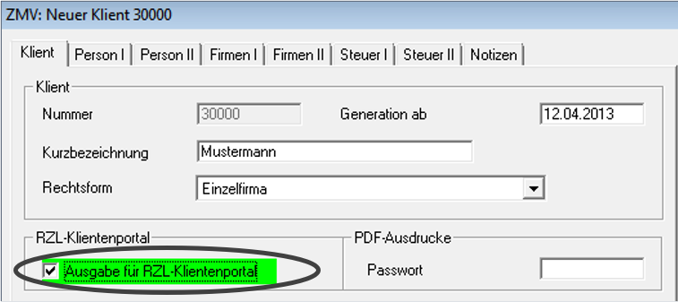

# Übernahme ZMV/Board

Die Klientenstammdaten müssen am Portal nicht neu angelegt werden. Sie
werden aus den Programmen RZL-Board oder ZMV hochgeladen.

## Übernahme der Klienten aus dem Board

Prüfen Sie vor der Übernahme der Klienten die Stammdateneinstellungen im RZL Board. Für Klienten am RZL Klientenportal aktivieren Sie im Bereich *Klientenportal* die Option *Klient am eigenen Klientenportal ..... anlegen.*

Die Stammdatensynchronisation ins Klientenportal wird automatisch durchgeführt. Ebenfalls im BOARD-STAMM können im Register *Einstellungen* den Eintrag *Klientenstammdaten synchronisieren* anwählen.

In oben abgebildeten Programmteil kann die Klientenstammdaten Synchronisation händisch angewählt werden. Die im Klientenportal angelegten Klienten finden Sie unterhalb in Listenform dargestellt.

!!! info "Tipp"
    Eine genaue Beschreibung der Belegsynchronisation finden Sie im Board im Programmteil *Hilfe / Kurzanleitungen* im Bereich *RZL Belegverarbeitung*.

## Übernahme der Klienten aus der ZMV

Prüfen Sie zunächst die Stammdaten der Klienten bezüglich der Freischaltung für das RZL Klientenportal. Sie finden die Markierung *Ausgabe für RZL Klientenportal* im Programmteil *Klient / Stammdaten* im Register\ blatt *Klient.*

Im Programmteil *Export/Klientenliste für RZL Klientenportal* können Sie die Klienten aus der ZMV für die Übernahme in das RZL Klientenportal bereitstellen.

Es werden nur jene Klienten im RZL Klientenportal bereitgestellt, in deren Stammdaten die Markierung *Ausgabe für RZL Klientenportal* gesetzt ist.
