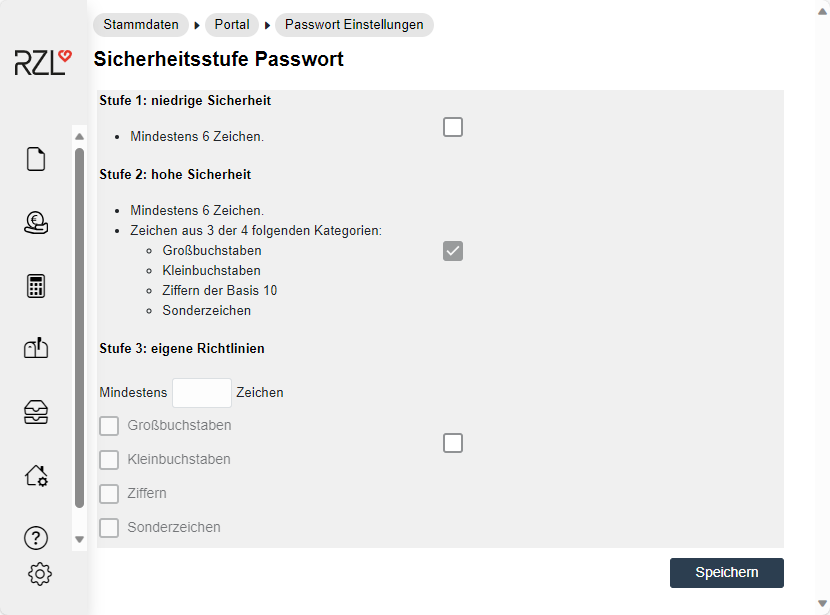
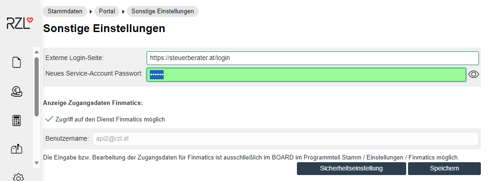

# Stammdaten des Portals

## E-Mail Texte

Im Programmteil *Stammdaten / Portal / E-Mail Texte* können Sie die Texte der automatisch generierten E-Mails bearbeiten und formatieren. Es können auch Bilder eingefügt werden.

Die Texte werden je nach Thema (**1**) in unterschiedlichen Registerblättern dargestellt. Ein E-Mail-Text enthält den Betreff (**2**) und den Textkörper (**3**) bearbeiten wollen. Nach Anwahl der gewünschten Schaltfläche können Sie die Texte bearbeiten, formatieren, Bilder einfügen und vieles mehr.

Die Schaltfläche *RZL Vorgabe* (**4**) holt den Original RZL Text zurück. Die Anzahl der Platzhalter wird links unten (**5**) angezeigt und kann nicht bearbeitet werden. Die Platzhalter werden durch eingeklammerte Nummern dargestellt. Sie können Platzhalter {KNA} für den Klientennamen und {KNR} für die Klientennummer vergeben.

## E-Mail Einstellungen

Im Programmteil *Stammdaten / Portal / E-Mail Einstellungen* können Sie allgemeine Einstellungen zu den E-Mail Benachrichtigungen treffen.

### Allgemeine Absenderadresse 

Die hier eingetragene Absenderadresse wird bei einer E-Mail Benachrichtigung als Absenderadresse herangezogen.

### Absendername 

Der Name der Kanzlei wird im Mailprogramm als Absender angezeigt. Damit für den Klienten einfach ersichtlich ist, von wem das E-Mail kommt, sollte dieses Feld unbedingt ausgefüllt werden.

### Allgemeine Antwortadresse

Wenn auf eine E-Mail Benachrichtigung geantwortet wird, so wird -- sofern keine E-Mail Adresse beim Kanzleimitarbeiter bzw. Klienten Benutzer hinterlegt ist -- diese Adresse vorgeschlagen. Durch die allgemeine Antwortadresse sollen jene Fälle abgedeckt werden, für die keine E-Mail Adresse für die Antwort aus den Stammdaten gefunden wurde.

### E-Mail Benachrichtigung aktivieren 

Durch diese Auswahl können Sie die E-Mail Benachrichtigungen aktivieren. Nur wenn diese Option (*E-Mail Benachrichtigungen aktivieren* (**1**)) aktiviert ist, werden E-Mails an die in der Verwaltung eingetragenen E-Mail Adressen versendet.

## Passwort Einstellungen

Am RZL Klientenportal können Sie selbst die Sicherheitsstufe für die zu vergebenden Passwörter am RZL Klientenportal definieren. Die Einstellungen dazu finden Sie unter *Stammdaten / Portal / Passwort Einstellungen.* Wählen Sie hier Stufe 3, können Sie selbst festlegen, wie viele Zeichen Ihr Passwort haben soll und welche Eigenschaften die
Passwörter aufweisen sollen. Im Gegensatz dazu, wird Ihnen dies bei Stufe 2 vorgegeben.

## Farben

Am RZL Klientenportal können Sie die Farben der Menüpunkte, des Hintergrundes usw. ändern. Diese Möglichkeiten finden Sie im Programmteil *Stammdaten / Portal / Farben*.

Das Farbschema *Standard* (**1**) ist das voreingestellte Farbschema. Sie können dieses Farbschema weder löschen noch bearbeiten. Wenn Sie ein neues Schema anlegen wollen, vergeben Sie im Feld *Name* (**2**) eine Bezeichnung und wählen die Schaltfläche *Erstellen* an.

Nach Anwahl des Eintrags *Editieren* (**3**) können Sie das neue Farbschema bearbeiten. Das neu angelegte Farbschema können Sie durch Anwahl des Icons *auswählen* (**4**) aktivieren.

Für den jeweiligen Bereich des RZL Klientenportals werden die Farbe, der Farbcode und die Darstellung angezeigt. Die gewünschte Farbe kann aus der Liste -- durch einen Klick auf das Pfeil-Symbol -- ausgewählt werden. Durch Anklicken der Schaltfläche *Speichern* -- ganz unten im Dialog -- werden die vorgenommenen Änderungen gespeichert.

## Logo

Im Programmteil *Stammdaten / Portal / Logo* können Sie ein individuelles Logo für das RZL Klientenportal hochladen.

Nach Anwahl der Schaltfläche *Datei auswählen* öffnet sich ein Dialog zur Auswahl einer Bilddatei auf ihrem Computer. Hier ist das gewünschte Logo auszuwählen.

Das Logo sollte maximal 500 Pixel breit und 500 Pixel hoch sowie 1024kB groß sein. Durch Anwahl der Schaltfläche *Hochladen* wird das Logo im Klientenportal hochgeladen. Die Schaltfläche *Zurücksetzen* entfernt das neu hinterlegte Logo wieder.

## Sonstige Einstellungen

### Externe Login-Seite definieren 

Über das Menü *Stammdaten / Portal / Sonstige Einstellungen* können Sie eine Externe Login-Seite definieren.

Wenn Sie auf Ihrer Kanzlei-Homepage ein Login zum RZL Klientenportal eingerichtet haben, können Sie hier durch Eintragung der Adresse Ihrer Homepage bewirken, dass der Klient nach dem Ausstieg aus dem RZL Klientenportal zurück auf Ihre Login-Seite fällt (Kapitel 1.3, Seite [7](#login-formular-auf-ihre-kanzlei-homepage)).

!!! warning "Hinweis"
    Bitte stellen Sie zuvor sicher, dass das Login-Formular auf Ihrer Kanzlei-Homepage korrekt funktioniert, da beim Aufruf der Klientenportal URL -- welchen Sie von uns erhalten haben -- nicht mehr das Login-Formular des Klientenportals angezeigt wird, sondern Ihre hier eingetragene Adresse.

### Service-Account Passwort 

Hier ist das Service-Account Passwort für die Belegsynchronisation einzutragen.

!!! info "Tipp"
    Eine genaue Beschreibung der Belegsynchronisation finden Sie im Board im Programmteil *Hilfe / Kurzanleitungen* im Bereich *RZL Belegverarbeitung*.
