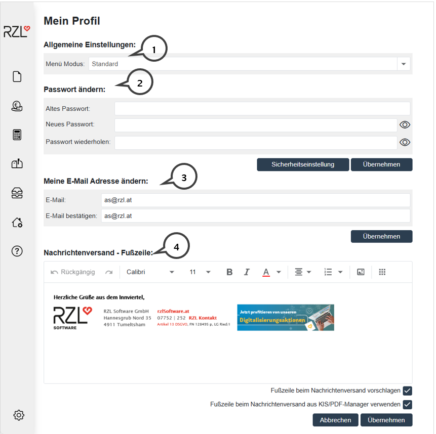

# Profil

## Allgemeine Einstellungen

 Sie können innerhalb des eigenen Profils im Bereich *Allgemeine Einstellungen* zwischen 4 verschiedenen Darstellungen des Menüs (**1**)  auswählen. Der Menü Modus *Standard* zeigt links zunächst nur die  Symbole für die einzelnen Programmteile an. Wenn Sie mit der Maus auf die Leiste fahren, werden die Symbole und der Text der einzelnen  Programmteile angezeigt. Der Menü Modus *Fixiert groß* blendet die  Symbole und den Text dauerhaft ein. *Fixiert klein* zeigt auf der ersten  Ebene nur mehr die Symbole ohne Text für die Programmteile, *Fixiert  Klein mit Text* zeigt die Symbole mit dem Text der Programmteile in  kleiner Schrift unterhalb des Symbols.
  
## Passwort ändern

 Im Bereich *Passwort ändern* können Sie ihr aktuelles Passwort abändern. Mit dem Button *Sicherheitseinstellung* kommen Sie in die Einstellungen  für das Passwort. Weitere Informationen finden Sie unter 2.4.3 Passwort Einstellungen.

## Meine Email Adresse

 Die E-Mail Adresse, die bei Ihrem Kanzlei-Benutzer hinterlegt ist, können Sie im Bereich *Meine E-Mail Adresse* (**3**) ändern.

## Fußzeile beim Nachrichtenversand

 Im Bereich *Nachrichtenversand -- Fußzeile* (**4**) kann eine Fußzeile gestaltet werden. Die Fußzeile kann beim Nachrichtenversand verwendet werden, sowohl aus dem Klientenportal als auch aus dem KIS und dem RZL PDF-Manager.

 