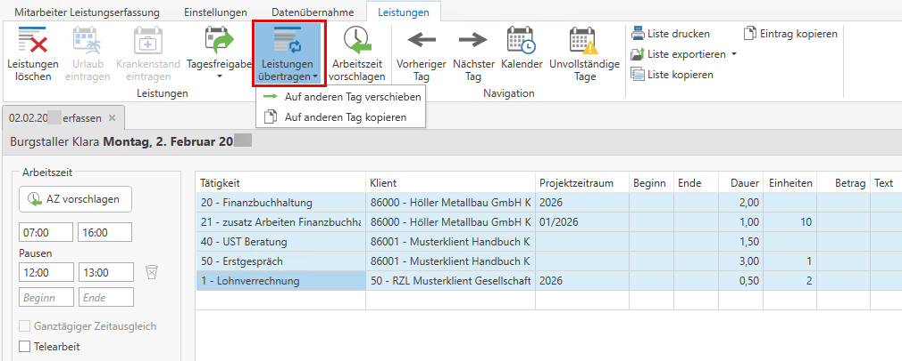
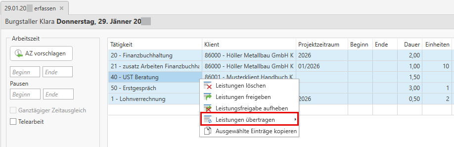
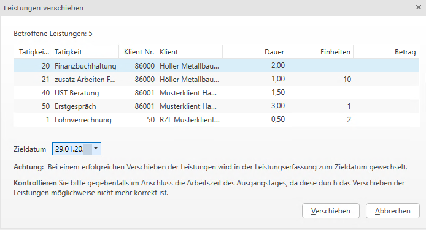

# Leistungen auf einen anderen Tag kopieren/verschieben

Sollen erfasste Leistungen auf einen anderen Tag verschoben oder kopiert werden, so können diese durch das
Icon *Leistung übertragen* oder mittels Kontextmenü übertragen werden.

Es können auch mehrere Leistungszeilen verschoben/kopiert werden, indem diese
mittels STRG-Taste markiert (farblich hinterlegt) werden.

Bereits in der Honorarverrechnung verrechnete Leistungen können nicht mehr verschoben werden. Diese sind in der Leistungserfassung farblich grau dargestellt und in der Spalte Status wird das Zeichen  für Verrechnet angezeigt.

Nachdem Sie die Leistungen, welche verschoben/kopiert werden sollten markiert haben, öffnet sich folgender Dialog. Hier wird hinterlegt, zu welchem Tag die Leistungen verschoben werden sollen.

!!! warning "Hinweis"
    Bei einem erfolgreichen Verschieben der Leistungen öffnet sich autoamtisch das Zieldatum.

Die Leistung kann nicht verschoben werden wenn:

- Quell-Tag ist gesperrt
- Ziel-Tag ist gesperrt
- Leistung ist in Verrechnung
- Leistung ist bereits verrechnet
- Leistung ist in Pauschalausgleich

Die Leistung kann nicht kopiert werden wenn:

- Ziel-Tag ist gesperrt

!!! warning "Hinweis"
    Sie können hier auch mit Shortcuts arbeiten: **Strg+Alt+X** für Verschieben und **Strg+Alt+C** für Kopieren.