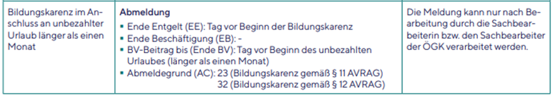
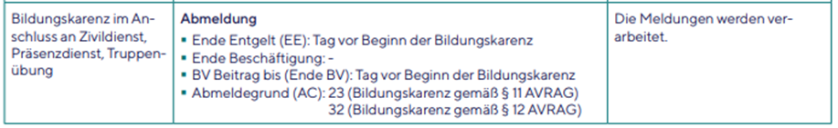

# Bildungskarenz im Anschluss an Unbezahlten Urlaub, Zivil-, Präsenzdienst oder Truppenübung

Wird im Anschluss an einen unbezahlten Urlaub, den Zivil- oder Präsenzdienstes oder eine Truppenübung eine Bildungskarenz begonnen, erwartet die ÖGK eine **Abmeldung**.

Da das Dienstverhältnis bereits ruhend ist, führen Sie einen **Wiedereintritt** durch (*Abrechnungen / Wiedereintritt*). Geben Sie **kein** Eintrittsdatum ein, sondern nur das **Austrittsdatum** und den Grund (26 Bildungskarenz § 11 AVRAG bzw. 37 Bildungskarenz § 12 AVRAG). Es sollte Ihnen automatisch das Ende Entgeltdatum und Ende BV-Datum vorgeschlagen werden.