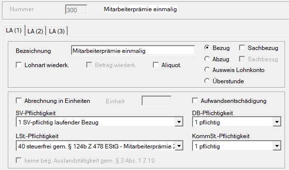
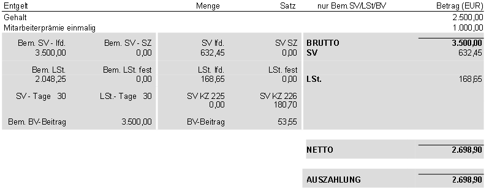
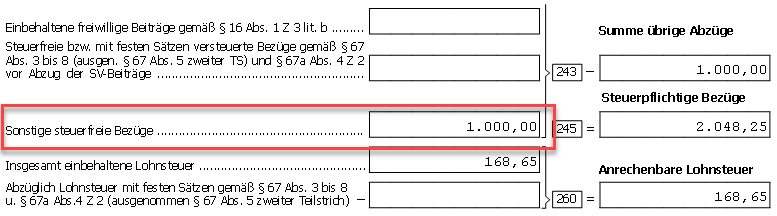
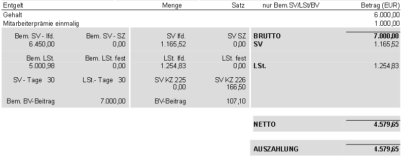

# Mitarbeiterprämie 2025

Durch das Budgetbegleitgesetz 2025 hat der Gesetzgeber für Zeiträume ab dem 01.01.2025 die Möglichkeit geschaffen, Zulagen und Bonuszahlungen bis zu EUR 1.000,00 jährlich steuerfrei auszubezahlen. Die gesetzliche Grundlage hierfür findet sich im § 124b Z 478 lit a bis e EStG.

## Voraussetzungen bzw. Einschränkungen für die Steuerfreiheit sind

- Die Mitarbeiterprämie kann einem oder mehreren Arbeitnehmern aus sachlichen, betriebsbezogenen Gründen gewährt werden.
- Es muss sich dabei um eine **zusätzliche Zahlung** handeln, die üblicherweise bisher nicht gewährt wurde.
- Kommt es im Kalenderjahr 2025 sowohl zu einer Auszahlung einer Gewinnbeteiligung gem. § 3 Abs. 1 Z 35 EStG als auch zur Zahlung einer Mitarbeiterprämie 2025, ist die Gewinnbeteiligung nur insoweit steuerfrei als Sie gemeinsam mit der Mitarbeiterprämie den Betrag von EUR 3.000,00 im Kalenderjahr nicht übersteigt.
- Wird mehr als EUR 1.000,00 steuerfrei für die Mitarbeiterprämie und insgesamt mehr als EUR 3.000,00 für die Mitarbeiterprämie und Gewinnbeteiligung in Summe berücksichtigt, liegt ein Pflichtveranlagungstatbestand gem. § 41 Abs. 1 EstG. vor.

## Keine Befreiung im Bereich der Sozialversicherung, DB/DZ und Kommst

Der Gesetzgeber sieht für das Jahr 2025 **keine Befreiung** im Bereich der **Sozialversicherung** sowie der Nebenbeiträge **DB/DZ** und **Kommst** vor. Die fehlende Befreiung im Bereich der Sozialversicherung wird von politischer Seite mit der Vermeidung von Negativeffekten bei der Höhe der Pension begründet.

Zudem wird es vermutlich nicht möglich sein, die SV-Dienstnehmeranteile die auf die Mitarbeiterprämie 2025 entfallen, bei der Ermittlung der Lohnsteuer-Bemessungsgrundlage abzuziehen (auf Basis § 20 Abs. 2 EStG). Dies wird natürlich insgesamt dazu führen, dass die Auszahlung an die Dienstnehmer im Vergleich zu den Monaten ohne Mitarbeiterprämie nicht um den Maximalbetrag von EUR 1,000,00 steigt, sondern um deutlich weniger.

Die Abrechnung der Mitarbeiterprämie 2025 in der RZL Lohnverrechnung muss über eine neu anzulegende freie Lohnart erfolgen, die Sie unter *Stamm / Lohnarten* oder in der Kanzleilohnartentabelle unter *Klient / Kanzlei / Lohnarten, Lohnformeln* anlegen müssen.

## Abrechnung in der RZL-Lohnverrechnung

Die Entscheidung ob im Bereich der Sozialversicherung ein laufender Bezug oder eine Sonderzahlung vorliegt, muss in jedem Einzelfall genau abgewogen werden. Es kommt dabei nicht nur auf den Zeithorizont der Auszahlung an, sondern auch auf die Frage ob mit dem Dienstnehmer eine wiederholte Gewährung der Prämie vereinbart wurde oder nicht.

Zudem gilt es die Frage zu klären, ob man alleine aus der vorherigen Gewährung von Corona-Prämien, Teuerungsprämie oder Mitarbeiterprämie alt eine wiederkehrende Zahlung ableiten kann oder nicht.

Letztlich wird es auch auf die Frage ankommen, ob sich der Arbeitgeber zu einer wiederkehrenden Zahlung in den nächsten Jahren verpflichten möchte und dabei auf eine noch unklare Gesetzeslage für 2026 treffen könnte.

### Erstmalige, absolut einmalige Gewährung ohne Vereinbarung einer Wiederkehr

Wird keine Wiederkehr vereinbart und liegt ein erstmaliger Bezug der Mitarbeiterprämie vor, handelt es sich um einen laufenden Bezug in der Sozialversicherung (SV-Pflichtigkeit = 1).

{width="500"}

!!! warning "Hinweis"
    Unser Vorschlag zur Anlage der Lohnart basiert auf dem Informationsstand aus diversen Fachartikeln zum Zeitpunkt 07/2025. Die Letztverantwortung hinsichtlich der Anlage der Lohnarten verbleibt beim Anwender.

Im Bereich der Lohnsteuer haben wir mit der Version 2.25.8 die neue Lohnsteuerpflicht Nr. 40 - steuerfrei gem. § 124b Z. 447 EstG – Mitarbeiterprämie 2025 eingeführt. Aufgrund der deutlich abweichenden gesetzlichen Vorgaben im Vergleich zu den Vorjahren, erschien uns die Wiederverwendung der bestehenden Lohnsteuerpflichtigkeiten aus den Vorjahren nicht sinnvoll.

Eine Befreiung bei den Lohnnebenkosten (DB, DZ und Kommunalsteuer) ist durch den Ge-setzgeber nicht vorgesehen. In dem Bereich muss die Lohnart daher als 1 = pflichtig definiert werden.

### Wiederkehrender Bezug

Ist dagegen bereits jetzt eine mehrmalige Auszahlung dieser Lohnart vereinbart, handelt es sich im Bereich der Sozialversicherung um eine Sonderzahlung (Pflichtigkeit = 2). Alle anderen Punkte bleiben unverändert.

{width="500"}

!!! warning "Hinweis"
    Unser Vorschlag zur Anlage der Lohnart basiert auf dem Informationsstand aus diversen Fachartikeln zum Zeitpunkt 07/2025. Die Letztverantwortung hinsichtlich der Anlage der Lohnarten verbleibt beim Anwender.

### Beispiele

**Beispiel 1**

In beiden Varianten der Auszahlung trifft die Pflichtigkeit in der Sozialversicherung auf eine Abgabenbefreiung in der Lohnsteuer. Diese inzwischen recht seltene Konstellation, führt in Verbindung mit der Darstellung am L16 (Jahreslohnzettel), zur Notwendigkeit diese SV-Dienstnehmeranteile zu „neutralisieren“. Gemäß § 20 Abs. 2 EstG dürfen SV-Beiträge die sich auf nicht steuerpflichtige Einkünfte beziehen nicht abgezogen werden.

Lfd. Bezug EUR 2.500,00; Mitarbeiterprämie 2025 einmalig EUR 1.000,00

Der gesamte SV-Dienstnehmeranteil in Höhe von EUR 632,45 setzt sich zusammen aus EUR 451,75 für den Gehalt des Dienstnehmers und EUR 180,70 für die steuerfreie Mitarbeiterprämie 2025. Hier kommt es zur Besonderheit, dass der Dienstnehmeranteil für die Mitarbeiterprämie 2025 **NICHT** als **Werbungskosten** für die Ermittlung der Lohnsteuer-Bemessungsgrundlage anerkannt wird.

|                                 |         |              |
| :------------------------------ | :------ | -----------: |
| Brutto                          | EUR     |     3.500,00 |
| - SV-DNA (2.500,00 x 18,07 %)   | EUR     |     - 451,75 |
| - steuerfreie Mitarbeiterprämie | EUR     |   - 1.000,00 |
| **Lohnsteuer-BMGL lfd.**        | **EUR** | **2.048,25** |

Aus den gesamten SV-Dienstnehmeranteilen, wird über die KZ 226, der Anteil der auf die Mitarbeiterprämie 2025 entfällt, ausgeschieden und kürzt daher nicht die lfd. Lohnsteuer-Bemessungsgrundlage.

{width="600"}

{width="600"}

!!! warning "Hinweis"
    Bisher gibt es keinerlei Aussagen zu einem etwaigen Ausweis der Mitarbeiterprä-mie 2025 über eine eigenständige Kennziffer am L16. Wir haben daher für den Augenblick diesen Wert unter Sonstige steuerfreie Bezüge am L16 ausgewiesen. Der Ausdruck des L16 und die elektronische Erstellung wurden unsererseits daher mit Warnhinweisen abgesi-chert. Die Weitergabe des Formulars ist bei Bezahlung einer solchen Prämie daher im Mo-ment nicht zu empfehlen.

**Beispiel 2**

Laufender Bezug EUR 6.000,00; Mitarbeiterprämie 2025 einmalig EUR 1.000,00

Im Falle der Überschreitung der laufenden Höchstbeitragsgrundlage müssen die SV-Beiträge im Verhältnis der Bruttobezüge zueinander zugeordnet werden (EUR 6000,00 = 85,71 % zu EUR 1000,00 = 14,29 %).

Der gesamte SV-Dienstnehmeranteil in Höhe von EUR 1.165,52 wird im Verhältnis 85,71 % zu 14,29 % zwischen lfd. Bezug und steuerfreier Mitarbeiterprämie 2025 aufgeteilt. Abzugsfähig sind daher nur EUR 999,02, also 85,71% der gesamten Dienstnehmeranteile.

|                                 |         |              |
| :------------------------------ | :------ | -----------: |
| Brutto                          | EUR     |     7.000,00 |
| - SV-DNA                        | EUR     |     - 999,02 |
| - steuerfreie Mitarbeiterprämie | EUR     |   - 1.000,00 |
| **Lohnsteuer-BMGL lfd.**        | **EUR** | **5.000,98** |

{width="600"}

Dadurch wird jener Teil der Sozialversicherung, der auf die Mitarbeitergewinnbeteiligung entfällt (= EUR 166,50), über die KZ 226 ausgeschieden.

!!! warning "Hinweis"
    Abschließend möchten wir nochmals erwähnen, dass Änderungen durch den Gesetzgeber hier auch rückwirkend noch immer nicht gänzlich ausgeschlossen sind. Entsprechende Kor-rekturmaßnahmen über Aufrollungen können in diesem Zusammenhang also noch anfallen.
