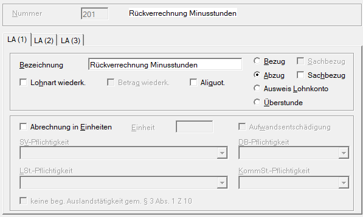
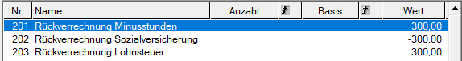
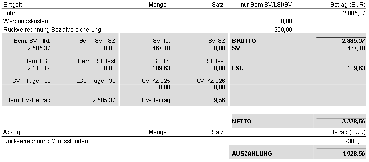

# Rückverrechnung von Minusstunden

Unterschreitet der Arbeitnehmer mit seiner tatsächlichen Arbeitsleistung die vereinbarte Normalarbeitszeit, stellt sich die Frage, ob der Arbeitgeber das auf diese Minderleistung entfallende Entgelt zurückfordern darf. 

Im Fall einer Rückzahlung für Zeitschulden ist grundsätzlich der erhaltene **Bruttobetrag** vom Arbeitnehmer zurückzuerstatten.

**Sozialversicherung**

In der Sozialversicherung sowie in der Betrieblichen Vorsorge reduziert sich die Bemessungsgrundlage. Sofern das Zeitminus einem konkreten Abrechnungsmonat zugeordnet werden kann, ist der Abzug in der jeweiligen Monatsabrechnung vorzunehmen. Ist keine eindeutige Zuordnung möglich, erfolgt die Reduktion in jenem Monat, in dem die Rückverrechnung durchgeführt wird.

Quelle: [ÖGK](https://www.gesundheitskasse.at/cdscontent/?contentid=10007.893168&portal=oegkdgportal)

**Lohnsteuer**

Lohnsteuerlich handelt es sich bei der Rückverrechnung um eine Rückzahlung von Arbeitslohn, die als Werbungskosten gemäß [§ 16 Abs. 2 EStG](https://www.ris.bka.gv.at/NormDokument.wxe?Abfrage=Bundesnormen&Gesetzesnummer=10004570&Artikel=&Paragraf=16&Anlage=&Uebergangsrecht=) zu behandeln ist. Dies führt zu einer entsprechenden Minderung der Lohnsteuerbemessungsgrundlage.

Am Jahreslohnzettel L16 ist der rückverrechnete Betrag unter "sonstige steuerfreie Bezüge" (Kennzahl 243) anzuführen. (vgl. [Lohnsteuerrichtlinie Rz 319](https://findok.bmf.gv.at/findok/volltext(suche:Standardsuche)?segmentId=af96b89b-0d22-4bba-b160-b42903369ad0))

**Lohnnebenkosten**

Für die Lohnnebenkosten (Dienstgeberbeitrag, Dienstgeberzuschlag und Kommunalsteuer) gilt nach überwiegender Rechtsauffassung, dass **keine Minderung** der Bemessungsgrundlage erfolgt.

## Abrechnungsbeispiel in der RZL-Lohnverrechnung

Rückverrechnung einer Zeitschuld von EUR 300,00 brutto.

**Benötigte Lohnarten**

*Abzug Bruttobetrag der Zeitschuld*

{width="500"}

*Verringerung der Sozialversicherungs-Bemessung*

{width="500"}

*Verringerung der Lohnsteuer-Bemessung*

{width="500"}

In alle drei Lohnarten wird der Betrag EUR 300,00 berücksichtigt. Bei der Sozialversicherung wird beim Betrag ein Minus davor gesetzt.

**Auszug freie Lohnarten**

{width="500"}

**Auszug Abrechnung**

{width="600"}

**Auszug Jahreslohnzettel L16**

{width="600"}