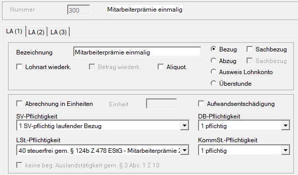
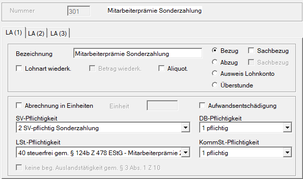
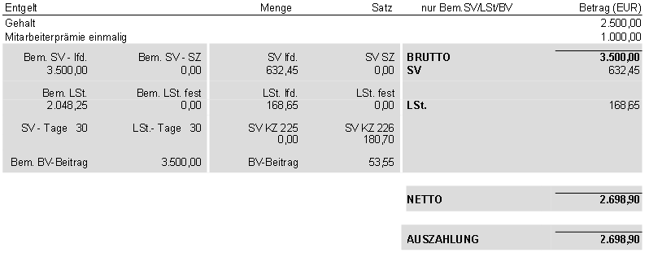
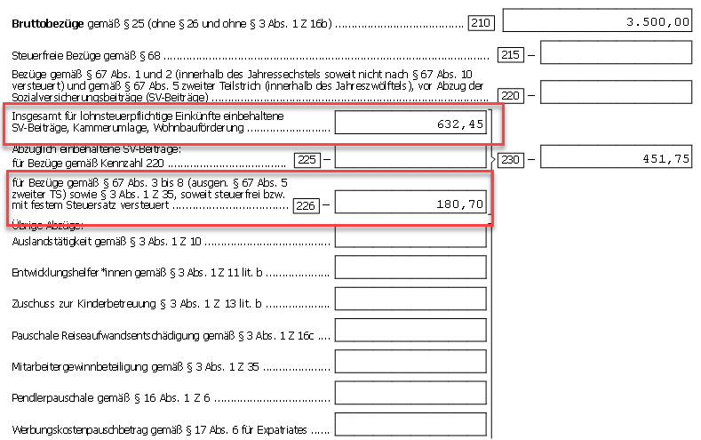
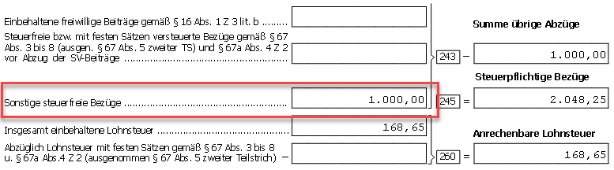
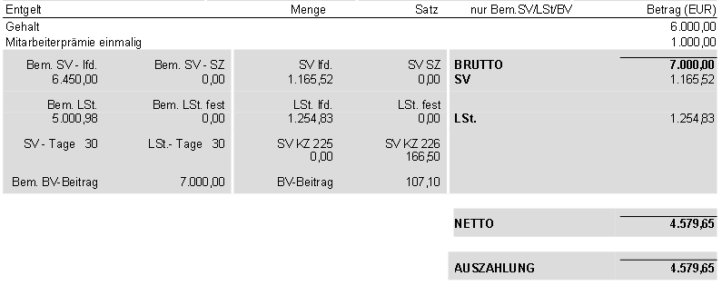
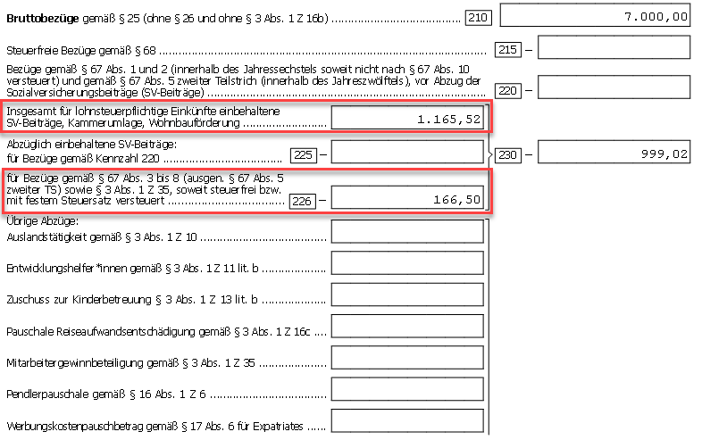

# Mitarbeiterprämie 2025

Durch das Budgetbegleitgesetz 2025 hat der Gesetzgeber die Möglichkeit geschaffen, ab dem 01.01.2025 Zulagen und Bonuszahlungen bis zu **EUR 1.000,00 jährlich** steuerfrei auszubezahlen. Die gesetzliche Grundlage hierfür findet sich in [**§ 124b Z 478 lit a bis e EStG**](https://www.ris.bka.gv.at/NormDokument.wxe?Abfrage=Bundesnormen&Gesetzesnummer=10004570&Artikel=&Paragraf=124b&Anlage=&Uebergangsrecht=).

## Voraussetzungen und Einschränkungen für die Steuerfreiheit

- Die Mitarbeiterprämie kann einem oder mehreren Arbeitnehmern aus sachlichen, betriebsbezogenen Gründen gewährt werden.
- Es muss sich dabei um eine **zusätzliche Zahlung** handeln, die bisher nicht üblich war.
- Erfolgt im Kalenderjahr 2025 sowohl eine Auszahlung einer [**Gewinnbeteiligung gem. §&nbsp;3&nbsp;Abs. 1 Z 35 EStG**](https://www.ris.bka.gv.at/NormDokument.wxe?Abfrage=Bundesnormen&Gesetzesnummer=10004570&Artikel=&Paragraf=3&Anlage=&Uebergangsrecht=) als auch eine Zahlung der **Mitarbeiterprämie 2025**, ist die Gewinnbeteiligung nur insoweit steuerfrei, als sie gemeinsam mit der Mitarbeiterprämie den Betrag von **EUR 3.000,00** im Kalenderjahr nicht übersteigt.
- Wird mehr als EUR 1.000,00 für die Mitarbeiterprämie steuerfrei berücksichtigt und gleichzeitig der Gesamtbetrag von EUR 3.000,00 für die Mitarbeiterprämie und Gewinnbeteiligung überschritten, besteht ein Pflichtveranlagungstatbestand gem. [§&nbsp;41&nbsp;Abs.&nbsp;1 EStG](https://www.ris.bka.gv.at/NormDokument.wxe?Abfrage=Bundesnormen&Gesetzesnummer=10004570&Artikel=&Paragraf=41&Anlage=&Uebergangsrecht=).

## Keine Befreiung im Bereich der Sozialversicherung, DB/DZ und Kommunalsteuer

Für das Jahr 2025 sieht der Gesetzgeber **keine Befreiung** im Bereich der **Sozialversicherung** sowie der Nebenabgaben **DB/DZ** und **Kommunalsteuer** vor. Die fehlende Befreiung in der Sozialversicherung wird politisch mit der Vermeidung negativer Auswirkungen auf die Pensionshöhe begründet.

Derzeit liegt noch **keine gesetzliche oder behördliche Stellungnahme** zur konkreten lohnsteuerlichen Behandlung der Mitarbeiterprämie 2025 vor. Nach aktueller Einschätzung unsererseits – die auch von einigen Fachexperten geteilt wird – wird es voraussichtlich nicht möglich sein, die auf die Prämie entfallenden Dienstnehmeranteile zur Sozialversicherung bei der Ermittlung der Lohnsteuer-Bemessungsgrundlage abzuziehen (laut [§ 20 Abs. 2 EStG](https://www.ris.bka.gv.at/NormDokument.wxe?Abfrage=Bundesnormen&Gesetzesnummer=10004570&Artikel=&Paragraf=20&Anlage=&Uebergangsrecht=)). Das bedeutet, dass sich der Auszahlungsbetrag an die Dienstnehmer nicht um den vollen steuerfreien Maximalbetrag von EUR 1.000,00 erhöht, sondern nur um einen entsprechend geringeren Nettobetrag.

**Bitte beachten Sie:** Aufgrund der derzeit bestehenden Unsicherheit kann es – sollte sich unsere Annahme im Nachhinein als nicht korrekt herausstellen – noch zu einer Anpassung der Abrechnung kommen.

!!! warning "Hinweis"
    Bislang gibt es seitens des Finanzamts keine eindeutige Stellungnahme dazu, ob die Mitarbeiterprämie ebenfalls unter [§ 20 Abs. 2 EStG](https://www.ris.bka.gv.at/NormDokument.wxe?Abfrage=Bundesnormen&Gesetzesnummer=10004570&Artikel=&Paragraf=20&Anlage=&Uebergangsrecht=) fällt.

Wie in [§ 124b Z 478 lit. a EStG](https://www.ris.bka.gv.at/NormDokument.wxe?Abfrage=Bundesnormen&Gesetzesnummer=10004570&Artikel=&Paragraf=124b&Anlage=&Uebergangsrecht=) festgelegt, erhöht die Mitarbeiterprämie 2025 das Jahressechstel **nicht**.

Die Abrechnung der Mitarbeiterprämie 2025 in der RZL Lohnverrechnung muss über eine neu anzulegende freie Lohnart erfolgen. Diese ist entweder unter *Stamm / Lohnarten* oder in der Kanzleilohnartentabelle unter *Klient / Kanzlei / Lohnarten, Lohnformeln* anzulegen.

## Abrechnung in der RZL Lohnverrechnung

Die Entscheidung ob im Bereich der Sozialversicherung ein **laufender Bezug** oder eine **Sonderzahlung** vorliegt, muss in jedem Einzelfall sorgfältig abgewogen werden. Dabei kommt es nicht nur auf den Zeithorizont der Auszahlung an, sondern auch auf die Frage, ob mit dem Dienstnehmer eine wiederholte Gewährung der Prämie vereinbart wurde oder nicht.

Zudem ist zu klären, ob aus der bisherigen Auszahlung von Corona-Prämien, Teuerungsprämien oder der „Mitarbeiterprämie alt“ eine wiederkehrende Zahlung abgeleitet werden kann – oder eben nicht.

Letztlich spielt es auch eine Rolle, ob der Arbeitgeber beabsichtigt, die Prämie in den kommenden Jahren regelmäßig auszuzahlen – und sich damit auf eine derzeit unklare Gesetzeslage für 2026 einlässt.

### Erstmalige, absolut einmalige Gewährung ohne Vereinbarung einer Wiederkehr

Wird keine Wiederkehr vereinbart und handelt es sich um den erstmaligen Bezug der Mitarbeiterprämie, liegt in der Sozialversicherung ein laufender Bezug vor (**SV-Pflichtigkeit = 1**).

{width="500"}

!!! warning "Hinweis"
    Unser Vorschlag zur Anlage der Lohnart basiert auf dem Informationsstand aus verschiedenen Fachartikeln mit Stand **Juli 2025**. Die Letztverantwortung für die korrekte Anlage der Lohnarten liegt beim Anwender.

Im Bereich der Lohnsteuer gibt es eine eigene Lohnsteuerpflicht-Nr. **40 steuerfrei gem. § 124b Z 478 EStG – Mitarbeiterprämie 2025**. Wegen der abweichenden gesetzlichen Vorgaben gegenüber den Vorjahren halten wir die Wiederverwendung der bisherigen Lohnsteuerpflichtigkeit für nicht sinnvoll.

Eine Befreiung von den **Lohnnebenkosten** (DB, DZ und Kommunalsteuer) ist vom Gesetzgeber nicht vorgesehen. In diesem Bereich muss die Lohnart daher als **1 = pflichtig** definiert werden.

### Wiederkehrender Bezug

Wird hingegen bereits im Vorfeld eine mehrmalige Auszahlung dieser Lohnart vereinbart, gilt sie im Bereich der Sozialversicherung als **Sonderzahlung** (**Pflichtigkeit = 2**). Alle übrigen Regelungen bleiben unverändert.

{width="500"}

!!! warning "Hinweis"
    Unser Vorschlag zur Anlage der Lohnart basiert auf dem Informationsstand aus verschiedenen Fachartikeln mit Stand **Juli 2025**. Die Letztverantwortung für die korrekte Anlage der Lohnarten liegt beim Anwender.

### Beispiele

**Beispiel 1**

In beiden Varianten der Auszahlung (laufender Bezug oder Sonderzahlung) trifft die Pflichtigkeit in der Sozialversicherung auf eine Abgabenbefreiung in der Lohnsteuer. Diese inzwischen seltene Konstellation führt - insbesondere im Zusammenhang mit der Darstellung am L16 (Jahreslohnzettel) - dazu, dass die SV-Dienstnehmeranteile „neutralisiert“ werden müssen. Gemäß [§ 20 Abs. 2 EStG](https://www.ris.bka.gv.at/NormDokument.wxe?Abfrage=Bundesnormen&Gesetzesnummer=10004570&Artikel=&Paragraf=20&Anlage=&Uebergangsrecht=) dürfen Sozialversicherungsbeiträge, die sich auf nicht steuerpflichtige Einkünfte beziehen, nicht als Werbungskosten vom steuerpflichtigen Einkommen abgezogen werden.

- Laufender Bezug: EUR 2.500,00
- Mitarbeiterprämie 2025 (einmalig): EUR 1.000,00

{width="600"}

Der gesamte SV-Dienstnehmeranteil beträgt EUR 632,45 und setzt sich wie folgt zusammen:

- EUR 451,75 entfallen auf das laufende Gehalt (2.500,00 x 18,07 %)
- EUR 180,70 entfallen auf die steuerfreie Mitarbeiterprämie 2025 (1.000,00 x 18,07 %)

Der auf die Mitarbeiterprämie entfallende Anteil von EUR 180,70 darf **nicht** als Werbungskosten bei der Ermittlung der Lohnsteuer-Bemessungsgrundlage berücksichtigt werden, da die zugrunde liegende Prämie steuerfrei ist.

|                                 |         |              |
| :------------------------------ | :------ | -----------: |
| Brutto                          | EUR     |     3.500,00 |
| - SV-DNA (2.500,00 x 18,07 %)   | EUR     |     - 451,75 |
| - steuerfreie Mitarbeiterprämie | EUR     |   - 1.000,00 |
| **Lohnsteuer-BMGL lfd.**        | **EUR** | **2.048,25** |

Im L16 (Jahreslohnzettel) wird über die Kennzahl 226 jener Teil der SV-Dienstnehmeranteile ausgeschieden, der auf die steuerfreie Mitarbeiterprämie 2025 entfällt. Dieser Anteil darf die laufende Lohnsteuer-Bemessungsgrundlage daher **nicht** mindern.

{width="600"}

{width="600"}

!!! warning "Hinweis"
    Zum Zeitpunkt der Implementierung der Mitarbeiterprämie lag noch kein neues L16 Formular vor. Aus diesem Grund wird der Betrag vorläufig unter „Sonstige steuerfreie Bezüge“ im L16 ausgewiesen. Sowohl der Ausdruck des L16 als auch die elektronische Übermittlung wurden unsererseits mit entsprechenden Warnhinweisen abgesichert. Die Weitergabe des L16-Formulars bei Auszahlung einer solchen Prämie ist zum aktuellen Zeitpunkt nicht zu empfehlen, da eine eindeutige gesetzliche oder technische Umsetzung noch aussteht.

**Beispiel 2**

- Laufender Bezug: EUR 6.000,00
- Mitarbeiterprämie 2025 (einmalig): EUR 1.000,00

Bei Überschreitung der laufenden Höchstbeitragsgrundlage müssen die SV-Dienstnehmeranteile anteilig im Verhältnis der Bruttobezüge zugeordnet werden (EUR 6.000,00 = 85,71 % zu EUR&nbsp;1.000,00 = 14,29 %).

{width="600"}

Der gesamte SV-Dienstnehmeranteil beträgt EUR 1.165,52 und wird entsprechend dem Verhältnis 85,71 % zu 14,29 % aufgeteilt:

- EUR 999,02 entfallen auf den laufenden Bezug und sind abzugsfähig (1.165,52 x 85,71 %)
- EUR 166,50 entfallen auf die steuerfreie Mitarbeiterprämie 2025 und sind nicht als Werbungskosten abzugsfähig (1.165,52 x 14,29 %)

Nur der auf den steuerpflichtigen Teil entfallende Anteil der SV-Beiträge darf bei der Ermittlung der Lohnsteuer-Bemessungsgrundlage als Werbungskosten berücksichtigt werden.

|                                 |         |              |
| :------------------------------ | :------ | -----------: |
| Brutto                          | EUR     |     7.000,00 |
| - SV-DNA                        | EUR     |     - 999,02 |
| - steuerfreie Mitarbeiterprämie | EUR     |   - 1.000,00 |
| **Lohnsteuer-BMGL lfd.**        | **EUR** | **5.000,98** |

{width="600"}

Dadurch wird der Teil der Sozialversicherungsbeiträge, der auf die Mitarbeiterprämie entfällt (EUR&nbsp;166,50), über die Kennzahl 226 ausgeschieden.

!!! warning "Hinweis"
    **Abschließend möchten wir darauf hinweisen, dass gesetzliche Änderungen auch rückwirkend nicht ausgeschlossen sind. Entsprechende Korrekturmaßnahmen, etwa durch Aufrollungen, können daher noch erforderlich werden.**
