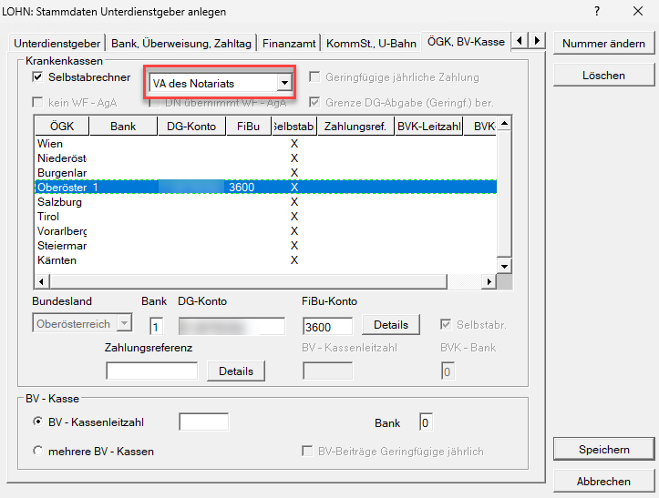
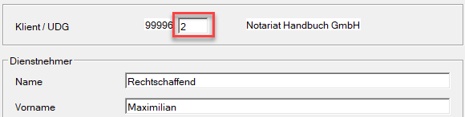
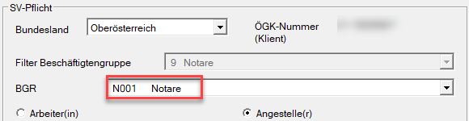
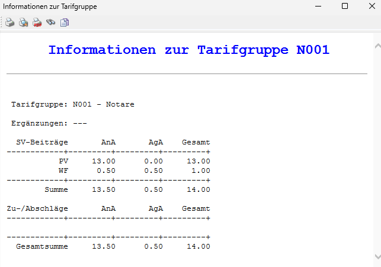

# Notare bzw. Notariatsanwärter

Um einen Notar bzw. Notariatsanwärter korrekt abzurechnen, müssen Sie zuerst einen [*Unterdienstgeber*](../Klientenstammdaten/Unterdienstgeber.md) anlegen.

Im Registerblatt *ÖGK, BV-Kasse* wählen Sie bei der Option *Selbstabrechner* den Punkt *VA des Notariats* aus. Da Notare keine eigene Beitragskontonummer haben, empfiehlt es sich, die Beitragskontonummer der ÖGK zu verwenden.

{width="500"}

In der Abrechnung des Dienstnehmers müssen Sie im Abrechnungsbildschirm [*Stammdaten Dienstnehmer*](../Abrechnungsbildschirme/Stammdaten%20Dienstnehmer.md) die Unterdienstgebernummer im entsprechenden Feld *Klient/UDG* eintragen.

{width="500"}

Im Anschluss daran können Sie im [*Sozialversicherungsbildschirm*](../Abrechnungsbildschirme/Sozialversicherung.md) die Beschäftigtengruppe auf **N001 Notare** setzen.

{width="500"}

Es werden nun automatisch nur die Pensionsversicherung sowie die Wohnbauförderung berechnet.

{width="500"}

!!! warning "Hinweis"
    Wenn Sie die monatliche Beitragsgrundlagenmeldung (mBGM) übermitteln, erscheint ausschließlich die BV-Bemessung. Nur die Betriebliche Vorsorge wird an die ÖGK übermittelt. Die PV sowie der WF werden an die VA des Notariats überwiesen. 

!!! info "Tipp"
    Für Notare gibt es eine *Mindestbeitragsgrundlage* der Pensionsversicherung, die vom Programm jährlich automatisch angepasst wird.