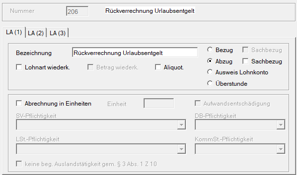
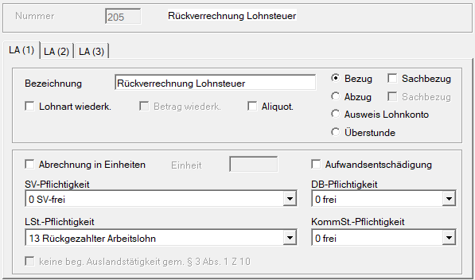
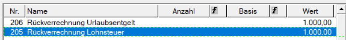
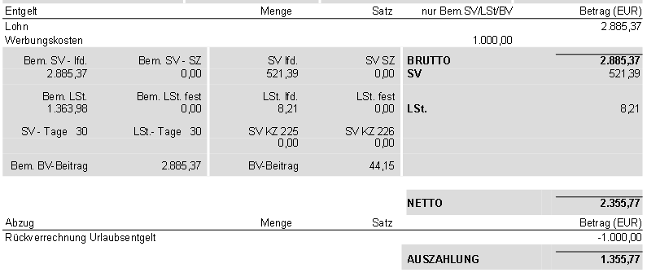
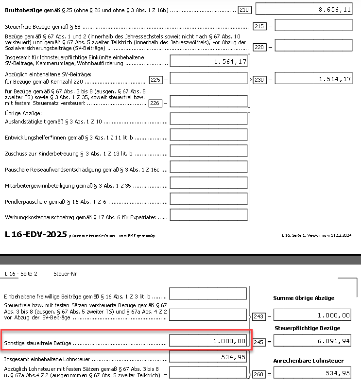

# Rückverrechnung von Urlaubsentgelt

Verlässt ein Dienstnehmer das Unternehmen und hat dabei mehr Urlaub konsumiert, als ihm anteilig zusteht, so ist das zu viel erhaltene Urlaubsentgelt im Fall eines **unberechtigten vorzeitigen Austritts** oder einer **verschuldeten Entlassung vom Dienstnehmer** an den Dienstgeber zurückzuerstatten.

Die Rückverrechnung erfolgt über einen **Bruttominusbetrag**.

**Sozialversicherung und Lohnnebenkosten**

Für die Sozialversicherung, Betriebliche Vorsorge sowie die Lohnnebenkosten (DB, DZ, Kommunalsteuer) wird die Bemessungsgrundlage **nicht reduziert**.

Quelle: [ÖGK](https://www.gesundheitskasse.at/cdscontent/?contentid=10007.892176&portal=oegkdgportal)

**Lohnsteuer**

Lohnsteuerlich handelt es sich um eine Rückzahlung von Arbeitslohn, die als Werbungskosten gemäß [§ 16 Abs. 2 EStG](https://www.ris.bka.gv.at/NormDokument.wxe?Abfrage=Bundesnormen&Gesetzesnummer=10004570&Artikel=&Paragraf=16&Anlage=&Uebergangsrecht=)) zu behandeln ist. Dadurch reduziert sich die Lohnsteuer-Bemessungsgrundlage. (vgl. [Lohnsteuerrichtlinie RZ 319a](https://findok.bmf.gv.at/findok/volltext(suche:Standardsuche)?segmentId=af96b89b-0d22-4bba-b160-b42903369ad0))

Am Jahreslohnzettel L16 ist der rückverrechnete Betrag unter "sonstige steuerfreie Bezüge" (Kennzahl 243) anzuführen. (vgl. [Lohnsteuerrichtlinie Rz 319](https://findok.bmf.gv.at/findok/volltext(suche:Standardsuche)?segmentId=af96b89b-0d22-4bba-b160-b42903369ad0))

## Abrechnungsbeispiel in der RZL-Lohnverrechnung

Rückverrechnung Urlaubsentgelt von EUR 1.000,00 brutto.

**Benötigte Lohnarten**

*Abzug Bruttobetrag Urlaubsentgelt*

{width="500"}

*Verringerung der Lohnsteuer-Bemessung*

{width="500"}

In alle zwei Lohnarten wird der Betrag EUR 1.000,00 berücksichtigt.

**Auszug freie Lohnarten**

{width="500"}

**Auszug Abrechnung**

{width="600"}

**Auszug Jahreslohnzettel L16**

{width="600"}

!!! warning "Hinweis"
    Bei den oben aufgeführten Musterlohnarten handelt es sich lediglich um unverbindliche Vorschläge. Die endgültige Auswahl, Anpassung und rechtliche Prüfung obliegt ausschließlich dem Anwender. Eine Haftung für die Richtigkeit, Vollständigkeit oder Anwendbarkeit der Vorschläge wird nicht übernommen.