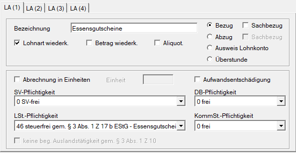
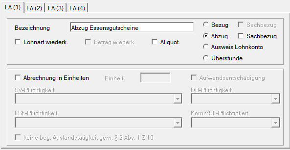

# Abrechnung Essensgutscheine

Seit 2026 müssen Essensgutscheine gemäß § 3 Abs. 1 Z 17 lit. b EStG sowohl im Jahreslohnkonto als auch im Jahreslohnzettel erfasst werden. Damit die Werte dort korrekt ausgewiesen werden, sind Essensgutscheine über die Lohnsteuerpflichtigkeit Nr. *46 steuerfreie Bezüge gem. § 3 Abs. 1 Z 17 lit. b EStG* abzurechnen.

## Musterlohnart für Essensgutscheine

| Abgabenart         | frei/pflichtig | Paragraph                                                                                                                                                                                       |
| :----------------- | :------------- | :---------------------------------------------------------------------------------------------------------------------------------------------------------------------------------------------- |
| Sozialversicherung | frei           | [§ 49 Abs. 3 Z 12 Allgemeines Sozialversicherungsgesetz](https://www.ris.bka.gv.at/NormDokument.wxe?Abfrage=Bundesnormen&Gesetzesnummer=10008147&Artikel=&Paragraf=49&Anlage=&Uebergangsrecht=) |
| Lohnsteuer         | frei           | [§ 3 Abs. 1 Z 17 lit. b Einkommenssteuergesetz](https://www.ris.bka.gv.at/NormDokument.wxe?Abfrage=Bundesnormen&Gesetzesnummer=10004570&Artikel=&Paragraf=3&Anlage=&Uebergangsrecht=)           |
| DB / DZ            | frei           | [§ 41 Abs. 4 lit. c Familienlastenausgleichsgesetz](https://www.ris.bka.gv.at/NormDokument.wxe?Abfrage=Bundesnormen&Gesetzesnummer=10008220&Artikel=&Paragraf=41&Anlage=&Uebergangsrecht=)      |
| Kommunalsteuer     | frei           | [§ 5 Abs. 2 lit. c Kommunalsteuergesetz](https://www.ris.bka.gv.at/NormDokument.wxe?Abfrage=Bundesnormen&Gesetzesnummer=10004841&Artikel=&Paragraf=5&Anlage=&Uebergangsrecht=)                  |

Da die Gutscheine bereits an die Dienstnehmer ausgegeben wurden, müssen diese zusätzlich über eine Abzugslohnart wieder abgezogen werden. Andernfalls würde der Dienstnehmer den Betrag doppelt erhalten.

!!! warning "Hinweis"
    Für die Anlage dieser Lohnarten ist der Anwender selbst verantwortlich. Die RZL Software GmbH übernimmt hierfür keinerlei Haftung.