# Hospizkarenz

Bei einer Hospizkarenz erfolgt keine normale Abmeldung des Dienstnehmers bzw. der Dienstnehmerin bei der ÖGK. Stattdessen wird für den Zeitraum der Hospizkarenz eine eigene Anmeldung erstellt. Nach Ende der Hospizkarenz erfolgt die entsprechende Abmeldung.

Aus diesem Grund darf im *Austrittsbildschirm* kein regulärer Austritt erfasst werden. Die erforderlichen Daten werden ausschließlich im Bereich ***Hospizkarenz*** eingetragen.

## Welche Fälle zählen zur Hospizkarenz?

Dazu zählen

- Familienhospizkarenz gegen Entfall des Entgelts
- Pflegekarenz gegen Entfall des Entgelts
- Familienhospizteilzeit mit Herabsetzung des Entgelts unter die Geringfügigkeitsgrenze
- Pflegeteilzeit mit Herabsetzung des Entgelts unter die Geringfügigkeitsgrenze
- Pflegekarenzgeld während Freistellung wegen Kinderrehabilitation

## Abrechnungsbeispiel: Pflegekarenz gegen Entfall des Entgelts

Dieses Beispiel gilt auch für die **Familienhospizkarenz gegen Entfall des Entgelts** sowie für das **Pflegekarenzgeld während einer Freistellung wegen Kinderrehabilitation**.

### Fallbeispiel

Die Dienstnehmerin befindet sich von **17.08.2026 bis 16.11.2026** in Pflegekarenz.

Der reguläre Austritt bleibt unangetastet.

#### Abrechnung August

Tragen Sie im *Austrittsbildschirm* im Bereich [*Hospizkarenz*](../Abrechnungsbildschirme/Austritt.md/#hospizkarenz) den entsprechenden *Zeitraum* ein und wählen Sie die zutreffende *Hospizkarenzart* aus.

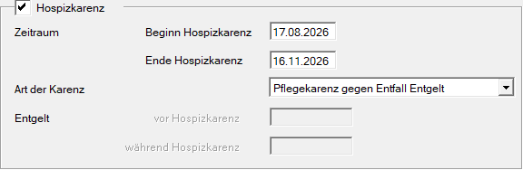

!!! warning "Hinweis"
    Die Felder *Entgelt vor der Hospizkarenz* und *Entgelt während der Hospizkarenz* müssen nur bei einer **Teilzeit** befüllt werden. Bei einer Karenz sind diese Felder ausgegraut und können nicht befüllt werden.

Da kein Austritt erfasst wird, erfolgt **keine** automatische Kürzung des Lohns bzw. Gehalts. Der Bezug muss für die Dauer der Hospizkarenz manuell angepasst werden.

Im Beispiel beträgt das monatliche Gehalt EUR 3.400,00. Für August erhält die Dienstnehmerin daher:

EUR 3.400,00 : 31 × 16 = EUR 1.754,84

Je nach anzuwendender Aliquotierungsregel kann alternativ auch mit 30 Tagen gerechnet werden.

Tragen Sie den aliquoten Betrag anschließend bei den *Fixen Lohnarten* unter [*Lohn/Gehalt*](../Abrechnungsbildschirme/Fixe_Lohnarten.md/#lohn-gehalt) ein. Im Beispiel sind dies EUR 1.754,84.

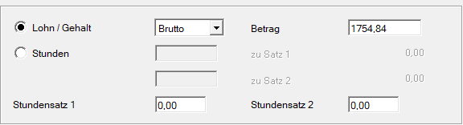

!!! warning "Hinweis"
    Wenn Sie das HGKV-Modul verwenden, kann unter diesen Umständen der Hinweis erscheinen, dass der KV-Mindestbezug unterschritten wurde. Dieser Hinweis kann in diesem Fall ignoriert werden.

Beim Speichern der Abrechnung erscheint die Abfrage, ob die *Familienhospiz-Anmeldung in die ÖGK-Datei gestellt werden soll*.

Bestätigen Sie diese Abfrage mit **Ja**. Dadurch wird die Anmeldung erstellt und muss anschließend nur noch versendet werden.

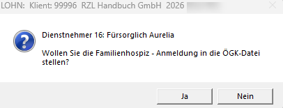

!!! warning "Hinweis"
    Während einer Pflegekarenz gegen vollständigen Entfall des Entgelts sind vom Dienstgeber **keine** Beiträge zur Betrieblichen Vorsorge abzuführen.

#### Abrechnung September und Oktober

Führen Sie eine [*laufende Abrechnung mit Änderung*](../Abrechnungen/Laufende_Abrechnung_mit_Aenderung.md) durch.

Tragen Sie bei den *Fixen Lohnarten* unter [*Lohn/Gehalt*](../Abrechnungsbildschirme/Fixe_Lohnarten.md/#lohn-gehalt) den Betrag **EUR 0,00** ein. Während dieser beiden Monate erhält die Dienstnehmerin kein Entgelt vom Dienstgeber.

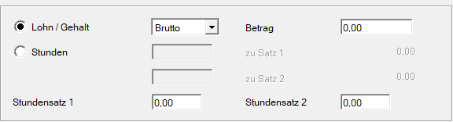

#### Abrechnung November

Die Dienstnehmerin befindet sich bis einschließlich **16.11.2026** in Pflegekarenz. Für den verbleibenden Zeitraum im November erhält sie daher:

EUR 3.400,00 : 30 × 14 = EUR 1.586,67

Diesen Betrag müssen Sie wieder manuell bei den [*Fixen Lohnarten*](../Abrechnungsbildschirme/Fixe_Lohnarten.md/#lohn-gehalt) eintragen.

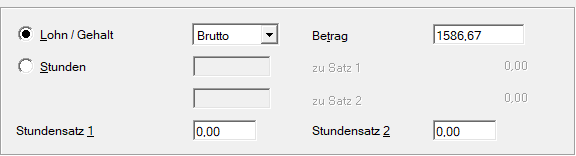

Beim Speichern der Abrechnung erscheint die Abfrage, ob *die Familienhospiz-Abmeldung in die ÖGK-Datei gestellt werden soll*.

Bestätigen Sie diese Abfrage mit **Ja**. Dadurch wird die Abmeldung erstellt und muss anschließend nur noch versendet werden.

!!! warning "Hinweis"
    Wird eine Hospizkarenz, die am **1. eines Monats** beginnt, bereits im Vormonat vor Beginn der Hospizkarenz erfasst, wird die Anmeldung zu diesem Zeitpunkt noch nicht erstellt. Damit die Anmeldung zur Hospizkarenz ausgegeben wird, müssen Sie den Monat abrechnen, in dem die Hospizkarenz beginnt.

## Abrechnungsbeispiel: Zwei Pflegekarenzen in einem Monat

### Fallbeispiel

Die Dienstnehmerin befindet sich in folgenden Zeiträumen in Pflegekarenz:

- **07.09.2026 bis 11.09.2026**
- **23.09.2026 bis 23.12.2026**

Da zwei Pflegekarenzzeiträume innerhalb desselben Monats vorliegen, sind zusätzliche Schritte erforderlich.

#### Erste Abrechnung September

Tragen Sie im *Austrittsbildschirm* im Bereich [*Hospizkarenz*](../Abrechnungsbildschirme/Austritt.md/#hospizkarenz) zunächst den ersten *Zeitraum* ein und wählen Sie die entsprechende *Hospizkarenzart* aus.

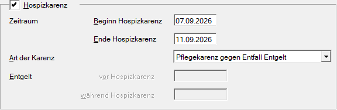

Da der Lohn bzw. das Gehalt nicht automatisch gekürzt wird, müssen Sie den Bezug bei den [Fixen Lohnarten](../Abrechnungsbildschirme/Fixe_Lohnarten.md/#lohn-gehalt) manuell anpassen.

Im Beispiel beträgt der monatliche Bezug EUR 3.000,00. Für den Zeitraum bis zum Beginn der ersten Pflegekarenz ergibt sich:

EUR 3.000,00 : 30 × 6 = EUR 600,00

Zusätzlich müssen Sie im Bereich *Stammdaten Fristen* das Häkchen bei [*Aliquotierung*](../Abrechnungsbildschirme/Stammdaten_Fristen.md/#rundung-und-aliquotierung) entfernen.

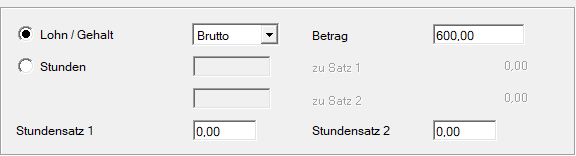

!!! warning "Hinweis"
    Wenn Sie das HGKV-Modul verwenden, kann unter diesen Umständen der Hinweis erscheinen, dass der KV-Mindestbezug unterschritten wurde. Dieser Hinweis kann in diesem Fall ignoriert werden.

Speichern Sie die Abrechnung.

Bestätigen Sie sowohl die Abfrage zur *Familienhospiz-Anmeldung* als auch jene zur *Familienhospiz-Abmeldung* mit **Ja**. Die entsprechenden Meldungen werden dadurch erstellt und müssen anschließend nur noch versendet werden.

#### Zweiten Pflegekarenzzeitraum erfassen

Sobald feststeht, dass im selben Monat ein zweiter Zeitraum der Hospizkarenz vorliegt, muss aus programmtechnischen Gründen zusätzlich ein Austrittsdatum sowie ein Ende-Entgelt-Datum erfasst werden. Dabei handelt es sich nicht um eine an die ÖGK zu meldende reguläre Abmeldung.

Als Austrittsdatum empfiehlt sich der letzte Arbeitstag vor Beginn der ersten Pflegekarenz. Im Beispiel ist dies der **06.09.2026**.

Erfassen Sie dabei *keinen Austrittsgrund*, sondern ausschließlich das *Ende-Entgelt-Datum*.

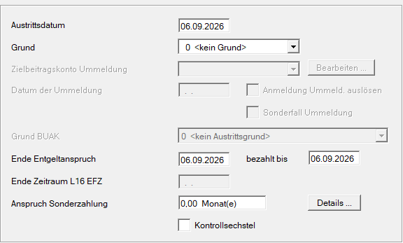

Sie erhalten keine Abfrage zur Erstellung der Abmeldung, da kein Austrittsgrund hinterlegt ist. In diesem Fall soll auch keine Abmeldung erstellt werden.

Führen Sie anschließend im **September** einen [*Wiedereintritt*](../Abrechnungen/Wiedereintritt.md) durch.

Als *Eintrittsdatum* verwenden Sie den ersten Tag nach Ende der ersten Pflegekarenz. Im Beispiel ist dies der **12.09.2026**.

Überschreiben Sie danach im *Austrittsbildschirm* im Bereich [*Hospizkarenz*](../Abrechnungsbildschirme/Austritt.md/#hospizkarenz) den bisherigen *Zeitraum* sowie die *Hospizkarenzart* und erfassen Sie die Daten des zweiten Pflegekarenzzeitraums.

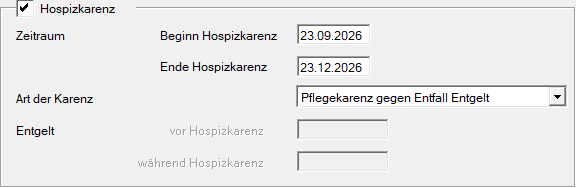

Der Bezug für den Zeitraum zwischen den beiden Pflegekarenzen muss ebenfalls manuell angepasst werden.

Im Beispiel ergibt sich für den Zeitraum 12.09.2026 bis 22.09.2026:

EUR 3.000,00 : 30 × 11 = EUR 1.100,00

Tragen Sie diesen Betrag bei den *Fixen Lohnarten* unter [*Lohn/Gehalt*](../Abrechnungsbildschirme/Fixe_Lohnarten.md/#lohn-gehalt) ein.

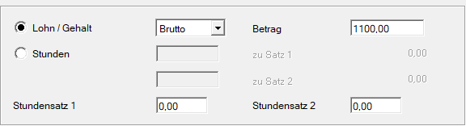

Speichern Sie anschließend die Abrechnung.

Zunächst erscheint die Abfrage, ob die reguläre **Anmeldung** in die ÖGK-Datei gestellt werden soll. Diese Abfrage müssen Sie mit **Nein** beantworten.

Der Wiedereintritt ist aus programmtechnischen Gründen erforderlich und würde eine normale Anmeldung auslösen. Diese darf jedoch **nicht** an die ÖGK übermittelt werden, da zuvor keine reguläre Abmeldung gesendet wurde.

Danach erscheint die Abfrage, ob *die Familienhospiz-Anmeldung in die ÖGK-Datei gestellt werden soll*. Diese Abfrage bestätigen Sie mit **Ja**. Die Meldung wird erstellt und muss anschließend nur noch versendet werden.

#### Abrechnung Oktober und November

Führen Sie jeweils eine [*laufende Abrechnung mit Änderung*](../Abrechnungen/Laufende_Abrechnung_mit_Aenderung.md) durch.

Tragen Sie bei den *Fixen Lohnarten* unter [*Lohn/Gehalt*](../Abrechnungsbildschirme/Fixe_Lohnarten.md/#lohn-gehalt) den Betrag **EUR 0,00** ein. Während dieser Monate erhält die Dienstnehmerin kein Entgelt vom Dienstgeber.

#### Abrechnung Dezember

Die Dienstnehmerin befindet sich bis einschließlich **23.12.2026** in Pflegekarenz.

Für die verbleibenden acht Kalendertage im Dezember ergibt sich:

EUR 3.000,00 : 31 × 8 = EUR 774,19

Diesen Betrag müssen Sie wieder manuell eintragen.

Je nach anzuwendender Aliquotierungsregel kann alternativ auch mit 30 Tagen gerechnet werden.

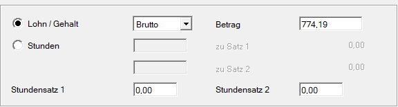

Beim Speichern der Abrechnung erscheint die Abfrage, ob *die Familienhospiz-Abmeldung in die ÖGK-Datei gestellt werden soll*.

Bestätigen Sie diese Abfrage mit **Ja**. Die Abmeldung wird erstellt und muss anschließend nur noch versendet werden.

## Abrechnungsbeispiel: Pflegeteilzeit

Auch bei einer **Pflegeteilzeit** bzw. **Familienhospizteilzeit** ist eine An- und Abmeldung bei der ÖGK erforderlich, wenn das **Entgelt unter die Geringfügigkeitsgrenze** herabgesetzt wird.

Im *Austrittsbildschirm* müssen daher im Bereich [*Hospizkarenz*](../Abrechnungsbildschirme/Austritt.md/#hospizkarenz) folgende Angaben erfasst werden:

- Zeitraum der Hospizkarenz
- Hospizkarenzart
- Entgelt vor der Hospizkarenz
- Entgelt während der Hospizkarenz

### Betriebliche Vorsorge

Während einer Pflege- bzw. Familienhospiz**teilzeit** muss die Betriebliche Vorsorge auf Basis des **Entgelts vor der Herabsetzung** berechnet werden (§ 6 Abs. 4 BMSVG).

Für die Erhöhung der BV-Bemessungsgrundlage stehen zwei Möglichkeiten zur Verfügung:

- Erfassen Sie den entsprechenden Betrag bei den *Fixen Lohnarten* im Bereich [*BV Bemessung Sonderfälle*](../Abrechnungsbildschirme/Fixe_Lohnarten.md/#bv-bemessung-fur-prasenz-zivildienst-mutterschutz-und-krankheit) bei *Krankheit*, oder
- legen Sie eine *freie Lohnart* an, die ausschließlich eine Erhöhung der BV-Bemessungsgrundlage auslöst.

Beispiel für eine entsprechende freie Lohnart:

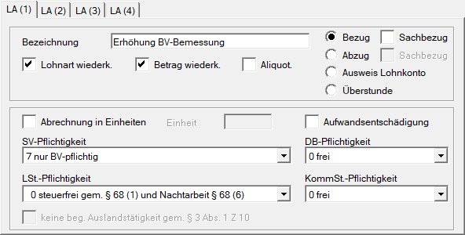

### Fallbeispiel

Die Dienstnehmerin befindet sich von **01.10.2026 bis 31.12.2026** in Pflegeteilzeit mit Herabsetzung des Entgelts unter die Geringfügigkeitsgrenze.

**Vor** der Pflegeteilzeit beträgt ihr Gehalt EUR 700,00. **Während** der Pflegeteilzeit erhält sie EUR 350,00.

Der reguläre Austritt bleibt unangetastet.

#### Abrechnung Oktober

Tragen Sie im Bereich *Hospizkarenz* den *Zeitraum* ein und wählen Sie die entsprechende *Hospizkarenzart* aus.

Erfassen Sie zusätzlich das *Entgelt vor* und *während der Hospizkarenz*.

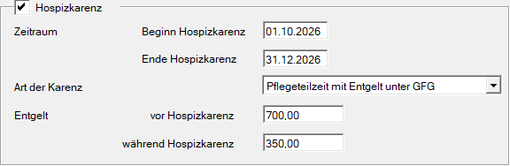

Tragen Sie anschließend bei den *Fixen Lohnarten* unter [*Lohn/Gehalt*](../Abrechnungsbildschirme/Fixe_Lohnarten.md/#lohn-gehalt) den **während** der Pflegeteilzeit zustehenden Bezug ein. Im Beispiel sind dies EUR 350,00.

Zusätzlich muss die [*Beschäftigtengruppe*](../Abrechnungsbildschirme/Sozialversicherung.md/#sv-pflicht) im *Sozialversicherungsbildschirm* angepasst werden:

- Angestellter B002 → Geringfügige Angestellte B030
- Arbeiter B001 → Geringfügiger Arbeiter B010

Erfassen Sie anschließend den Betrag, um den die BV-Bemessungsgrundlage auf das Entgelt vor der Pflegeteilzeit erhöht werden muss. Tragen Sie dazu die Differenz zwischen dem Entgelt vor der Herabsetzung und dem reduzierten Teilzeitbezug bei der entsprechenden fixen Lohnart bzw. der dafür angelegten freien Lohnart zur Erhöhung der BV-Bemessungsgrundlage ein.

Die beiden Möglichkeiten zur Erhöhung der BV-Bemessungsgrundlage sind im Abschnitt [Betriebliche Vorsorge](#betriebliche-vorsorge) beschrieben.

Im Beispiel beträgt die Differenz EUR 350,00. Dadurch wird die BV-Bemessungsgrundlage von EUR 350,00 auf das ursprüngliche Entgelt von EUR 700,00 erhöht.

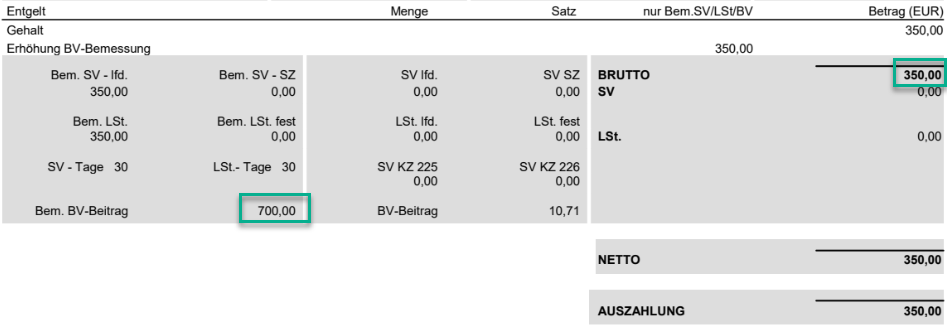

Beim Speichern der Abrechnung erscheint die Abfrage, ob *die Familienhospiz-Anmeldung in die ÖGK-Datei gestellt werden soll*.

Bestätigen Sie diese mit **Ja**. Die Anmeldung wird erstellt und muss anschließend nur noch versendet werden.

!!! warning "Hinweis"
    Beginnt die Pflegeteilzeit während eines Monats, kann die bisherige Beschäftigtengruppe in diesem Monat noch bestehen bleiben. Maßgeblich ist der gesamte beitragspflichtige Bezug des Monats. Liegt dieser insgesamt über der Geringfügigkeitsgrenze, erfolgt die Umstellung auf eine geringfügige Beschäftigtengruppe erst in einem Monat, in dem der maßgebliche Bezug die Geringfügigkeitsgrenze nicht überschreitet.

#### Folgemonate und Ende der Pflegeteilzeit

Die Folgemonate werden grundsätzlich wie der Oktober abgerechnet.

Im Dezember erscheint im Beispiel beim Speichern der Abrechnung zusätzlich die Abfrage, ob *die Familienhospiz-Abmeldung in die ÖGK-Datei gestellt werden soll*.

Bestätigen Sie diese ebenfalls mit **Ja**. Die Abmeldung wird erstellt und muss anschließend nur noch versendet werden.

!!! warning "Hinweis"
    Liegt das Entgelt während der Pflegeteilzeit **über** der Geringfügigkeitsgrenze, ist **keine** gesonderte Familienhospiz-/Pflegekarenz-Anmeldung bzw. -Abmeldung erforderlich. Die Abrechnung und die monatliche Beitragsgrundlagenmeldung erfolgen weiterhin mit dem entsprechend reduzierten Entgelt.

!!! warning "Bitte beachten"
    Die während der Pflegeteilzeit vereinbarte wöchentliche Normalarbeitszeit darf **zehn Stunden nicht unterschreiten**.