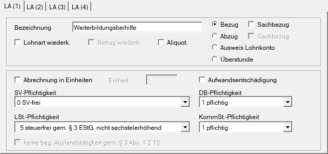

# Weiterbildungsbeihilfe gemäß § 37e AMSG

## Wichtigste Eckpunkte

- Arbeitnehmer/innen, die eine Weiterbildungsbeihilfe für Bildungskarenz oder Bildungsteilzeit beantragen, müssen vor Beginn der Bildungskarenz bzw. Bildungsteilzeit in der Regel mindestens zwölf Monate arbeitslosenversicherungspflichtig im selben Unternehmen beschäftigt gewesen sein.

- Eine Weiterbildungsbeihilfe bzw. Weiterbildungsteilzeitbeihilfe im Anschluss an eine gesetzliche Elternkarenz ist nicht möglich. Zwischen gesetzlicher Elternkarenz und Bildungskarenz bzw. Bildungsteilzeit müssen zumindest 26 Wochen arbeitslosenversicherungspflichtiger Beschäftigung liegen.

- Der/Die Arbeitnehmer/in hat mit dem AMS abzuklären, ob die angestrebte Weiterbildung hinsichtlich Umfang und arbeitsmarktpolitischer Kriterien förderbar ist.

- Die Weiterbildungsmaßnahme muss grundsätzlich mindestens **20 Wochenstunden** umfassen. Bei Personen mit Betreuungspflichten für Kinder unter sieben Jahren beträgt das Mindestausmaß **16 Wochenstunden**.

- Liegt das laufende Bruttomonatsentgelt unter **50 % der ASVG-Höchstbeitragsgrundlage** — im Jahr 2026: **€ 3.465,00** — muss der/die Arbeitnehmer/in vor der Antragstellung verpflichtend eine Bildungsberatung bei einem vom AMS beauftragten Institut absolvieren.

- Erforderlich ist eine schriftliche Vereinbarung zwischen Arbeitgeber/in und Arbeitnehmer/in über die Bildungskarenz bzw. Bildungsteilzeit. Diese Vereinbarung muss insbesondere folgende Angaben enthalten:
    - Bildungsstand des Arbeitnehmers bzw. der Arbeitnehmerin
    - Art und Dauer der Bildungsmaßnahme
    - Bildungsziel
    - bei Bildungsteilzeit zusätzlich: Ausmaß und Lage der reduzierten Arbeitszeit

- Die Vereinbarung wird erst mit dem Folgetag jenes Tages rechtswirksam, an dem dem/der Arbeitnehmer/in die Weiterbildungsbeihilfe bzw. Weiterbildungsteilzeitbeihilfe durch das AMS zuerkannt wird.

- Der/Die Arbeitnehmer/in ist verpflichtet, den/die Arbeitgeber/in unverzüglich über die Mitteilung des AMS — Zuerkennung oder Nichtzuerkennung — zu informieren.

- Bei Personen, deren laufendes Bruttomonatsentgelt mindestens **50 % der ASVG-Höchstbeitragsgrundlage** — im Jahr 2026: **€ 3.465,00** — beträgt, muss sich der/die Arbeitgeber/in bei Bildungskarenz im Voraus bereit erklären, einen Zuschuss zur Weiterbildungsbeihilfe des AMS zu leisten. Dieser Zuschuss beträgt **15 % der AMS-Beihilfe** und ist direkt an den/die karenzierte/n Arbeitnehmer/in zu zahlen. Der vom AMS ausbezahlte Beihilfenbetrag reduziert sich entsprechend.

- Bei Bildungsteilzeit besteht keine Verpflichtung des Arbeitgebers bzw. der Arbeitgeberin zur Tragung eines Zuschusses in Höhe von 15 %.

- Die für den Weiterbildungskostenzuschuss anfallenden Sozialversicherungsbeiträge werden zur Gänze vom AMS getragen. Aus betrieblicher Sicht besteht daher SV-Beitragsfreiheit.

- Betriebliche Vorsorgebeiträge gemäß BMSVG („Abfertigung Neu“) sind ebenfalls nicht zu entrichten.

- Lohnsteuer fällt gemäß § 3 Abs. 1 Z 5 lit. f EStG nicht an.

- Für Dienstgeberbeitrag, Zuschlag zum Dienstgeberbeitrag und Kommunalsteuer besteht hingegen Abgabepflicht, da keine entsprechende Befreiungsregelung vorgesehen ist.

- Aus praktischer Sicht ist davon auszugehen, dass der Weiterbildungskostenzuschuss am Lohnkonto sowie am Lohnzettel L16 im Feld **„Sonstige steuerfreie Bezüge“** anzugeben ist.

- Die AMS-Beihilfe wird an den/die Arbeitnehmer/in ausbezahlt.

- Die Höhe der Weiterbildungsbeihilfe für Bildungskarenz richtet sich nach einem einkommensabhängigen Stufenmodell. Die entsprechenden Werte sind in der nachfolgenden Fördertabelle dargestellt.

- Die Höhe der Weiterbildungsteilzeitbeihilfe für Bildungsteilzeit ist in Abhängigkeit vom Einkommen und vom Ausmaß der Arbeitszeitreduktion analog zu berechnen.

## AMS-Pauschalsatztabelle für 2026

Stufenmodell zur Höhe der Weiterbildungsbeihilfe gemäß § 37e AMSG.

| Stufe   | Allgemeine Beitragsgrundlage von | Allgemeine Beitragsgrundlage bis | Beihilfen-Tagsatz 2026 | Arbeitgeber-Beteiligung 15 % | Gesamt AMS + Arbeitgeber |
| :------ | -------------------------------: | -------------------------------: | ---------------------: | ---------------------------: | -----------------------: |
| Stufe 1 |                           551,10 |                         1.571,31 |                  41,49 |                            — |                    41,49 |
| Stufe 2 |                         1.571,32 |                         2.053,99 |                  43,09 |                            — |                    43,09 |
| Stufe 3 |                         2.054,00 |                         2.567,49 |                  44,61 |                            — |                    44,61 |
| Stufe 4 |                         2.567,50 |                         3.080,99 |                  47,28 |                            — |                    47,28 |
| Stufe 5 |                         3.081,00 |                         3.464,99 |                  54,18 |                            — |                    54,18 |
| Stufe 6 |                         3.465,00 |                         3.594,49 |                  46,06 |                         8,12 |                    54,18 |
| Stufe 7 |                         3.594,50 |                         4.107,99 |                  51,53 |                         9,09 |                    60,62 |
| Stufe 8 |                         4.108,00 |                         4.621,49 |                  56,71 |                        10,00 |                    66,71 |
| Stufe 9 |                         4.621,50 |                                — |                  59,31 |                        10,46 |                    69,77 |

Für die Weiterbildungsteilzeitbeihilfe kommt ebenfalls das Stufenmodell zur Anwendung. Eine Verpflichtung des Arbeitgebers bzw. der Arbeitgeberin zur Tragung von 15 % der Beihilfe besteht dabei jedoch nicht.

Die Höhe der Beihilfe richtet sich nach dem Ausmaß der Arbeitszeitreduktion. Die Reduktion muss mindestens **25 %** und darf höchstens **50 %** betragen.

## Musterlohnart für die Weiterbildungsbeihilfe

| Abgabenart         | frei / pflichtig | Rechtsgrundlage            |
| :----------------- | :--------------- | :------------------------- |
| Sozialversicherung | frei             | § 37e Abs. 7 AMSG          |
| Lohnsteuer         | frei             | § 3 Abs. 1 Z 5 lit. f EStG |
| DB/DZ              | pflichtig        |                            |
| Kommunalsteuer     | pflichtig        |                            |

!!! warning "Hinweis"
    Für die korrekte Anlage der Lohnart ist der Anwender bzw. die Anwenderin verantwortlich. RZL übernimmt keine Haftung.