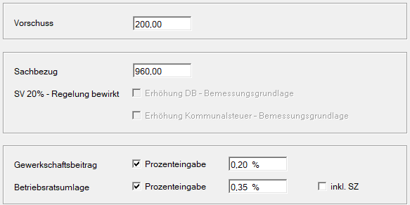

# Abzüge

**Vorschuss**

Eingabe eines vom Nettolohn abzuziehenden Vorschusses.

**Sachbezug**

Eingabe des Betrages an Sachbezug (z. B. für freie Station, KFZ-Privatnutzung usw.), der vom Nettolohn abgezogen wird. Die hier eingegebenen Beträge werden lediglich abgezogen. Ist der Sachbezug nicht im Bruttolohn enthalten, so ist er als [eigene freie Lohnart](../Freie%20Lohnarten/Anlage%20freie%20Lohnart%20Sachbezug%20-%20drei%20Möglichkeiten.md) anzulegen, damit die Berücksichtigung bei SV und LSt erfolgen kann.

!!! warning "Hinweis"
    Beachtung der Sonderregelung in der Sozialversicherung: Gemäß § 53 ASVG dürfen die dienstnehmerbezogenen SV-Beiträge maximal 20 % seiner Geldbezüge betragen, wird einem Dienstnehmer ein entsprechend hoher Sachbezug abgezogen, so kann dies Auswirkung auf die dem Dienstnehmer maximal abziehbaren SV-Beiträge haben. Diese Sonderregelung wird vom Programm automatisch berücksichtigt.

**SV – 20 % Regelung bewirkt Erhöhung …**

Durch Aktivierung dieser Felder erfolgt eine Erhöhung der DB- und Kommunalsteuerbemessung um den vom Dienstgeber übernommenen SV-Anteil des Dienstnehmers (20-%-Regelung).

**Gewerkschaftsbeitrag**

Eingabe des Betrages oder Prozentsatzes eines monatlich abzuziehenden Gewerkschaftsbeitrages. Wird hier eine Prozenteingabe vorgenommen, kann ein [maximaler Gewerkschaftsbeitrag](../Klientenstammdaten/Stammdaten%20Klient/LA,%20Formeln,%20Texte,%20Kontenplan,%20Beiträge,%20Währung.md) in den Dienstgeberstammdaten festgelegt werden.

**Betriebsratsumlage**

Eingabe des Betrages oder Prozentsatzes einer monatlich abzuziehenden Betriebsratsumlage. Wird hier eine Prozenteingabe vorgenommen, kann eine [maximale Betriebsratsumlage](../Klientenstammdaten/Stammdaten%20Klient/LA,%20Formeln,%20Texte,%20Kontenplan,%20Beiträge,%20Währung.md) in den Dienstgeberstammdaten festgelegt werden.