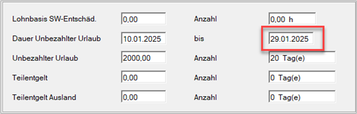
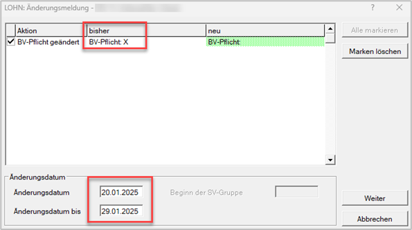

# Fixe Lohnarten

## Lohn / Gehalt

Hier können Sie einstellen, ob nach Stunden oder durch Eingabe des Grundlohnes bzw. Grundgehaltes abgerechnet werden soll. Wird nach Stunden abgerechnet, so können zwei verschiedene Stundensätze mit der entsprechenden Anzahl der Stunden eingegeben werden. Der eingegebene Stundensatz bleibt erhalten, die Stundenanzahl muss jeden Monat neu eingegeben werden.

Wird nicht nach Stunden abgerechnet, so ist der monatliche Grundlohn bzw. Grundgehalt mit bis zu 2 Nachkommastellen einzugeben. Der hier eingegebene Betrag bleibt erhalten, kann jedoch in jedem Monat geändert werden. Die Eingabe des Betrages schließt sich mit der Verrechnung nach Stunden aus. Bei Ein- oder Austritt während des Monats wird dieser Betrag aliquotiert, falls das Eingabefeld *Aliquotierung* im Bildschirm [*Stammdaten Fristen*](../Abrechnungsbildschirme/Stammdaten_Fristen.md) aktiviert wurde.

**Brutto / Netto**

Standardmäßig wird von Brutto auf Netto gerechnet. Es besteht jedoch auch die Möglichkeit, von Netto auf Brutto zu rechnen. Für diesen Fall ist der Nettobetrag unter *Lohn/Gehalt* einzugeben und das Programm ermittelt dann automatisch den richtigen Bruttobetrag.

## Zulagen, Sonderzahlungen und Diäten

**Trinkgeld**

Das Trinkgeld erhöht nur die Sozialversicherungsgrundlage, nicht jedoch den Auszahlungsbetrag. Falls [*Aliquotierung*](../Abrechnungsbildschirme/Stammdaten_Fristen.md) aktiviert ist, erfolgt eine automatische Aliquotierung dieses Betrags bei Ein- oder Austritt während des Monats.

**Sonderzahlung**

Diese Lohnart dient zur Abrechnung einer Sonderzahlung gemäß § 67 (1) und (2) EStG (Urlaubszuschuss, Weihnachtsremuneration, sonstiger Sonderzahlungen). Die Sechstelberechnung, der Freibetrag, sowie die Bagatellregelung werden vom Programm berücksichtigt. Auf der Abrechnung wird diese fixe Lohnart allgemein als *Sonderzahlung* ausgewiesen. Sollte auf der Abrechnung eine Sonderzahlung mit individueller Bezeichnung, wie *Urlaubszuschuss*, *Weihnachtsremuneration* oder *Bilanzgeld* aufscheinen, so ist dazu eine freie Lohnart mit dem entsprechenden Namen und den richtigen Pflichtigkeiten anzulegen.

**Urlaubszuschuss**

Diese Lohnart dient zur Abrechnung des Urlaubszuschusses gemäß § 67 (1) und (2) EStG. Die Sechstelberechnung, der Freibetrag sowie die Bagatellregelung werden vom Programm berücksichtigt. Auf der Abrechnung wird diese fixe Lohnart allgemein als *Urlaubszuschuss* ausgewiesen. Sollte auf der Abrechnung eine individuelle Bezeichnung, wie *Urlaubsgeld* aufscheinen, so ist dazu eine freie Lohnart mit dem entsprechenden Namen und den richtigen Pflichtigkeiten anzulegen.

**Weihnachtsremuneration**

Diese Lohnart dient zur Abrechnung der Weihnachtsremuneration gemäß § 67 (1) und (2) EStG. Die Sechstelberechnung, der Freibetrag, sowie die Bagatellregelung werden vom Programm berücksichtigt. Auf der Abrechnung wird diese fixe Lohnart allgemein als *Weihnachtsremuneration* ausgewiesen. Sollte auf der Abrechnung eine individuelle Bezeichnung, wie *Weihnachtsgeld* aufscheinen, so ist dazu eine freie Lohnart mit dem entsprechenden Namen und den richtigen Pflichtigkeiten anzulegen.

**Erschwerniszulage**

Diese Lohnart dient zur Abrechnung von Erschwerniszulagen gemäß § 68 EStG 1988. Vom Programm wird diese Lohnart als SV-pflichtig lfd. Bezug, LSt-frei gemäß § 68 EStG (bis EUR 360,00 bzw. EUR 540,00 bei Nachtarbeitern), DB-pflichtig und Kommst.-pflichtig und als monatlich wiederkehrend behandelt. Es kann jede Erschwerniszulage auch als freie Lohnart angelegt werden.

**Reisekosten frei**

In diesem Feld erfolgt die Eingabe von Aufwandsentschädigungen, die gemäß § 26 Abs. 4&nbsp;EStG steuerfrei sind. Aufwandsentschädigungen können auch als freie Lohnart angelegt werden.

**Reisekosten pflichtig**

Hier können Aufwandsentschädigungen eingegeben werden, die die Grenzen des §&nbsp;26&nbsp;Abs.&nbsp;4 überschreiten und somit lohnsteuerpflichtig und sozialversicherungspflichtig sind. Solche pflichtigen Aufwandsentschädigungen können auch als freie Lohnarten angelegt werden.

## Begünstigte Auslandstätigkeit § 3 Abs. 1 Z 10 u. 11 EStG (Montagetätigkeit)

Dieser Bereich ermöglicht die Abrechnung der Montagetätigkeit gemäß § 3 Abs. 1 Z 10 und 11 EStG.

Nach Abzug der Sozialversicherungsbeiträge können seit 2012 60 % der laufenden Einkünfte steuerfrei bleiben, wenn dieser Betrag die monatliche Höchstbeitragsgrundlage nicht übersteigt. Bezüge gemäß §§ 26 und 3 Abs. 1 Z 16b EStG (Reisekosten) bleiben dabei außer Ansatz. Sonderzahlungen fallen generell nicht unter die Befreiungsbestimmungen, da diese nur die laufenden Bezüge einschließt. Zusätzlich können die Zulagen und Zuschläge gemäß § 68 EStG während der Entsendung nicht in Anspruch genommen werden. Diese Bestimmungen werden vom Programm automatisch berücksichtigt.

Je nachdem, ob zur Vermeidung von Doppelbesteuerungen die Anrechnungsmethode oder die Befreiungsmethode (kein Häkchen im Feld *DBA-Anrechnungsmethode*) mit oder ohne Lohnsteuerabzug zur Anwendung kommt, werden unterschiedliche Lohnzettelarten erstellt (siehe Tabelle unterhalb).

## Auslandstätigkeit (keine Montage) – Besteuerungsrecht im Ausland

In diesem Bereich werden Einkünfte abgerechnet, die keine Montagetätigkeit (§ 3 Abs. 1 Z 10 u. 11 EStG) betreffen, sondern Einkünfte, wo das Besteuerungsrecht im Ausland liegt.

Je nachdem, ob zur Vermeidung von Doppelbesteuerungen die Anrechnungsmethode oder die Befreiungsmethode (kein Häkchen im Feld *DBA-Anrechnungsmethode*) mit oder ohne Lohnsteuerabzug zur Anwendung kommt, werden unterschiedliche Lohnzettelarten erstellt (siehe Tabelle unterhalb).

| Übersicht Lohnzettelarten | Auslandstätigkeit/Montagetätigkeit | Auslandstätigkeit/ Keine Montagetätigkeit |
| ------------------------- | ---------------------------------- | ----------------------------------------- |
| Befreiung/mit LSt         | LZ-Art 23                          | LZ-Art 8                                  |
| Befreiung/ohne LSt        | LZ-Art 8 und 23                    | LZ-Art 8                                  |
| Anrechnung/mit LSt        | LZ-Art 23 und 24 je Land           | LZ-Art 24 je Land                         |
| Anrechnung/ohne LSt       | LZ-Art 23 und 24 je Land           | LZ-Art 24 je Land                         |

## Urlaubsablöse und Abfertigung alt

**Urlaubsablöse**

Die Urlaubsablöse wird als SV-laufender Bezug, lohnsteuerrechtlich wie eine Sonderzahlung, DB/DZ-pflichtig und Kommunalsteuer-pflichtig behandelt.

**Abfertigung alt**

Die Abfertigung wird als SV-frei, lohnsteuerrechtlich entweder mit festem Steuersatz oder mit der Vervielfachermethode (je nachdem, welche Variante günstiger ist), DB-frei, KommSt-frei behandelt.

!!! warning "Hinweis"
    Bei der Abrechnung einer Abfertigung muss unbedingt der *Detail*-Bildschirm ausgefüllt werden, da es sonst zu einer falschen Berechnung der festen Lohnsteuer der Abfertigung kommen kann.

Eingabe des Datums, ab dem der Abfertigungsanspruch beginnt. Das *Eintrittsdatum* wird vorgeschlagen.

Eingabe von *Vordienstzeiten* in Jahren, falls diese für die Berechnung des Abfertigungs-Anspruches angerechnet werden.

Eingabe der Anzahl der Monate, um die der Abfertigungszeitraum zu *kürzen* ist (z. B. bei Karenzurlaub).

Eingabe des *Entgeltes*, das für die Berechnung der Abfertigung maßgeblich ist. Bei der erstmaligen Eingabe wird der laufende Bezug des Monats als Entgelt vorgeschlagen. Ist der vorgeschlagene Betrag nicht die Basis für die Berechnung des Abfertigungsanspruches, so muss das entsprechende richtige Entgelt hier eingegeben werden. Das hier eingegebene Entgelt dient als Grundlage für den Vorteilsvergleich bei der Berechnung der Lohnsteuer (Vervielfachermethode oder fester Steuersatz).

Eingabe des *Sonderzahlungsanspruches*, der für die Berechnung der Abfertigung maßgeblich ist. Entweder Eingabe des Gesamtjahresanspruches oder des Anspruches in Monaten (vom Programm werden Eingabewerte unter 20 als Monatseingaben gewertet).

Aufgrund der für die Abfertigung maßgeblichen Daten wird vom Programm automatisch der *Abfertigungsanspruch* berechnet und vorgeschlagen. Dieser kann auch abgeändert werden. Eine solche Änderung ist durch ein Sternchen (*) vor dem Betragsfeld ersichtlich.

## Schlechtwetterentschädigung, unbezahlter Urlaub und Teilentgelt

**Lohnbasis SW-Entschädigung**

Eingabe des vollen Stundensatzes und der Stundenanzahl. Es werden davon automatisch 60 % gerechnet. Die Differenz (= 40 %) wird bis zur Krankenversicherungshöchstbeitragsgrundlage in der Zuschlagsgruppe Z06 bzw. Z11 (Lehrlinge) (nur Dienstgeberanteil) abgerechnet.

**Unbezahlter Urlaub**

Eingabe der Zahl der Tage und des Grundlohns für den Zeitraum des unbezahlten Urlaubs für Zwecke der Sozialversicherung. Für die Zeit des unbezahlten Urlaubes hat der Dienstnehmer die Sozialversicherungsbeiträge (einschließlich Schlechtwetterbeitrag), auch die Dienstgeberanteile, zur Gänze zu tragen. Die KU, der WF und die
LKU (außer in der Steiermark und Kärnten) entfallen für solche Zeiträume. Der IESG-Zuschlag und der Beitrag gemäß dem Nachtschicht-Schwerarbeitsgesetz sind jedoch vom Dienstgeber zu entrichten. Seit 01.01.2025 erwartet sich die ÖGK bei einem kürzer als ein Monat andauernden Unbezahlten Urlaub eine Änderungsmeldung mit der Abmeldung von der Betrieblichen Vorsorgekasse.

- **Verlängerung des Unbezahlten Urlaubs**
    
    Kommt es zur Verlängerung des Unbezahlten Urlaubs muss das *Bis-Datum* entsprechend geändert werden. Zum Beispiel neues Bis-Datum ist der 29.01.2025

    {width="500"}

    Danach erfolgt eine erneute Änderungsmeldung mit dem neuen Von-Bis-Datum 20.01.2025 bis 29.01.2025

    {width="500"}

    Es wird **nicht** wieder der vollständige Zeitraum angeführt, sondern nur die neue Änderung.

- **Verkürzung des Unbezahlten Urlaubs**

    Kommt es zu einer Verkürzung des unbezahlten Urlaubes, dann muss die BV-Pflicht für diesen Zeitraum wieder aktiviert werden. In diesem Fall wird eine Änderungsmeldung mit dem Zeitraum vom ursprünglichen Datum gesendet:
    
    {width="500"}

- **Veränderung des Von- UND Bis-Datums**
    
    Eine gleichzeitige Änderung des Von und Bis-Datums ist nicht möglich. Es erfolgt folgende Meldung:
 
    {width="300"}

    Sie müssen zuerst die Änderung für das Von-Datum vornehmen. Änderungsmeldung erstellen und versenden. Danach können Sie das Bis-Datum verändern und die Änderungsmeldung versenden.

**Teilentgelt**

Hier sind die Anzahl der Tage und der Betrag des Teilentgeltes einzugeben. Es ist zu beachten, dass hier nur das beitragspflichtige Teilentgelt eingegeben werden darf. Ein nicht beitragspflichtiges Teilentgelt (z. B. beim Lehrling) muss als freie Lohnart definiert werden.

**Teilentgelt Ausland**

Wenn der Bezug von Teilentgelt in eine Periode mit Auslandstätigkeit fällt, können hier die Eintragungen vorgenommen werden. Die Abrechnung in diesen Feldern wird lohnsteuerfrei gerechnet.

## BUAK-Direktauzahlung

Die Abwicklung der Direktauszahlung von Urlaubsentgelt ist ab 1.4.2010 in diesem Bereich der Fixen Lohnarten.

Die BUAK zahlt dem Arbeitnehmer das Netto-Urlaubsentgelt aus, die darauf entfallende Lohnsteuer wird an das zuständige Finanzamt abgeführt. Die SV-Beiträge (Dienstnehmer- und Dienstgeberanteil) und die Lohnnebenkosten führt die BUAK ebenfalls ab.

Die BUAK versendet pro Dienstnehmer nachfolgende Informationen, die in der Lohnverrechnung berücksichtigt werden müssen.

Aus dem oben angeführten Beispiel müssen die Ziffern in der Abrechnung erfasst werden.

{width="500"}

Innerhalb des RZL Lohnverrechnungsprogrammes ist der Bildschirm wie das Schreiben der BUAK aufgebaut.

Die Eintragung im RZL Feld *Monat der RV* muss nicht dasselbe Monat sein, sondern kann abhängig von der Zahlung der BUAK an die Behörden auch ein Folgemonat sein.

!!! info "Tipp"
    Wird in der Dezember-Abrechnung bei *Monat der RV* ***1*** eingetragen, dann erkennt das Lohnprogramm automatisch, dass es sich um den Jänner des nächsten Jahres handelt.

## BUAK-Treuhandkonto

{width="500"}

{width="700"}

Im Kontextmenü wählen Sie *BUAK–Urlaubsentgeltverrechnung* aus.

{width="700"}

Durch Anwahl *Werte übernehmen* können die in diesem Bildschirm angeführten Beträge in die vorgesehenen Felder importiert werden.

Es erfolgt eine automatische Aufteilung des Urlaubsentgelts und des Urlaubszuschusses der BUAK.

**UZ (BUAG**)

Seit 1.1.2012 darf der Urlaubszuschuss für Dienstnehmer, die dem BUAG unterliegen und die keine Direktauszahlung von der BUAK erhalten, nicht als normale Sonderzahlung abgerechnet werden.

Die Eintragung kann im Feld *UZ (BUAG)* erfolgen. Die Versteuerung erfolgt mit 6 % ohne Berücksichtigung des Freibetrages (EUR 620,00), ohne Berücksichtigung der Freigrenze (ab 2024: EUR 2.447,00 bis 2023: EUR 2.100,00) und ohne Anrechnung auf das Jahreszwölftel. Der Urlaubszuschuss kann auch mit einer freien Lohnart mit Lohnsteuerpflichtigkeit *Nr. 3 LSt. gem. §&nbsp;67 ohne Freibetrag von 620,00 ohne Sechstelbestimmung* abgerechnet werden.

Damit das Feld *UZ (BUAG)* ausgefüllt werden kann und für weitere sonstige Bezüge (Weihnachtsremuneration) das Jahreszwölftel gemäß § 67 (5) EStG berücksichtigt wird, muss im Abrechnungsbildschirm *Sozialversicherung* im Bereich [*Bauarbeiter- Urlaubs- und Abfertigungskasse (BUAK)*](../Bauarbeiter_Urlaubs_und_Abfertigungskasse/Abrechnungsbildschirm_Bauarbeiter_Urlaubs_und_Abfertigungskasse.md) das Häkchen gesetzt sein.

## BV-Bemessung für Präsenz-/Zivildienst, Mutterschutz und Krankheit

{width="500"}

Bei Ableistung von Präsenz- und Zivildienst und beim Bezug von Wochen- und Krankengeld sind vom Dienstgeber die BV-Beiträge weiter an die BV-Kasse abzuführen.

Aufgrund des im Abrechnungsbildschirm [*Austritt*](../Abrechnungsbildschirme/Austritt.md) eingetragenen Austrittsgrunds (Präsenz- bzw. Zivildienst, Wochengeld) wird vom Programm automatisch die Bemessungsgrundlage in das jeweilige Feld eingetragen.

Beim Bezug von Krankengeld ist die Eintragung und Aliquotierung manuell vorzunehmen.

Für Zeiten des Kinderbetreuungsgeldbezuges, der Bildungskarenz und der Hospizkarenz werden die Abfertigungsbeiträge vom Familienlastenausgleichsfonds gezahlt. Den Arbeit­geber trifft für diese Zeiten keine Beitragspflicht.

!!! info "Tipp"
    Für die korrekte Berücksichtigung der Sonderzahlung ist die Schaltfläche B*V-Bemessung Vorjahr* anzuwählen und es sind die entsprechenden Eintragungen vorzunehmen.

## Start-Up-Mitarbeiterbeteiligung (ab 2024)

Siehe [Start-Up-Mitarbeiterbeteiligung](../Abrechnungen_Sonderfaelle/Start-Up-Mitarbeiterbeteiligung.md)

## Sonder-Berechnung

{width="500"}

In Ausnahmefällen kann die Berechnung der Lohnsteuer und/oder der Sozialversicherung durch den Benutzer abweichend eingetragen bzw. geändert werden. Durch Anwahl der *rechten Maustaste* oder der Tastenkombination *Strg + 0,* kann der Wert im jeweiligen Feld *Explizit 0* gesetzt werden.

Eingabe der *abweichenden Lohnsteuer* getrennt nach laufender und fester Lohnsteuer gemäß §&nbsp;67&nbsp;(1) und § 67 (3) EStG 1988. Wird eine abweichende Lohnsteuer eingegeben, so ist immer die gesamte Lohnsteuer der Abrechnung (laufende und feste Lohnsteuer) einzugeben.

Wie bei der abweichenden Lohnsteuer kann auch die *Sozialversicherung* bei Vorliegen eines speziellen Falles *abweichend* eingegeben werden. Im Feld *Betrag* ist immer der gesamte SV-Arbeitnehmeranteil einzutragen, in den beiden Eingabefeldern KZ 225 und KZ 226 jener SV-Anteil, der auf diese beiden Kennziffern gemäß Lohnzettel entfällt.

Das Programm berechnet bei Ein- und Austritten während eines Monats die SV und LSt-Tage automatisch. Eine davon abweichende Regelung kann in den Feldern *abw. SV* und *LST-Tage* vorgenommen werden.

Im Feld *abw. BV-Bemessung* kann die automatische Berechnung der BV-Bemessung durch eine abweichende Eintragung geändert werden.

## BVA/Eisenbahn/Bergbau – Bem. Krankenversicherung während der Karenz

Wenn in den Stammdaten des Klienten im [Registerblatt *ÖGK, BV-Kasse*](../Klientenstammdaten//Stammdaten_Klient/OEGK_BV-Kasse.md) die Versicherungsanstalt für öffentlich Bedienstete, Eisenbahnen oder Bergbau ausgewählt ist, kann hier die Bemessungsgrundlage für die Krankenversicherung während der Karenz eingetragen werden. Dies betrifft beispielsweise die Tarifgruppen V603, V604, V605, V606, V607.