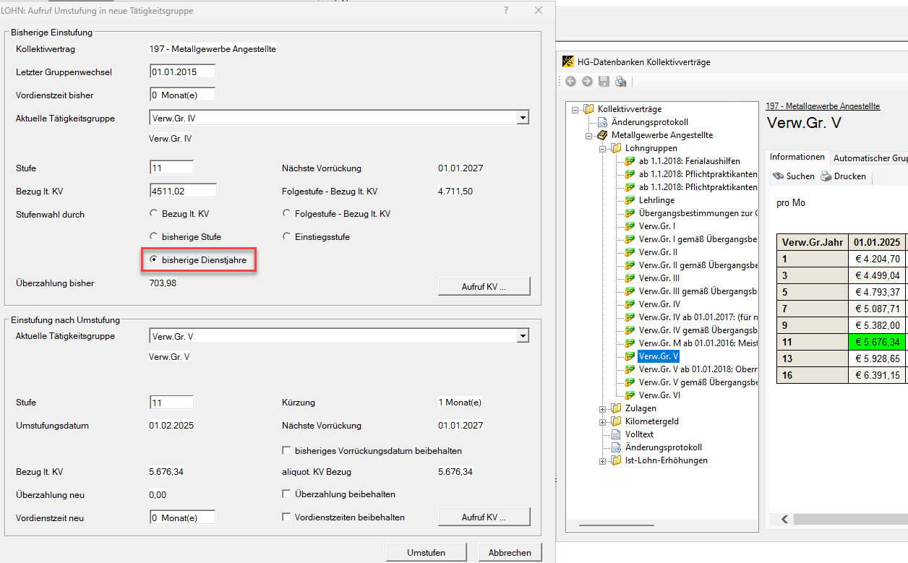

# Kollektivvertrag

Dieser Abrechnungsbildschirm bietet im ersten Bereich die Verknüpfung mit der HGKV-Datenbank (Kollektivvertragsdatenbank). Im zweiten Bereich können Kollektivvertragsdaten manuell eingetragen werden. Die manuelle Eintragung ist nur möglich, wenn der Bereich *HGKV-DB* nicht aktiviert ist.

## HGKV-DB

Mit den in diesem Bereich getroffenen Einstellungen weist das Programm auf „Bezüge unter KV-Mindestlohn“ und auf „Bezüge unter vereinbarter KV-Überzahlung“ hin. Im Abrechnungsbildschirm *Fixe Lohnarten* kann im Feld *Betrag* bzw. in den Feldern *Stundensatz 1* und *2* mit der Tastenkombination *Strg + K* der KV-Bezug (mit oder ohne Überzahlung) automatisch übernommen werden.

**Kollektivvertrag**

Durch Anwahl der *F2-Taste* können die in den *Klientenstammdaten* hinterlegten [Kollektivverträge](../Klientenstammdaten/Stammdaten_Klient/Kostenstellen_Kostentraeger_Krankenstandsbescheinigungen_KV.md) aufgerufen und dem Dienstnehmer zugeordnet werden.

**Beginn Einstufung**

In diesem Feld wird der Beginn der erstmaligen Einstufung eingetragen. Mit der *F2-Taste* wird das Eintrittsdatum vorgeschlagen.

**Vordienstzeit**

Die Eintragung von anrechenbaren Vordienstzeiten kann hier in Monaten eingetragen werden.

**Umstufung Tätigkeitsgruppe** 

Dieser Punkt wurde ursprünglich für den Kollektivvertrag Handel Angestellte geschaffen und kann aber nun auch für alle anderen Kollektivverträge angewendet werden. (Näheres zur Umstufung KV-Handel finden Sie [hier](../Kollektivvertraege/Umstellung_KV_Handel_Angestellte.md)).

{width="600"}

In diesem Dialog wird oben immer die bisherige Einstufung dargestellt. Im unteren Bereich wird die neue Umstufung vorgeschlagen.

Damit bei *Einstufung nach Umstufung* Werte angezeigt werden, müssen Sie bei *Bisherige Einstufung* *die Stufenwahl durch* auswählen: *Bezug lt. KV, Folgestufe – Bezug lt. KV, bisherige Stufe, Einstiegsstufe oder bisherige Dienstjahre*.

- *Bezug lt. KV*

    Bei der Stufenauswahl *Bezug lt. KV* (=bisheriger KV-Bezug) vergleicht das Lohnprogramm im Bereich *Einstufung nach Umstufung*, ob der Bezug mindestens dem bisherigen KV-Bezug (EUR&nbsp;4.511,02) entspricht. In unserem Beispiel ist der nächst höhere Bezug in der Stufe 5 in der Gruppe 5 (EUR 4.793,37).

    

- *Folgestufe – Bezug lt. KV*

    Bei der Stufenauswahl ***Folgestufe - Bezug lt. KV*** vergleicht das Lohnprogramm im Bereich *Einstufung nach Umstufung*, ob der Bezug mindestens der bisherigen Folgestufe KV-Bezug (EUR&nbsp;4.711,50) entspricht. In unserem Beispiel ist der nächst höhere Bezug in der Stufe 5 in der Gruppe 5 (EUR 4.793,37).

    

- *Bisherige Stufe*

    Bei der Stufenauswahl ***bisherige Stufe*** vergleicht das Lohnprogramm im Bereich *Einstufung nach Umstufung*, ob die gleiche Stufe wie zuvor angewendet wird. In unserem Beispiel Stufe&nbsp;11.

    

- *Einstiegsstufe*

    Bei der Stufenauswahl ***Einstiegsstufe*** wird im Bereich *Einstufung nach Umstufung* die Stufe 1 vorgeschlagen. Es wird die erste Stufe von dieser neuen Tätigkeitsgruppe vorgeschlagen.

    

- *bisherige Dienstjahre*
  
    Bei der Stufenauswahl ***bisherige Dienstjahre*** werden die Dienstjahre zur korrekten Ermittlung der Stufe herangezogen. Da wir uns in diesem Beispiel im 11. Dienstjahr befinden, schlägt das Lohnprogramm als nächste Stufe die Stufe 11 vor.

    

    !!! warning "Hinweis"
        Die Anzahl der Jahre für die Option *bisherige Dienstjahre* ergibt sich aus dem *Beginn der Einstufung* zuzüglich der im Feld *Vordienstzeiten* eingetragenen Zeiten. Unterbrechungen sowie Dienstjahre vor dem Beginn der Einstufung bleiben unberücksichtigt. Ob die jeweilige Option im konkreten Anlassfall korrekt ist, muss von Ihnen selbst abgewogen und entschieden werden. Bitte beachten Sie, dass es sich bei der neuen Umstufung um ein sehr komplexes Thema handelt.

!!! warning "Hinweis"
    Bei allen fünf Varianten wird die bisherige Vordienstzeit auf null gesetzt.

- *Nächste Vorrückung*

    Grundsätzlich wird für die Ermittlung des nächsten Vorrückdatums das **Umstufungsdatum** herangezogen.

    {width="600"}

    Wenn das ursprüngliche Vorrückdatum erhalten bleiben soll, dann aktivieren Sie das Häkchen bei *bisheriges Vorrückungsdatum beibehalten*.

    {width="600"}

- *Überzahlung beibehalten*

    Wenn die ursprüngliche Überzahlung beibehalten bleiben soll, dann aktivieren Sie das Feld *Überzahlung beibehalten*.

    {width="600"}

    Wenn das Feld nicht angehakt wird, dann wird die *Überzahlung neu*, erneut ermittelt.

    {width="600"}

- *Vordienstzeit neu*
    
    Im Bereich *Vordienstzeiten neu* haben Sie die Möglichkeit, durch Auswahl der Option *Vordienstzeiten beibehalten* die bisherigen Vordienstzeiten in den *Kollektivvertragsbildschirm* zu übertragen. Wenn keine Auswahl getroffen wird, werden die bisher erfassten Vordienstzeiten mit **Null** überschrieben.
    
    Über das Feld *Vordienstzeiten neu* haben Sie die Möglichkeit, bisher nicht erfasste Vordienstzeiten nachzutragen. Geben Sie hierzu die Anzahl der Vordienstzeitenmonate ein.

    !!! warning "Hinweis"  
        Wenn Sie nach der Umstufung eine manuelle Änderung der Vordienstzeiten im *Kollektivvertragsbildschirm* vornehmen, überprüfen Sie den nächsten Vorrückstichtag auf Richtigkeit. Sollte dieser nicht korrekt sein, nehmen Sie die entsprechende Anpassung im Feld *Kürzung Stufe* vor.

**Aktuelle Tätigkeitsgruppe**

In diesem Bereich muss die Tätigkeitsgruppe des Dienstnehmers angewählt werden. Durch die Verknüpfung mit dem Kollektivvertrag können sämtliche Tätigkeitsgruppen aufgerufen und angewählt werden.

**Folgegruppen**

In bestimmten Kollektivverträgen (z. B. Informationstechnik) verbleibt man eine bestimmte Zeitdauer in einer Gruppe (z. B. Einstiegsstufe) und wechselt dann automatisch in die nächsthöhere Gruppe (z. B. Regelgruppe). Diese [Folgegruppen](../Kollektivvertraege/Wann_sind_Folgegruppen_notwendig.md) werden im jeweiligen Kollektivvertrag verknüpft.

**Letzter Gruppenwechsel / Letzte Tätigkeitsgruppe**

Wenn bereits ein Wechsel innerhalb der Gruppen stattgefunden hat, zeigt das Programm den letzten Gruppenwechsel mit Datum und die letzte Tätigkeitsgruppe an.

**Stufe / abw. Stufe / abw. Stufe fixieren**

In vielen Kollektivverträgen erhöht sich mit der Anzahl der Dienstjahre auch der Bezug innerhalb einer Gruppe.

Das Programm zeigt die aktuelle Stufe an. Durch Anwahl des Felds *abw. Stufe* kann eine andere Stufenzuordnung erreicht werden. Die Stufe bezieht sich auf die linke Spalte in den Tabellen (hier zwischen 1 und 18 Jahren). Durch Anwahl *abw. Stufe fixieren*, kann die abweichende Stufe fixiert werden, das heißt, es gibt keine Vorrückungen mehr.

**Kürzung Stufe**

Durch Eintragung der Monate, um welche die Stufe gekürzt werden soll, kann ein abweichender nächster Vorrückungsstichtag ermittelt werden.

**Anzeige der KV-Daten**

Durch die Verknüpfung mit dem Kollektivvertrag werden die Normalarbeitszeit, der Stundenlohn und/oder der Bezug laut Kollektivvertrag, sowie eine Überzahlung nach Betrag bzw. prozentuell angezeigt.

Auf die hier angezeigten Werte kann im Rahmen der automatischen Berechnung mit [Lohnformeln](../Lohnformeln/Verwaltung_der_Lohnformeln_innerhalb_eines_Klienten/Anlage_von_Lohnformeln.md) zugegriffen werden.

## KV-Handel Reformbetrag 1

Durch die Umstellung von KV-Handel Angestellte ALT auf KV-Handel Angestellte NEU kann es zu einem *Reformbetrag 1* kommen. Diesen Betrag können Sie hier eintragen bzw. wird dieser vom Programm bei der Umstellung automatisch befüllt.

## Jubiläumsgelder

Wenn im Kollektivvertrag ein eindeutiges Jubiläumsgeld hinterlegt ist, dann werden hier die Felder automatisch befüllt. Wenn es keine eindeutigen Daten zum Jubiläumsgeld gibt, müssen die Felder von Ihnen befüllt werden.

## Weitere Informationen aus dem Kollektivvertrag/abweichende Einstellungen

Im Programmteil *Klient / Kanzlei / Kollektivverträge* können in der Kurzinformation zusätzliche Daten pro Kollektivvertrag eingetragen werden.

{width="500"}

Wenn diese Felder im jeweiligen Kollektivvertrag ausgefüllt werden, gelten die Eintragungen für alle Dienstnehmer, die diesem KV zugeordnet sind und werden automatisch in den Abrechnungsbildschirm *Kollektivvertrag* übernommen.

!!! warning "Hinweis"
    Diese hier gewählte Einstellung hat auf **alle Klienten**, wo dieser Kollektivvertrag hinterlegt wurde, eine Auswirkung.

**Abw. Hochrechnungsfaktor (von Stundenlohn laut KV auf Monatsbezug)**

Wenn ein Kollektivvertrag keine Monatsbezüge beinhaltet, sondern Stundenlöhne liefert, rechnet das Programm grundsätzlich automatisch aufgrund der Normalarbeitszeit laut Kollektivvertrag mit dem Multiplikator 4,33 auf einen Monatsbezug hoch.

Das Feld *Hochrechnungsfaktor* muss nur ausgefüllt werden, wenn die Hochrechnung vom Stundenlohn auf einen Monatslohn mit einem abweichenden Teiler (laut Kollektivvertrag) durchgeführt werden muss.

**abw. Std.-Teiler-Teilzeit**

Manche Kollektivverträge schreiben für die Berechnung der Teilzeitbezüge – ausgehend von einem Monatsbezug – abweichende Stundenteiler vor. In diesem Feld ist ein abweichender Stundenteiler für die Berechnung des Teilzeitbezugs einzutragen.

**Überzahlung**

Im Bereich der Überzahlung kann pro Kollektivvertrag festgelegt werden, ob Überzahlungen beibehalten werden müssen. Wenn das Feld *Bei Biennalsprung beibehalten* aktiviert ist, bleibt die Überzahlung auch nach einer Erhöhung aufgrund der Dienstjahre in voller Höhe aufrecht.

Soll die Überzahlung nicht betraglich, sondern prozentuell beibehalten werden, ist das Feld *Prozentuelle Überzahlung beibehalten* zu aktivieren.

## Abweichende Einstellungen für einzelne Dienstnehmer

Innerhalb des Abrechnungsbildschirms *Kollektivvertrag* können beim Dienstnehmer im Bereich *abw. Einstellungen für diesen Dienstnehmer* abweichende Eingaben eingetragen werden.

{width="500"}

**Abw. Normalarbeitszeit lt. KV**

Das Feld *abw. Normalarbeitszeit lt. KV* ist für Sonderfälle, wenn ein Kollektivvertrag mehrere Normalarbeitszeiten kennt (z. B. Nahrungs- und Genussmittelindustrie). Mit diesem Feld kann der (automatische) Eintrag im Feld *Arbeitszeit lt. KV* übersteuert werden.

**abw. Zu-/Abschlag KV-Bezug**

Der IT-Kollektivvertrag (Datenverarbeitung Informationstechnik) sieht beispielsweise vor, dass Ferialpraktikanten/Ferialaushilfen als Mindestgehalt 50 % des Kollektivvertragsgehaltes erhalten.

Dieses Feld ermöglicht die Eingabe eines Zu- oder Abschlags zum Bezug laut Kollektivvertrag in Prozent. Die Eingabe eines Abschlags erfolgt mit dem Bindestrich auf der Tastatur.

!!! info "Tipp"
    Durch Anwahl der Tastenkombination *Alt – F8* kann der beim Dienstnehmer ausgewählte Kollektivvertrag aufgerufen werden.

Die abonnierten Kollektivverträge müssen in den *Klientenstammdaten* zugeordnet werden. Die Zuordnung erfolgt im [Registerblatt *Kostenstellen, Krankenstandsbesch., KV* im Bereich *Kollektivverträge*](..//Klientenstammdaten/Stammdaten_Klient/Kostenstellen_Kostentraeger_Krankenstandsbescheinigungen_KV.md).

{width="500"}

## Manuelle Eingabe von Kollektivvertragsdaten

{width="500"}

Die manuelle Eintragung von Kollektivvertragsdaten ist nur möglich, wenn der Bereich *HGKV-DB* nicht aktiviert ist.

**Kollektivvertrag**

Eingabe des anzuwendenden Kollektivvertrages. Die Eintragung wird für die Erstellung des Dienstzettels verwendet.

**Stundensatz laut KV / Bezug laut KV**

Auf die hier eingetragenen Werte kann im Rahmen der automatischen Berechnung mit [Lohnformeln](../Lohnformeln/Verwaltung_der_Lohnformeln_innerhalb_eines_Klienten/Anlage_von_Lohnformeln.md) zugegriffen werden.