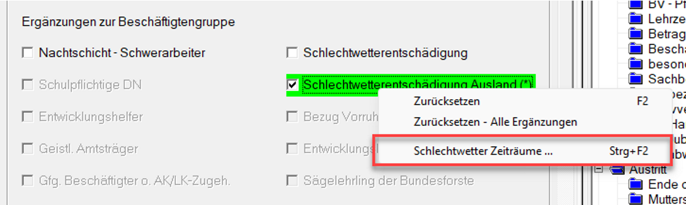
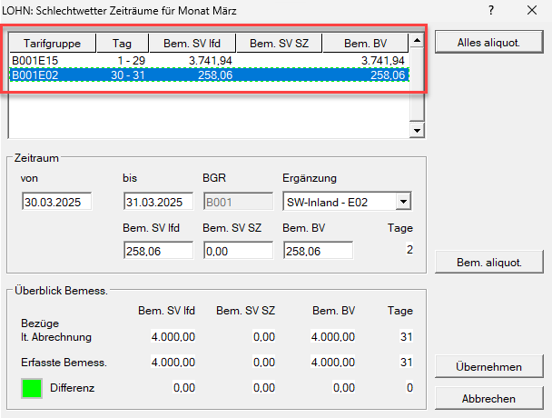
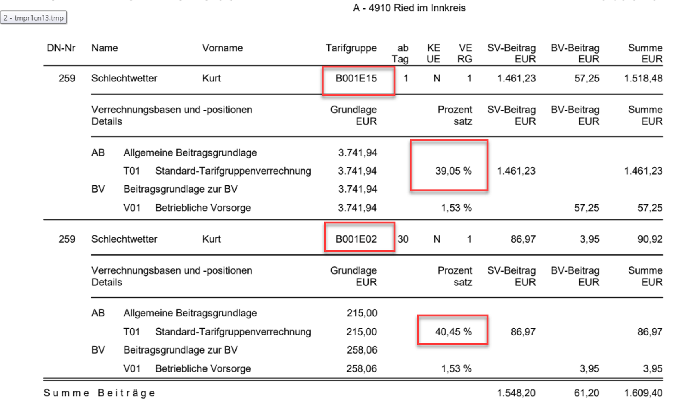

# Sozialversicherung

**SV-Pflicht**

- **Bundesland**

    Eingabe des Bundeslandes, in welchem der Dienstnehmer bei der ÖGK angemeldet ist, durch Auswahl aus der vorgegebenen Liste der österreichischen Bundesländer. Neben dem Eintrag *ÖGK-Nummer* wird die in den Stammdaten des Klienten eingetragene Beitragskontonummer angezeigt. Sollte keine Kontonummer vorhanden sein, erfolgt ein Warnhinweis.

- **Filter Beschäftigtengruppe**

    

    Hier kann die Beschäftigtengruppenauswahl gefiltert werden. Somit erscheinen nur die benötigten Beschäftigungsgruppen.

- **Beschäftigungsgruppe**

    Eingabe der Beschäftigungsgruppe durch Auswahl aus der vorgegebenen Liste der im Programm vorgesehenen Beschäftigungsgruppen.

    Aufgrund der gewählten Beschäftigungsgruppe werden die jeweiligen Felder hinsichtlich der Nebenbeiträge automatisch aktiviert. Es brauchen daher nur in Ausnahmefällen diese vorgeschlagenen Eingaben korrigiert werden, wenn z. B. ein Berufsanwärter nicht der Kammerumlagepflicht unterliegt.

    Durch Anklicken des blauen Rufzeichens  können Sie sich die Details der Beschäftigtengruppe anzeigen lassen.

    {width="500"}

- **Beschäftigungsbereich (Anmeldung)**

    Aufgrund der gewählten Beschäftigtengruppe erkennt das Programm automatisch, ob es sich um einen Arbeiter oder Angestellten handelt. Dieses Eingabefeld muss daher nur dann entsprechend beachtet werden, wenn ausnahmsweise keine SV-Pflicht vorliegt.

**Schlechtwetterentschädigung / Schlechtwetterentschädigung Ausland**

In diesem Bereich haben Sie die Möglichkeit, die Ergänzungen für die Schlechtwetterentschädigung (E02) sowie für die Schlechtwetterentschädigung Ausland (E15) zu aktivieren.

Per Rechtsklick auf eines der beiden Felder öffnen Sie das Kontextmenü, über das Sie in den Detaildialog gelangen:

{width="500"}

In diesem Dialog können Sie folgende Zeiträume erfassen:

- Zeiträume **ohne** Schlechtwetter-Ergänzung,
- Zeiträume **mit** Schlechtwetter-Ergänzung **Inland** (E02),
- Zeiträume **mit** Schlechtwetter-Ergänzung **Ausland** (E15).

Außerdem weisen Sie hier die jeweiligen Bemessungsgrundlagen zu, bis der im Monat insgesamt abgerechnete Wert erreicht ist.

Die vom Programm vorgeschlagene Aufteilung erfolgt auf Basis der **Kalendertage** (nicht der SV-Tage). Das bedeutet, dass es in Monaten mit 31 Tagen zu einer abweichenden Verteilung kommen kann, verglichen mit der Berechnung auf Basis von 30 SV-Tagen.

Eine manuelle Anpassung der Verteilung ist jederzeit möglich. Wichtig ist, dass die gesamte Bemessungsgrundlage laut Abrechnung auf die jeweiligen Zeiträume verteilt wird. Sobald dies korrekt erfolgt ist, springt die Statusanzeige (Ampel) auf Grün.

{width="500"}

{width="500"}

!!! warning "Hinweis"
    Die Ergänzung wird im mBGM (monatlichen Beitragsgrundlagen) nicht separat ausgewiesen.

**Minderung PV um 50 % (Abschlag A15)**

Das Feld *Minderung PV um 50 %* kann nur aktiviert werden, wenn der Dienstnehmer das Regelpensionsalter bereits erreicht hat. Das Feld ist zu aktivieren, wenn der Dienstnehmer das Regelpensionsalter erreicht hat, jedoch keine Pensionsbezüge erhält. Das Feld muss von Ihnen manuell angewählt werden, da das Lohnprogramm nicht erkennen kann, ob der Dienstnehmer Pensionsbezüge erhält oder nicht.

Da die Nutzung des Abschlages A15 zeitlich begrenzt ist, kommt in jenem Monat, wo der Abschlag nicht mehr in Anspruch genommen werden darf, ein Hinweis in der Abrechnung im Bereich Fristen/Termine.

**Reduktion DN-Anteil PV (Abschlag A22)**

Von 2024 bis 2025 können Dienstnehmer, die bereits das Regelpensionsalter erreicht haben und Pensionsbezüge erhalten, einen Abschlag der PV-Anteile bis zur doppelten Geringfügigkeitsgrenze in Anspruch nehmen.

Das Feld *Reduktion DN-Anteil PV* kann nur aktiviert werden, wenn der Dienstnehmer das Regelpensionsalter bereits erreicht hat. Das Feld ist zu aktivieren, wenn der Dienstnehmer das Regelpensionsalter erreicht hat und Pensionsbezüge erhält. Das Feld muss von Ihnen manuell angewählt werden, da das Lohnprogramm nicht erkennen kann, ob der Dienstnehmer Pensionsbezüge erhält oder nicht.

!!! warning "Hinweis"
    Die Felder *Reduktion DN-Anteil PV* und *Minderung PV um 50 %* schließen sich gegenseitig aus.

!!! warning "Hinweis"
    Es erfolgt ein Monat vor dem Erreichen der Regelpension und im aktuellen Monat des Erreichens der Regelpension ein Hinweis bei den Fristen / Termine:

    

    

**Sozialfonds**

Durch Aktivierung des Häkchens wird der Sozialfonds automatisch abgerechnet.

Die Bemessung ergibt sich aus den laufenden Bezügen und den Sonderzahlungen nach §&nbsp;49&nbsp;ASVG. Die Höchstbeitragsgrundlage kommt hierbei **nicht** zur Anwendung. Auch für geringfügige Dienstnehmer ist der Sozialfonds abzuführen. Seit 2022 beträgt der Sozialfonds 0,20 %.

**Meldung Schwerarbeit**

In diesem Bereich kann die Schwerarbeit für den abgerechneten Monat erfasst werden. Zunächst wird die zutreffende Kennziffer laut Verordnung aktiviert. Wenn in den Feldern *Dauer der Tätigkeit* kein Eintrag erfolgt, wird automatisch der volle Monat gespeichert. Durch Anwahl des Feldes *wiederkehrend* erfolgt monatlich dieselbe Erfassung.

!!! info "Tipp"
    Die Meldung für die Schwerarbeit kann im Programmteil *Stamm / Schwerarbeitsmeldung* für das gesamte Jahr erfasst werden.

**UST-Pflicht**

Handelt es sich beim Auftragnehmer um einen umsatzsteuerpflichtigen Unternehmer, so ist dieses Auswahlfeld zu aktivieren. Im nächsten Eingabefeld ist dann der *USt-Prozentsatz* einzugeben. Die USt wird vom Programm automatisch berechnet und zum Entgelt hinzugezählt. Das Programm geht davon aus, dass es sich bei den abgerechneten Beträgen um Nettobeträge, das heißt ohne Umsatzsteuer, handelt. Sie haben auch die Möglichkeit, eine *abweichende UST-Basis* einzutragen.

**Service – Entgelt (e-card)**

Mit der November-Abrechnung wird allen Dienstnehmern in einem aufrechten Dienstverhältnis das E-Card-Service-Entgelt (für das Folgejahr) automatisch abgezogen und über die monatliche Beitragsgrundlagenmeldung November in einer eigenen Verrechnungsgruppe an die ÖGK gemeldet und abgeführt. Liegt ausnahmsweise eine Befreiung vor, ist dieses Feld zu aktivieren.

**fallweise beschäftigte Dienstnehmer**

Bei fallweise beschäftigten Dienstnehmern sind am Kalenderblatt die Tage der fallweisen Beschäftigung zu markieren (*Strg + Leertaste* oder *Strg + Mausklick*).

Die Option *L16* *monatlich* ist voreingestellt und ermöglicht die monatliche Übermittlung des L16. Die *BV-Beitragspflicht* und der *Beginn der BV-Pflicht* werden automatisch ermittelt.

Wenn die einzelnen Tage unterschiedlich entlohnt werden, müssen die Bezüge pro Tag durch Anwahl der Schaltfläche *abw. Verteilung der Bezüge* im Detail erfasst werden.

**SV-Wechsel**

Dieser Bereich wird aktiviert, wenn innerhalb eines Monats ein Wechsel in der Beschäftigtengruppe stattfindet (z. B. vom Lehrling zum Arbeiter). Im Feld *Beschäftigtengruppe* – im Abrechnungsbildschirm *Sozialversicherung* ganz oben – ist die neue Beschäftigtengruppe einzugeben. In diesem Eingabeblock wird die alte Beschäftigtengruppe angezeigt und es sind die Tage und die Bemessungsgrundlage für die alte Beschäftigtengruppe einzugeben.

Wurde der Dienstnehmer im vorangegangenen Monat schon abgerechnet, so wird im Feld *BGR alt* die bisherige Beschäftigtengruppe mit den entsprechenden Nebenbeiträgen angezeigt. Eine Eingabe bzw. Änderung ist daher im Normalfall nicht notwendig.

Im Feld *Bemessungsgrundlage SV alt* ist die Anzahl und der Betrag der Sozialversicherungstage, die auf die alte Beschäftigtengruppe entfallen, einzutragen.

Im Feld *Bemessungsgrundlage SV SZ alt* wird die Bemessungsgrundlage für die Sonderzahlung, der auf diese Beschäftigtengruppe entfallenden Sonderzahlungen, eingetragen.

Im Feld *Bemessungsgrundlage BV alt* wird die Bemessungsgrundlage für die auf diese Beschäftigtengruppe entfallenden Beiträge eingetragen.

**SV-Freibetrag**

Eingabe eines Freibetrages zur Berechnung der Sozialversicherung mit Prozentsatz und Höchstbetrag. Eine solche Sonderregelung gibt es beispielsweise für Schilehrer in Tirol.

!!! warning "Hinweis"
    Bei Hausgehilfen und Landarbeitern wird unter Umständen die Sozialversicherung der Sonderzahlungen pauschal monatlich in die normale SV-Grundlage einbezogen. Bei Eingabe des Prozentsatzes mit einem **vorgestellten Minus** (z. B. –17 %) wird die Grundlage erhöht.

Wird das Feld *Pauschale SV-SZ bei 20 % Regelung nicht berücksichtigen* aktiviert, dann wird diese 20 % Regelung auf die pauschale Sozialversicherung nicht angewendet.

Diese 20 % Regelung sagt aus, dass die allgemeinen Beiträge (Kranken, Pensions- und Arbeitslosenversicherungsbeitrag) vom Dienstnehmeranteil, 20 % der Geldbezüge des Dienstnehmers nicht übersteigen darf (z. B. bei Sachbezügen).

**AlV-Rückverrechnung**

In Ausnahmefällen kann die Rückverrechnung der Arbeitslosenversicherung durch Anwahl des Feldes *keine AlV-Rückverrechnung* unterbunden werden.

Eine Minderung der ALV-Rückverrechnung kann in Fällen vorkommen, wo in einem Monat mehrere Dienstverhältnisse bestanden haben. In diesem Fall müssen die Bemessungsgrundlagen summiert werden und es kann sich eine niedrigere ALV-Rückverrechnung ergeben, als das Programm vorschlägt.

**Bonusgruppen**

Wenn nach beispielsweise Umgründungen die Dienstnehmer auf einen neuen Klienten mit Wiedereintritt übernommen werden, können durch Anwahl des Felds *Bonusgruppen nach 1. Sept. 2009 erlauben* bestehende Bonusgruppen weitergeführt werden.

**Abweichende mBGM Einstellungen**

Falls ein mBGM nicht korrekt von uns vorgeschlagen wird, haben Sie hier die Möglichkeit eine abweichende Einstellung für den mBGM vorzunehmen. 

Die Verrechnungsgrundlage und der Beginn der Verrechnung können unabhängig voneinander abweichend eingestellt werden.

Wenn kein mBGM erstellt werden soll, aktivieren Sie das Häkchen *mBGM nicht erstellen*.