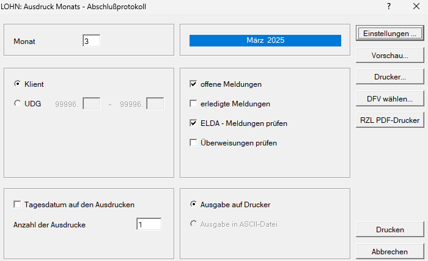

# Monats–Abschlussprotokoll

{width="500"}

Das Monats-Abschlussprotokoll kann für das im Feld *Monat* eingetragene Monat ausgedruckt werden.

Es können 4 Möglichkeiten des Ausdrucks bzw. der Prüfung aktiviert werden.

**Offene Meldungen**

Durch Anwahl dieser Option werden die für den eingetragenen Monat noch nicht erstellten Meldungen aufgelistet.

**Erledigte Meldungen**

Anzeige der für diesen Monat bereits erledigten Meldungen.

**ELDA-Meldungen prüfen**

Hier wird festgelegt, ob die Elda-Meldungen geprüft werden sollen und somit im Ausdruck der *Offenen* oder *Erledigten Meldungen* aufscheinen. Über das Drop-down-Menü haben Sie die Möglichkeit, gezielt nach folgenden ELDA-Meldungsarten zu filtern:

- alle ELDA-Meldungen
- monatliche Beitragsgrundlagenmeldung (mBGM)
- An- und Abmeldungen
- Änderungsmeldungen
- Jahreslohnzettel
- Kommunalsteuererklärung
- Dienstgeberabgabemeldung
- Schwerarbeitsmeldung

**Überweisungen prüfen**

Hier wird festgelegt, ob die Überweisungen geprüft werden sollen und somit im Ausdruck der *Offenen* oder *Erledigten Meldungen* aufscheinen.