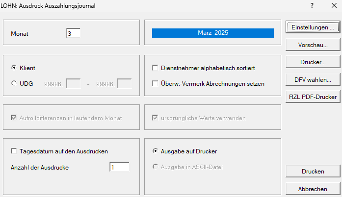

# Auszahlungsjournal

{width="500"}

Im Menüpunkt *Ausdruck / Journal / ÖGK / Auszahlungsjournal* kann für den Klienten oder für einzelne Unterdienstgeber ein Auszahlungsjournal für alle Dienstnehmer mit Angabe der Dienstnehmernummer, des Namens, des Bruttobezugs, des Nettobezugs sowie eventueller Differenzen bei Aufrollungen ausgedruckt werden. Weiters wird durch Nichtangabe eines Bankkontos bei den Dienstnehmerstammdaten durch den Vermerk *bar* die Aus­zahlungsform angegeben.

Im Anschluss an die Summenzeile werden die einzelnen monatlichen Zahlungen an die österreichische Gesundheitskasse, an das Finanzamt sowie an die Gemeinden, angegeben. Dieses Auszahlungsjournal eignet sich als zusammenfassende Übersicht für den Dienstgeber, da darin alle Dienstnehmer mit Nummer, Namen und alle monatlichen Zahlungsverpflichtungen angeführt werden.

Außerdem wird bei Aufrollungen eine eventuelle Differenz an Lohnsteuer, DB, DZ, und Kommst angegeben, wenn das Auswahlfeld *Aufrolldifferenzen im laufenden Monat* aktiviert wurde.

Wird das Auswahlfeld *ursprüngliche Werte verwenden* aktiviert, erfolgt der Ausdruck vor Aufrolldifferenzen (betrifft aufgerollte Monate).

Ist in den Dienstgeberstammdaten das Auswahlfeld [*Münzliste*](../../Klientenstammdaten/Stammdaten_Klient/Bank_Ueberweisung_Zahltag.md) aktiviert, erfolgt nach dem Ausdruck des Auszahlungsjournals der Ausdruck der Münzliste. Dabei werden nur jene Dienstnehmer berücksichtigt, bei denen keine Bank mit Namen und Kontonummer angelegt wurde.

!!! info "Tipp"
    Das Auszahlungsjournal kann auch für mehrere Klienten gleichzeitig (klientenübergreifend) im Programmteil *Klient / Drucken / Journal / ÖGK / Auszahlungsjournal* ausgedruckt werden.