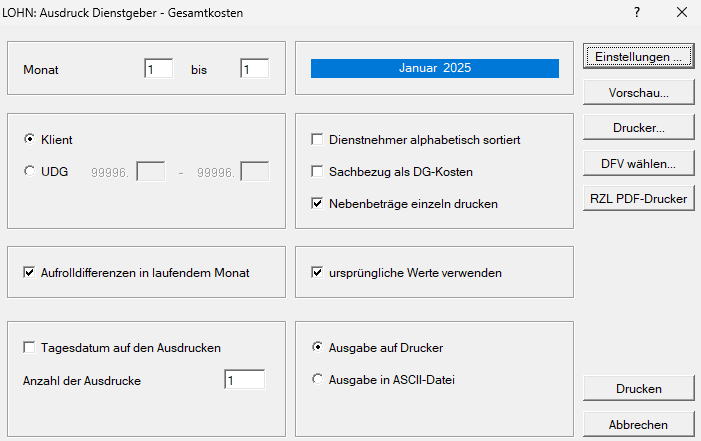

# Dienstgeber–Gesamtkosten

{width="500"}

Dieser Programmteil ermöglicht den Ausdruck der Dienstgeber-Gesamtkosten in einer Liste mit den einzelnen Dienstnehmern.

Über das Feld *Monat bis* kann eingeschränkt werden, für welchen Zeitraum die Auswertung erfolgt.

Die Aktivierung des Feldes *Sachbezug als DG-Kosten* bewirkt, dass der Sachbezug am Buchungsbeleg nicht als Durchläufer, sondern kostenwirksam verbucht wird.

Wird das Feld *Nebenbeträge einzeln drucken* aktiviert, dann erfolgt der Ausdruck im Querformat mit Einzeldarstellung der Dienstgeber-Gesamtkosten.