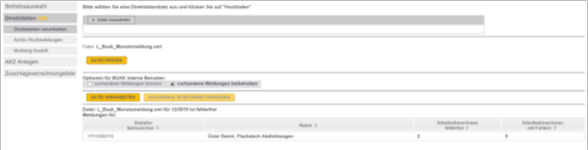

# Elektronische Übermittlung der Meldungen

## Erstellung der Monatsmeldung und der Urlaubsentgeltsmeldung

!!! info "Tipp"
    Die Monatsmeldung kann pro Monat nur einmal übermittelt werden. D. h. die Daten sollten vollständig sein. Nachträgliche Ergänzungen und Änderungen können derzeit nur telefonisch mit der BUAK abgewickelt werden.

Die Monatsmeldung wird im Programmteil *Bearbeiten / Elektronische Übermittlung / Elektronische Monatsmeldung BUAK erstellen* ausgegeben.

{width="500"}

Nach Anwahl der Schaltfläche *Erstellen* wird die Meldung erstellt und kann im Registerblatt *Protokoll* aufgerufen werden.

Der Programmteil *Klient / Elektronische Übermittlung / BUAK Monatsmeldung absenden* ermöglicht das Versenden der Meldung.

{width="500"}

Die genau gleiche Vorgehensweise finden Sie unter *Bearbeiten / Elektronische Übermittlung / Elektronisch Urlaubsentgeltsmeldung* auch für die Urlaubsentgeltsmeldung.

!!! info "Tipp"
    Über den Punkt *Sende-Optionen* ist der Standardpfad für den BUAK Login hinterlegt. Falls sich durch die BUAK eine Änderung ergibt, können Sie den Pfad manuell anpassen oder nach unserem Update den neuen Standardpfad vorschlagen lassen.

## Import der Monatsmeldung und der Urlaubsentgeltsmeldung im BUAK-Portal

Über den Link [*https://sp.buak.at/de/login/*](https://sp.buak.at/de/login/) wechseln Sie zunächst in Ihrem Browser zur Login-Seite für das BUAK-Portal. Nun müssen Sie sich mit den Zugangsdaten, die Sie von der BUAK erhalten haben, einloggen.

Über den Button *Steuerberatungsportal oder. Firmenportal* und anschließend den Punkt *Meldungseingabe* können Sie die Option *Direktdaten* auswählen.

Über *Datei auswählen* kann dann die im LV-Programm erzeugte Datei vom Speicherort übernommen werden. Anschließend müssen Sie die Datei noch über den entsprechenden Button prüfen.

Sie müssen den Vorgang mit *Daten verarbeiten* und schlussendlich mit der Freigabe des Betriebes abschließen.

!!! info "Tipp"
    Die Urlaubsentgeltsverrechnung steht zurzeit nur für Betriebe mit Treuhandkonto zur Verfügung.

## Erstellung der BUAK-Austrittsmeldung

Wenn ein Austritt abgerechnet wird, kann die Meldung unmittelbar nach dem Speichern der Abrechnung bereits erstellt werden.

{width="350"}

Die Austrittsmeldung kann ebenfalls im Programmteil *Bearbeiten / Elektronische Übermittlung / Elektronische Austrittsmeldung BUAK erstellen* ausgegeben werden.

{width="500"}

Austrittsmeldungen können erstellt bzw. auch durch Anwahl des Eintrages *Storno Austrittsmeldung* storniert werden.

Der Versand der Austrittsmeldungen erfolgt im Programmteil *Klient / Elektronische Meldung / BUAK Austrittsmeldung absenden*.

## Übermittlung der BUAK-Austrittsmeldung

Über *Klient / Elektronische Übermittlung / BUAK Austrittsmeldung* *absenden* werden Sie über Ihren Browser auf die Login-Seite des BUAK-Portals weitergeleitet. Nach dem Login finden Sie über das *Steuerberatungsportal* oder *Firmenportal* und anschließende *Meldungseingabe* die Option *Direktdaten* und letztlich den Punkt *Meldung Austritt*.

Die betroffene Datei können Sie hier auswählen und mit der Tastenkombination *Strg + V* einfügen und anschließend prüfen und speichern lassen.

## Import BUAK-Rückmeldung
    
Der Programmteil *Bearbeiten / Elektronische Übermittlung / Elektronische Monatsmeldung BUAK-Rückdatei importieren* können die XML-Dateien, die die BUAK zum Download zur Verfügung stellt, importiert werden.
    
{width="500"}
        
Im Feld *Importdatei* wählen Sie die XML-Datei an, die von der BUAK     gesendet wurde. Sie können die Zuschlagsverrechnungsliste beim Import durch Anwahl des Feldes *Zuschlagsverrechnungsliste drucken* oder innerhalb der Abrechnung der Dienstnehmer, durch Anwahl der Tastenkombination *Strg-Z,* aufrufen bzw. ausdrucken.
    
Im Abrechnungsbildschirm *BUAK* werden im Bereich *Urlaubsentgelt-Verrechnung (nur bei vorhandenem Treuhandkonto)* der Monat der letzten Rückmeldung, die Offenen Urlaubstage und der Offene Anspruch angezeigt.
    
!!! info "Tipp"   
    Über *Bearbeiten / Elektronische Übermittlung / Elektronische Urlaubsentgeltsmeldung BUAK-Rückdatei importieren* können Sie die Rückdatei zur Urlaubsverrechnung übernehmen.