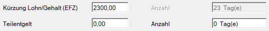

# EFZ-Berechnungsautomatik (fixe Lohnarten)

Zur Ermittlung der Bezüge während einer Entgeltfortzahlung von 50 % bzw. 0 % stellt das Lohnprogramm als Hilfestellung einen entsprechenden Vorschlag zur Verfügung.

Sie erhalten bei Feststellung eines Krankenstandes die Abfrage, ob die EFZ-Berechnungsautomatik durchgeführt werden soll:

{width="350"}

Konkret werden folgende Änderungen vorgenommen, wenn das Lohnprogramm einen 50 %- oder 0 %-Krankenstand ermittelt:

- **Automatische Kürzung der Bezüge**:
	Die Bezüge aus dem Feld *Bruttolohn / -gehalt* werden automatisch auf Basis der in der Krankenstandskartei erfassten Zeiten ohne vollen Entgeltsanspruch gekürzt. Die Kürzung erfolgt anhand der Kalendertage bzw. der EFZ-50 %- und EFZ-0 %-Zeiten im jeweiligen Abrechnungsmonat. Es erfolgt kein Ausweis einer Kürzungslohnart in der Abrechnung, sondern eine direkte Kürzung der Bruttobezüge.
- **Teilentgeltvorschlag**
	Für Zeiträume mit 50 %-iger Entgeltfortzahlung wird im Feld *Teilentgelt* bzw. im Feld *Teilentgelt Lehrling* ein vom Programm ermittelter Wert vorgeschlagen.
- **Fiktive Bemessungsgrundlage für BV-Beitrag**:
	Für Zeiträume mit 50 %-igem oder 0 %-igem Entgeltfortzahlungsanspruch muss eine fiktive Bemessungsgrundlage für den betrieblichen Vorsorgebeitrag angesetzt und über den mBGM gemeldet werden. Es wird ein entsprechender Vorschlag bei den fixen Lohnarten im Bereich BV-Bemessung Sonderfälle im Feld Krankheit erstellt.

!!! warning "Hinweis"
	Eine automatische Ermittlung der EFZ-Werte ist **nicht** möglich bei:

	- freien Lohnarten
	- Stundenlöhnern
	- BUAK-Mitarbeitern
	- freien Dienstnehmern
	
!!! warning "Hinweis"
	Krankenstand kann nur festgestellt werden, wenn die Krankenstandskartei verwendet wird.

Bei jeder Änderung relevanter Parameter – etwa Bruttobezug oder Krankenstandsdauer – erfolgt eine Neuberechnung der *Kürzung Teilentgelt* und des *Teilentgelts*, sofern Sie die entsprechende Abfrage mit *Ja* beantworten. Beide Felder können bei Bedarf manuell überschrieben werden. Zudem ist es möglich, diese Werte vor einer erneuten automatischen Anpassung zu *schützen*.

!!! warning "Hinweis"
	Bei Änderungen muss der Vorschlag für die BV-Bemessung Krankheit manuell erneut aufgerufen werden. Eine automatische Neuberechnung erfolgt **nicht**.

## Kürzung der Bruttobezüge und Vorschlag Teilentgelt

| Beispiel 1                                   |                             |
| -------------------------------------------- | --------------------------- |
| Abrechnungsmonat:                            | **März**                    |
| Entgelt vor Eintritt des Versicherungsfalls: | EUR 3.000,00 (Monat Jänner) |
| Krankenstand:                                | 05.02.2025 – 06.04.2025     |

Die Grundlage für die Berechnung bildet das **Entgelt vor dem Eintritt des Versicherungsfalls**. In diesem Fall also EUR 3.000,00 aus dem Monat Jänner.
 

| Berechnung März           |                                                                     |
| ------------------------- | ------------------------------------------------------------------- |
| Kürzung Lohn/Gehalt (EFZ) | EUR 3.000,00 : 31 Kalendertage x 13 Tage EFZ 50 % = EUR 1.258,06    |
|                           | 01.03.-18.03.2025 - 18 Tage EFZ 100 %                               |
|                           | 19.03.-31.03.2025 - 13 Tage EFZ 50 %                                |
| Teilentgelt               | EUR 3.000,00 : 31 Kalendertage x 13 Tage EFZ 50% x 50% = EUR 629,03 |

Wurde der Krankenstand bereits im Vormonat erfasst oder über eine elektronische Krankenstandsbescheinigung eingespielt, erhält der Benutzer beim Öffnen der Abrechnung folgende Abfrage:

{width="350"}

Wird diese mit *Ja* bestätigt, werden die Felder *Kürzung Lohn/Gehalt (EFZ)* und *Teilentgelt* automatisch befüllt.

Bei jeder Änderung der Parameter in der Krankenstandskartei erscheint erneut eine Abfrage, ob die Werte für die EFZ-Berechnung aktualisiert werden sollen. Bei Bedarf können diese beiden Werte manuell angepasst werden. In diesem Fall sind sie mit einem Sternchen gekennzeichnet.

Mit der Tastenkombination *STRG + S* kann das Feld *Kürzung Lohn/Gehalt (EFZ)* geschützt werden, um eine Veränderung durch eine erneute Aktualisierung zu verhindern. Mit der *F4-Taste* kann bei Bedarf der ursprüngliche Vorschlagswert wiederhergestellt werden.

## BV-Bemessung Krankheit

In Zeiten der 50%igen Entgeltfortzahlung setzt sich die Bemessungsgrundlage für die Betriebliche Vorsorge aus zwei Komponenten zusammen. Aus der reinen Entgeltfortzahlung und zusätzlich einer fiktiven Bemessungsgrundlage für den Zeitraum des Krankengeldbezuges. Als Basis dient 50 % des laufenden Entgelts vor Eintritt des Versicherungsfalls.

!!! warning "Hinweis"
	Betrifft nur Dienstnehmer, die der Abfertigung Neu unterliegen.

{width="500"}

Im Zuge dieses Updates wurde im Abrechnungsbildschirm unter *Fixe Lohnarten* im Bereich *BV-Bemessung Sonderfälle* ein automatischer Vorschlag für diese fiktive Bemessungsgrundlage integriert. Über das Kontextmenü bzw. mit der Tastenkombination *Umschalt + F2* kann das zugehörige Berechnungsblatt aufgerufen werden.

Das Berechnungsblatt zeigt, wie sich die Bemessungsgrundlage für die Betriebliche Vorsorge zusammensetzt:

| Erklärung                    |                                                    |              |
| ---------------------------- | -------------------------------------------------- | -----------: |
| Aliquotiertes Arbeitsentgelt |                                                    | EUR 1.741,94 |
| Teilentgelt                  |                                                    |   EUR 629,03 |
| Fiktive BV-Bemessung         | EUR 3.000,00 : 30 SV-Tage x 13 Tage EFZ 50 % : 2 = |   EUR 650,00 |

Die gesamte Bemessungsgrundlage darf jedoch maximal 100 % des vorherigen Entgelts betragen. Daher erfolgt eine Deckelung der fiktiven Bemessungsgrundlage auf EUR&nbsp;629,03.

Neben dem gekürzten Lohn / Gehalt sind in der Abrechnungsvorschau sowohl das Teilentgelt als auch die fiktive Bemessungsgrundlage für die Betriebliche Vorsorgekasse ersichtlich.

!!! warning "Hinweis"
    Die fiktive BV-Bemessung wird auf Basis von 30 SV-Tagen gerechnet - **nicht** auf Kalendertage.

## Änderung des Krankenstandzeitraums

**Fortsetzung Beispiel 1**

Im Abrechnungsmonat **April** hat sich der Zeitraum des Krankenstands nach einem Hinweis der ÖGK auf **15.01.2025–23.04.2025** geändert. Der Dienstnehmer tritt anschließend wieder seinen Dienst an.

Zuerst muss der Krankenstand in der Abrechnung für den Monat April angepasst werden. Dadurch kommt es einerseits zu einer Anpassung der Werte für den Monat April und andererseits zu einem Hinweis auf eine erforderliche Aufrollung für ein oder mehrere Vormonate.

Die in diesem Beispiel notwendige Aufrollung für den Monat März muss im Anschluss an die Abrechnung für April manuell ausgelöst werden. Dabei ist zu beachten, dass der Wert für die fiktive BV-Bemessung Krankheit in diesem Fall vom Benutzer manuell über das Kontextmenü bzw. die Tastenkombination Alt + F2 aktualisiert werden muss.

Es ergeben sich für den Monat **März** folgende neue EFZ-Beschäftigungstage:

| EFZ-Beschäftigungstage |         |         |
| ---------------------- | ------- | ------: |
| 01.03.2025-25.03.2025  | EFZ 50% | 25 Tage |
| 26.03.2025-31.03.2025  | EFZ 0%  |  6 Tage |

| Berechnung                |                                                             |              |
| ------------------------- | ----------------------------------------------------------- | -----------: |
| Kürzung Lohn/Gehalt (EFZ) | EUR 3.000,00 : 31 Kalendertage x 31 Tage EFZ 50 % und 0 % = | EUR 3.000,00 |
| Teilentgelt               | EUR 3.000,00 : 31 Kalendertage x 25 Tage EFZ 50 % : 2 =     | EUR 1.209,68 |

Fiktive BV-Bemessung: EUR 3.000,00 : 30 SV-Tage x 30 Tage EFZ 50 % und 0 % : 2 = EUR 1.500,00

Für den Monat **April**: 01.04.2025-23.04.2025 EFZ 0% = 23 Tage EFZ 0%

Kürzung: EUR 3.000,00 : 30 Kalendertage x 23 Tage EFZ 0 % = EUR 2.300,00

BV-Bemessung Krankheit: EUR 3,000,00 : 30 SV-Tage x 23 Tage EFZ 0 % : 2 = EUR 1.150,00

## Referenzmonat ist gleich Eintrittsmonat

| Beispiel 2                       |                       |
| -------------------------------- | --------------------- |
| Eintritt                         | 20.05.2025            |
| Bruttobezug für ein volles Monat | EUR 3.500,00          |
| aliquoter Bruttobezug Mai        | EUR 1.400,00          |
| Krankenstand                     | 10.06.2025-31.07.2025 |

| Berechnung **Juli**       |                                                                   |
| ------------------------- | ----------------------------------------------------------------- |
| Kürzung Lohn/Gehalt (EFZ) | EUR 3.500,00 : 31 Kalendertage x 9 Tage EFZ 50 % = EUR 1.016,13   |
|                           | 01.07.-22.07.2025 - 22 Tage EFZ 100 %                             |
|                           | 23.07.-31.07.2025 - 9 Tage EFZ 50 %                               |
| Teilentgelt               | EUR 3.500,00 : 31 Kalendertage x 9 Tage EFZ 50 % : 2 = EUR 508,06 |

Liegt vor dem Eintritt des Versicherungsfalls **kein volles Beschäftigungsmonat** vor, ist für die Ermittlung der fiktiven BV-Bemessungsgrundlage eine **Hochrechnung** erforderlich.

| Berechnung                  |                                                                              |
| --------------------------- | ---------------------------------------------------------------------------- |
| Basis für Juli              | EUR 1.400,00 aus dem Referenzmonat Mai : 12 SV-Tage x 30 Tage = EUR 3.500,00 |
| BV-Bemessung Krankheit Juli | EUR 3.500,00 : 30 SV-Tage x 9 Tage EFZ 50 % : 2 = EUR 525,00                 |

## Neuerlicher Krankenstand

**Fortsetzung zu Beispiel 2:**

Der **§ 122 ASVG** regelt, dass erst **ab dem 4. Tag der Arbeitsunfähigkeit** ein Anspruch auf Krankengeld durch die ÖGK besteht. Dies ist wiederum die Voraussetzung für die fiktive BV-Bemessung an diesem Tag gemäß § 7 Abs. 3 BMSVG.

Ist der Anspruch auf 100 % Entgeltfortzahlung bereits **ausgeschöpft** und tritt anschließend eine **neuerliche Erkrankung** ein, bei der nur mehr Anspruch auf 50 % EFZ oder 0 % EFZ besteht, muss für die ersten drei Tage **keine fiktive BV-Bemessungsgrundlage** angesetzt werden.

Im Programmvorschlag werden die Tage für die fiktive BV-Bemessungsgrundlage Krankheit daher entsprechend gekürzt.

| Beispiel 2 - August |                                         |
| ------------------- | --------------------------------------- |
| Wiedererkrankung    | 04.08.2025-10.08.2025 – 7 Tage EFZ 50 % |

Für die Ermittlung der fiktiven BV-Bemessungsgrundlage werden somit nur 4 Tage (7 Tage minus 3 Tage Anlaufphase) berücksichtigt.

## Teilentgelt Lehrlinge

Für Lehrlinge gelten im Bereich der Entgeltfortzahlung deutlich andere Bestimmungen als für Arbeiter und Angestellte.

Die drei wichtigsten Unterschiede bestehen in den folgenden Bereichen:

- Dauer der Entgeltfortzahlung
- Abgabenpflichtigkeit des Teilentgelts für Lehrlinge
- Ermittlung des Teilentgelts für Lehrlinge

Da das Teilentgelt für Lehrlinge sowohl im Bereich der Sozialversicherung als auch in der betrieblichen Vorsorge **beitragsfrei** abgerechnet wird, kann im Bereich *Fixe Lohnarten* unter *Teilentgelt Lehrlinge* der entsprechende Betrag erfasst werden.

Die Ermittlung der Höhe des Teilentgelts ist sehr komplex und kann nicht vollständig automatisiert werden. Es ist die Differenz zwischen der aliquoten Lehrlingsentschädigung für den jeweiligen Zeitraum und dem Krankengeld laut ÖGK-Rechner zu ermitteln. Im Kontextmenü des Feldes *Teilentgelt Lehrlinge* steht Ihnen ein Berechnungsdialog zur Verfügung, über den das Teilentgelt ermittelt werden kann.

In diesem Dialog kann der ÖGK-Krankengeldrechner aufgerufen werden, um das Teilentgelt für Lehrlinge im jeweiligen Zeitraum direkt ins Lohnprogramm zu übernehmen. Bei längeren Krankenständen ermittelt der Rechner unterschiedliche Tagsätze, die vom Anwender in die Berechnungsmaske zu übertragen sind.

| Beispiel 3       |                                                             |
| ---------------- | ----------------------------------------------------------- |
| Abrechnungsmonat | Oktober                                                     |
| Beitragsgruppe   | Arbeiterlehrling                                            |
| Bruttobezug      | EUR 980,00                                                  |
| Krankenstand     | 14.08.2025-31.10.2025                                       |
|                  | Teilentgelt vom 10.10.2025-31.10.2025 - 22 Tage Teilentgelt |

Wird beim Öffnen der Abrechnung über die Krankenstandskartei eine Teilentgeltphase erkannt, erhält der Anwender folgenden Hinweis zum Einsatz des neuen Berechnungsdialogs.

Anschließend öffnen Sie über das Kontextmenü (rechte Maustaste) oder die F4-Taste im Feld Teilentgelt Lehrling den *Berechnungsdialog*.

Der Bruttobezug wird hier auf Basis der Teilentgeltstage gekürzt:

EUR 980,00 : 31 Kalendertage x 22 Tage Teilentgelt Lehrling = EUR 695,48.

Nun ermitteln Sie über die Schaltfläche *ÖGK-Krankengeldrechner* das zustehende Krankengeld.

In unserem Beispiel ergibt der Rechner einen Tageswert von EUR 19,60, da der Krankenstand im Oktober bereits die Grenze von 42 Tagen überschritten hat. Diese Werte müssen nun in den Detailbildschirm übertragen werden.

Aus der Differenz zwischen der anteiligen Brutto-Lehrlingsentschädigung und dem Krankengeld laut ÖGK (EUR 695,48 – EUR 431,20 = EUR 264,28) ergibt sich das Teilentgelt für den Monat Oktober für diesen Lehrling.

Die Ermittlung der fiktiven BV-Bemessungsgrundlage Krankheit erfolgt nach dem gleichen Prinzip wie bei regulären Dienstnehmern:

EUR 980,00 : 30 SV-Tage x 22 Tage Teilentgelt : 2 = EUR 359,33.

