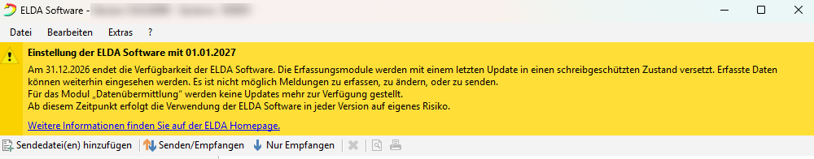
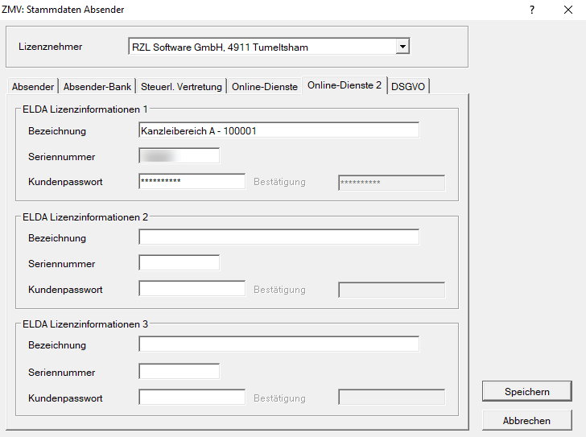
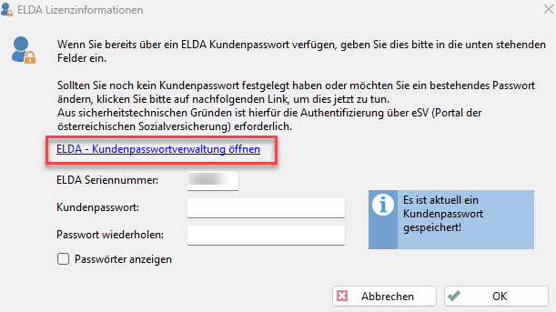
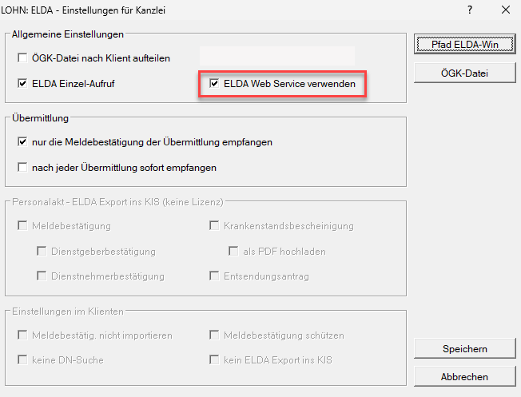
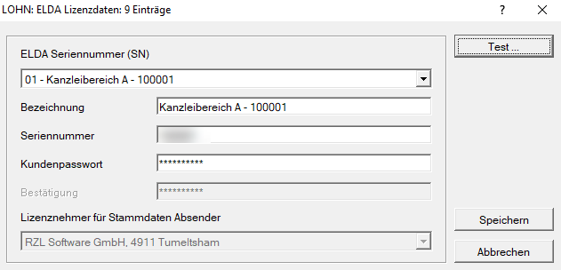
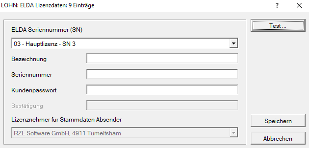
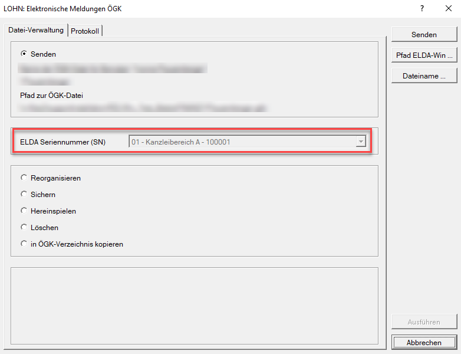
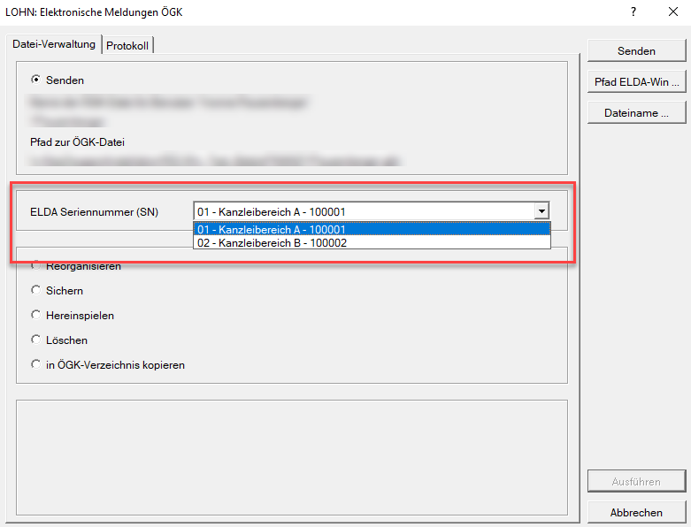
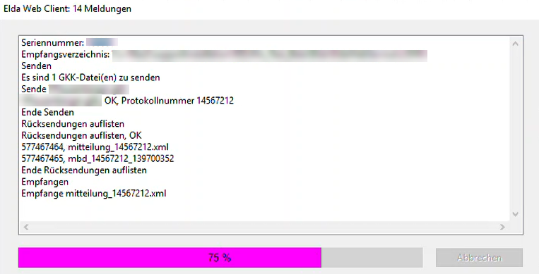

# ELDA Webservice

Mit 31.12.2026 endet die Verfügbarkeit der ELDA-Software für die Übertragung von Meldungen aus der Lohnverrechnung an die Österreichische Gesundheitskasse (ÖGK). Ab diesem Zeitpunkt können dort auch keine neuen Meldungen mehr erfasst werden. Zudem wird die Schnittstelle zur Datenübermittlung nicht mehr an gesetzliche Änderungen angepasst.

Nähere Informationen finden Sie direkt in Ihrer ELDA-Software bzw. unter diesem [Link](https://www.elda.at/cdscontent/?contentid=10007.854970&portal=eldaportal).

Als Ersatz stellt die **ÖGK** ein **Webservice** zur Verfügung, über das die Daten künftig direkt an die ÖGK übermittelt werden können. Im **RZL-Lohnverrechnungsprogramm** kann dieses Webservice genutzt werden. Eine verpflichtende Umstellung auf die Webservice-Übermittlung erfolgt jedoch erst mit **Jahresende 2026**.

## Hinterlegung der Zugangsdaten in der Zentralen Mandantenverwaltung (ZMV)

Im Menüpunkt *Allg. Dateien / Stammdaten Absender* wurde für die Hinterlegung der Zugangsdaten ein zusätzliches Registerblatt *Online-Dienste 2* eingerichtet.

{width="600"}

Grundsätzlich basiert der Zugang weiterhin auf der **ELDA-Seriennummer** und dem dazugehörigen **Kundenpasswort**. In diesem Dialog können Sie ab sofort mit bis zu drei verschiedenen Seriennummern/Kundenpasswörtern arbeiten und diese jeweils mit einer frei wählbaren Bezeichnung versehen.

### Neuanforderung des Passwortes über die ELDA-Software oder ID Austria

Falls insbesondere das Kundenpasswort in der Kanzlei nicht mehr verfügbar ist, kann über die ELDA-Software unter *Extras / Konfiguration / Lizenzinformationen ändern* der folgende Dialog bzw. Link geöffnet werden.

{width="500"}

Wenn Sie über einen Firmenzugang mittels ID Austria und die entsprechenden Berechtigungen verfügen, können Sie das Passwort bei Bedarf ändern und anschließend in den neuen Feldern für die Zugangsdaten hinterlegen.

## Aktivierung in der RZL-Lohnverrechnung

Über den Menüpunkt *Klient / Elektronische Übermittlung / ELDA-Einstellungen* kann die Option ***ELDA Web Service verwenden*** angewendet werden.

{width="600"}

!!! warning "Hinweis"
    Wird in den ELDA-Einstellungen die Verwendung des ELDA-Webservice aktiviert, so gilt diese Einstellung für die **gesamte Kanzlei bzw. Firma**. Eine Beschränkung auf einen einzelnen Arbeitsplatz ist **nicht** möglich.

### Übermittlung

Im Bereich *Übermittlung* stehen Ihnen zusätzlich folgende Auswahlmöglichkeiten zur Verfügung:

**Nur die Meldebestätigung der Übermittlung empfangen**

Wird diese Option aktiviert, werden ausschließlich die Rückmeldungen zu den von Ihnen versendeten Meldungen abgerufen. Andere bzw. fremde Rückmeldungen, Clearingfälle, Krankenstandsbescheinigungen oder Entsendungsanträge werden dabei nicht zusätzlich empfangen.

Es wird somit ausschließlich die Rückmeldung zur jeweils gesendeten Protokollnummer abgerufen.

**Nach jeder Übermittlung sofort empfangen**

Wird diese Option aktiviert, wird nach jeder Übermittlung die zugehörige Rückmeldung sofort abgeholt.

Dies ist insbesondere dann von Vorteil, wenn mehrere Übermittlungen durchgeführt werden, beispielsweise bei einer klientenübergreifenden Versendung der mBGM. Auf diese Weise wird sichergestellt, dass die jeweilige Rückmeldung unmittelbar empfangen wird und nicht versehentlich von einer anderen Person abgerufen werden kann.

### Aufruf bereits in der ZMV hinterlegter Zugangsdaten

Falls die Zugangsdaten bereits zuvor in der *ZMV* angelegt wurden, können diese über die Schaltfläche *Pfad ELDA-Win* erneut aufgerufen werden.

{width="500"}

### Durchführen eines Verbindungstests

Über die Schaltfläche *Test* können Sie einen Verbindungstest durchführen, der bislang direkt in der ELDA-Software möglich war.

### Verwaltung weiterer Zugangsdaten

Mithilfe des Listenfelds können Sie auch an dieser Stelle weitere Zugangsdaten hinterlegen. Diese werden anschließend ebenfalls in den *Absenderstammdaten* der *Zentralen Mandantenverwaltung* eingetragen.

{width="500"}

Für den Fall, dass die Kanzlei bzw. Firma über sogenannte RZL-Sublizenzen verfügt, können pro Sublizenz jeweils drei weitere Zugänge hinterlegt werden.

## Übermittlung der Meldungen an die ÖGK

Grundsätzlich ändert sich an der bisherigen Vorgehensweise bei der Erstellung und Übermittlung nichts. Im Übermittlungsdialog wird nun zusätzlich der verwendete Zugang bzw. die vergebene Bezeichnung angezeigt.

{width="600"}

### Zugangsauswahl bei mehreren Seriennummern

Wenn Sie mehrere Seriennummern einsetzen möchten, können Sie hier jenen Zugang auswählen, der für die jeweilige Übermittlung verwendet werden soll.

{width="600"}

### Darstellung des Übermittlungsvorgangs nach der Umstellung

Im Zuge des Übermittlungsvorgangs ergeben sich lediglich geringfügige optische Änderungen. Nach der Umstellung wird die ELDA-Software nicht mehr geöffnet. Stattdessen erscheint nur noch kurz ein Fortschrittsbalken, der die Übertragung anzeigt.

{width="500"}

Anschließend erhalten Sie wie bisher die Abfrage, ob das Protokoll der ÖGK gedruckt werden soll, und ob die übertragenen Meldungen aus der ÖGK-Datei gelöscht werden sollen.

Die Rückmeldungen stehen im Lohnprogramm weiterhin zur Verfügung:

- gesammelt für alle Klienten unter *Klient / Elektronische Übermittlung / Elektronische Meldung – ÖGK Rückmeldungen*
- oder innerhalb des Lohn-Klienten unter *Bearbeiten / Elektronische Übermittlung / Elektronische Übermittlung – ÖGK Rückmeldungen*, dann jedoch nur mit jenen Protokollen, die den jeweiligen Klienten betreffen.

!!! warning "Hinweis"
    Bitte beachten Sie, dass mit der Umstellung auf das Webservice die Rückmeldungen, Krankenstandsbescheinigungen oder Clearingfälle nicht mehr direkt in der ELDA-Software angezeigt werden. Diese werden künftig in ein eigenes Empfangsverzeichnis für das neue Webservice übernommen und von dort wie bisher in den bekannten Programmpunkten angezeigt, insbesondere für Krankenstandsbescheinigungen, Clearingfälle, Rückmeldungen zu den VSNR-Anforderungen und Entsendungsanträgen.