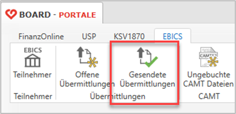

# Electronic Banking EBICS

EBICS (Electronic Banking Internet Communication Standard) ist ein internetbasierter Kommunikationsstandard für den gesicherten Datenaustausch zwischen Unternehmen und Banken bzw. Sparkassen. Er ermöglicht nicht nur die sichere Übermittlung von Zahlungsdaten, sondern standardisiert auch die Autorisierung und Freigabe von (Zahlungs-)Aufträgen.

Die **RZL EBICS-Schnittstelle ist kostenpflichtig** und kann ausschließlich von Anwendern genutzt werden, die über eine gültige Lizenz für das **RZL Board Basis-Programm** verfügen.

Für den Einsatz der **RZL EBICS Schnittstelle** muss außerdem der "**RZL Dienst**" durch den Systembetreuer installiert werden, sofern dieser nicht bereits vorhanden ist (z.B. durch die Nutzung von HON Next, o. Ä.). Nähere Informationen zur Installation finden Sie im **RZL Setup-Handbuch**, das im RZL-Programm über *Hilfe / Handbuch* aufgerufen werden kann.

Bitte klären Sie mit den zuständigen Ansprechpartnern Ihrer Bank oder Sparkasse, ob und in welchem Umfang eine Umstellung Ihrer eigenen sowie der Kundenkonten auf EBICS bereits angeboten wird – einschließlich eventuell anfallender Kosten. Bevor Sie das EBICS-Modul zur Abwicklung des Zahlungsverkehrs verwenden, vergewissern Sie sich, dass Ihre Klienten über ein EBICS-fähiges Onlinebanking-Portal (z. B. Raiffeisen Infinity) verfügen. Ohne ein solches Portal können Zahlungsdateien, die mit einem transportberechtigten Teilnehmer versendet wurden, von den Klienten nicht freigegeben werden.

## Anlage der EBICS Teilnehmer im RZL Board

Falls noch keine EBICS-Teilnehmer für den Einsatz in der *RZL Finanzbuchhaltung* angelegt wurden, ist dies spätestens jetzt für die Nutzung in der *RZL Lohnverrechnung* erforderlich. Im *RZL Board* können Sie über die Schaltfläche *Neuer Teilnehmer* einen neuen Zugang anlegen. Die hierfür notwendigen Zugangsdaten bzw. Informationen erhalten Sie von den jeweils zuständigen Banken.

Das{width="20"}-Symbol in der Statusspalte zeigt an, dass der Initialisierungsprozess für diesen Teilnehmer noch nicht gestartet wurde. Über die Schaltfläche *Initialisieren* beginnt dieser Prozess. Zunächst werden Sie dazu aufgefordert, ein Passwort festzulegen.

{width="350"}

!!! warning "Hinweis"
    Das Passwort wird **nicht gespeichert** und kann auch von RZL nicht ausgelesen bzw. wiederhergestellt werden. Bitte notieren Sie sich dieses Passwort sorgfältig!
 
Nach Bestätigung der Passworteingabe mit *OK* wird automatisch der Initialisierungsbrief (INI-Brief) erstellt. Dieser öffnet sich im Standardprogramm Ihres Systems (z. B. Adobe Reader, Microsoft Edge).

{width="500"}

Der Initialisierungsbrief muss unterschrieben an die jeweilige Bank übermittelt werden. Bis zur Rückmeldung und Freigabe durch die Bank wird der Status des EBICS-Teilnehmers im RZL mit dem Symbol {width="20"} dargestellt.

{width="400"}

Sobald der EBICS-Teilnehmer durch die Bank freigeschaltet wurde, kann der Status über die Schaltfläche *Aktualisieren* auf aktiv gesetzt werden. Dieser Zustand wird durch das Symbol {width="20"} angezeigt. Auch bei dieser Aktion ist erneut die Eingabe des Teilnehmer-Passworts erforderlich.

Ein EBICS-Teilnehmer sollte nur in Ausnahmefällen über die Schaltfläche *Deaktivieren* stillgelegt werden. Informieren Sie in diesem Fall unbedingt die Bank. Vor dem endgültigen Deaktivieren erfolgt ein Warnhinweis, der ausdrücklich bestätigt werden muss.

{width="400"}

!!! warning "Hinweis"
    Eine Deaktivierung eines EBICS-Teilnehmers ist nicht reversibel – dieser Vorgang kann nicht rückgängig gemacht werden!

Im Gegensatz zur Deaktivierung bewirkt das Löschen eines Teilnehmers im *RZL Board* lediglich die Entfernung aus dem Programm. Der Zugang bei der Bank bleibt weiterhin bestehen.

Zusammengefasst lassen sich für die EBICS-Teilnehmer daher folgende Statusvarianten unterscheiden:

|            Statusvarianten             |                                                               |
| :------------------------------------: | ------------------------------------------------------------- |
| {width="30"} | Aktiver Teilnehmer                                            |
| {width="30"} | Teilnehmer seitens der Bank noch nicht freigeschaltet         |
| {width="30"} | Teilnehmer ist angelegt; Anfrage zur Bank erfolgte noch nicht |
| {width="30"} | Teilnehmer wurde deaktiviert                                  |

## Passwortspeicherung

Bei der Nutzung von EBICS ist zwischen zwei Arten von Teilnehmern zu unterscheiden: solchen mit reiner Transportberechtigung und solchen mit zusätzlicher Zeichnungsberechtigung.

**Transportberechtigung**

Teilnehmer mit Transportberechtigung können CAMT-Kontoauszüge abrufen und Überweisungsdateien an die Bank übermitteln – allerdings *ohne automatische Freigabe* der Zahlungen. Die endgültige Freigabe muss durch berechtigte Personen direkt im Onlinebanking-Portal der jeweiligen Bank erfolgen.

**Zeichnungsberechtigung**

Teilnehmer mit Zeichnungsberechtigung sind zusätzlich berechtigt, Zahlungsaufträge direkt über die EBICS-Schnittstelle freizugeben. Aus Sicherheitsgründen ist hierfür stets die Eingabe des zugehörigen Passworts erforderlich.

{width="600"}

Die für die Nutzung der EBICS-Anbindung erforderlichen Passwörter können auf zwei Arten gespeichert werden:

- Lokal (am Arbeitsplatz)
- Zentral über den RZL Dienst

Die Speicherung über den *RZL Dienst* bietet Vorteile wie z. B. die Möglichkeit eines automatisierten CAMT-Abrufs in der *RZL Finanzbuchhaltun*g. Dafür genügt ein Teilnehmer mit reiner **Transportberechtigung** – ein Eingriff durch den Benutzer ist in diesem Fall nicht erforderlich.

Bei Teilnehmern mit **Zeichnungsberechtigung** wird aus **Sicherheitsgründen** dringend von einer Passwortspeicherung abgeraten. Eine Speicherung über den *RZL Dienst* ist hier ohnehin nicht möglich. Bitte klären Sie Ihre Kunden darüber auf, dass bei automatisierter Freigabe von Zahlungsaufträgen eine besonders sorgfältige Prüfung erforderlich ist. Informieren Sie zudem alle betroffenen Mitarbeiter in der Kanzlei über die erhöhte Sensibilität dieses Vorgangs.

Beide Varianten der Passwortspeicherung sind durch entsprechende Warnhinweise in der Benutzeroberfläche abgesichert.

## EBICS Überweisungen in der RZL Lohnverrechnung

Die Umstellung vom bisherigen Verfahren – dem Versand von SEPA-XML-Dateien an die Kunden – hin zur direkten Übertragung von Zahlungsdaten an die Bankrechner über EBICS soll die Arbeitsschritte für unsere Anwender und deren Kunden vereinfachen und so Zeit und Kosten einsparen. Gleichzeitig soll der Umstellungsaufwand möglichst gering und der Schulungsbedarf minimal gehalten werden.

Der Zahlungsverkehr in der *RZL Lohnverrechnung* erfolgt über den Menüpunkt *Bearbeiten / Electronic Banking (EBICS)*, der als zentrale Anlaufstelle für EBICS-Überweisungen zur Verfügung steht.

{width="500"}

Wie bereits im bisherigen System erfolgt auch hier eine Gliederung in folgende Bereiche:

- Abrechnungen
- Abgaben
- Exekutionsbeträge
- Überweisungen an sonstige Behörden
- Händisch erstellte Überweisungen

!!! warning "Hinweis"
    Die bisher eingesetzten MBS-Systeme werden von den Banken aktuell zwar noch im Parallelbetrieb weitergeführt, jedoch nicht mehr aktiv weiterentwickelt. Nach aktuellem Stand planen die österreichischen Banken, sämtliche Kunden bis Ende 2025 vollständig auf die neuen Systeme umzustellen.

Der Ablauf zur Erstellung der Überweisungen an Dienstnehmer hat sich im Vergleich zur bisherigen Vorgehensweise kaum verändert. Wie gewohnt wählen Sie:

- das gewünschte Überweisungsmonat
- die betroffenen Dienstnehmer
- die Bankverbindung
- das gewünschte Durchführungsdatum

Da im EBICS-System keine explizite Dateiübertragung mehr erforderlich ist, entfällt auch die Eingabe eines Speicherorts oder Dateinamens. Aus diesem Grund ist das entsprechende Eingabefeld im neuen EBICS-Überweisungsdialog nicht mehr vorhanden.

Die von den Banken vorgegebenen XML-Standards (sogenannte Rulebooks) werden im Rahmen der laufenden RZL-Updates automatisch auf die jeweils aktuelle Version umgestellt. In der Praxis ist daher nur in Ausnahmefällen eine benutzerdefinierte Auswahl erforderlich.

{width="500"}

Mit der Schaltfläche *Daten übergeben* werden die Überweisungsdaten direkt an das *RZL Board* übertragen. Wie bisher haben Sie die Möglichkeit, ein Überweisungsprotokoll zu drucken oder über den *RZL PDF Manager / Drucker* elektronisch abzulegen.

Auch weiterhin wird nach dem erstmaligen Erstellen der Überweisungsdaten automatisch ein Sperrvermerk gesetzt, um eine Doppelüberweisung zu verhindern. Falls eine Datei erneut erstellt werden muss, kann dieser Sperrvermerk wie gewohnt über *Bearbeiten / Repair / Überweisungen / Überweisung Abrechnung zurücksetzen* entfernt werden.

!!! warning "Hinweis"
    Bei der Überweisung über den Menüpunkt *Electronic Banking (EBICS)* muss zusätzlich die bereits ins *RZL Board* übergebene Datei **manuell** aus den offenen EBICS-Übermittlungen gelöscht werden, um eine unbeabsichtigte Doppelüberweisung zuverlässig auszuschließen.

## Darstellung der Daten im RZL Board

Im *RZL Board* finden Sie unter dem Bereich *Portale* einen eigenen Abschnitt für *EBICS-Überweisungen*. Hier werden offene Übermittlungen sowie bereits an die Banken übertragenen Dateien übersichtlich voneinander getrennt dargestellt.

{width="500"}

Mit der Schaltfläche *Offene Übermittlungen* werden alle noch nicht übermittelten Zahlungsaufträge angezeigt – unabhängig davon, aus welchem RZL-Programm sie stammen oder welcher Benutzer sie erstellt hat. Diese Liste kann nach unterschiedlichen Kriterien gefiltert, sortiert und individuell angepasst werden:

- Spaltenreihenfolge ändern
- Spalten ein- oder ausblenden
- Druck und Export der Listenansicht

Zusätzlich kann über die Schaltfläche *Exportieren* eine SEPA-XML-Datei nachträglich erzeugt und gespeichert werden. Bestehende SEPA-XML-Dateien können über *Importieren* in das *RZL Board* übernommen werden.

Mit der Funktion *Details anzeigen* erhalten Sie eine Übersicht der in der Überweisung enthaltenen Einzelbeträge – z. B. die Auszahlungsbeträge für die jeweiligen Mitarbeiter.

{width="300"}

Die eigentliche Übertragung der Daten an die jeweilige Bank erfolgt über die Schaltfläche *Übermitteln*. Nach erfolgreicher Übertragung sind die Zahlungen unter *Gesendete Übermittlungen* einsehbar. Übermittlungen mit einem grünen Häkchen in der Statusspalte wurden erfolgreich abgeschlossen. Auch hier stehen Filter-, Sortier- und Exportfunktionen zur Verfügung, um gezielte Auswertungen zu erstellen.

{width="300"}

{width="600"}

Die oben beschriebenen Funktionen gelten einheitlich für folgende Überweisungsarten:

- Überweisungen an Dienstnehmer
- Abgaben an Behörden (z. B. Finanzamt, Krankenkasse)
- Zahlungen an Exekutionsgläubiger
- Überweisungen an sonstige Institutionen
- Manuell erstellte Überweisungen im RZL Lohnprogramm

Alle Übertragungen folgen denselben Grundsätzen in der Bedienung und Darstellung.

## Berechtigungen für EBICS im RZL-Board einrichten

Wie bei allen Funktionen im *RZL Board* können auch für die Nutzung der EBICS-Lohnüberweisungen spezifische Berechtigungen vergeben und eingeschränkt werden. Das Berechtigungssystem ist über den Menüpunkt *Stamm / Berechtigungen* aufrufbar.

Im Bereich Berechtigungen stehen in den Standardrollen (gekennzeichnet mit {width="20"}) bereits vorgefertigte Rollen für EBICS-Funktionen zur Verfügung. Für den Bereich EBICS-Zahlungsdateien sind folgende Rollen vorbereitet:

- EBICS Übermittlung eigene
- EBICS Übermittlung fremde
- EBICS Lohnzahlungsansicht

Diese Rollen sind jeweils mit spezifischen Funktionen im Zusammenhang mit der Bearbeitung und Anzeige von EBICS-Zahlungen verknüpft. Über die Schaltfläche *Hinzufügen* kann eine dieser Rollen einem Benutzer oder Mitarbeiter der Kanzlei zugewiesen werden.

Die Rollen unterscheiden sich insbesondere hinsichtlich der folgenden Zugriffsrechte:

- EBICS Übermittlung **eigene**: Zugriff ausschließlich auf selbst erstellte Überweisungsdateien (anzeigen, löschen, übermitteln)
- EBICS Übermittlung **fremde**: Zugriff auch auf Überweisungen, die von anderen Kanzleimitarbeitern erstellt wurden
- EBICS **Lohnzahlungsansicht**: Ermöglicht die Anzeige der Teilbeträge innerhalb einer Überweisung – etwa der Nettoauszahlungsbeträge einzelner Dienstnehmer. Ein Mitarbeiter mit dieser Rolle kann z. B. einsehen, wie hoch die Auszahlungsbeträge für Mitarbeiter A, B und C sind:

{width="500"}

Nach Auswahl der entsprechenden Rolle kann über die Schaltfläche *Weiter* definiert werden, ob die Berechtigung für alle Klienten oder nur für bestimmte Klientengruppen gelten soll:

{width="500"}

Die Klientengruppe wird üblicherweise bei der Neuanlage eines Klienten festgelegt. Bestehende Klienten können im Berechtigungssystem unter *Stamm / Berechtigungen / Klientengruppen* nachträglich einer Klientengruppe zugewiesen werden. Dort ist auch die Anlage neuer Klientengruppen möglich.