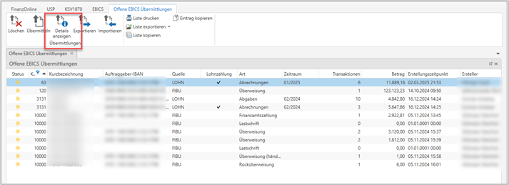

# Electronic Banking EBICS

Bei EBICS (Electronic Banking Internet Communication Standard) handelt es sich um einen internetbasierten Kommunikationsstandard zwischen Unternehmen und Banken/Sparkassen, der neben dem gesicherten Datenaustausch auch die Autorisierung bzw. die Freigabe von (Zahlungs-)Aufträgen an die Banken standardisiert.

Die **RZL EBICS-Schnittstelle ist kostenpflichtig** und nur für Anwender, die das **RZL Board Basis-Programm** lizenziert haben, nutzbar.

Für die Nutzung der **RZL EBICS Schnittstelle** ist weiters der "**RZL Dienst**" vom Systembetreuer zu installieren, falls dieser nicht ohnehin bereits installiert wurde (z.B. für HON Next, …). Details siehe **RZL Setup-Handbuch** (aufrufbar im RZL Programm unter *Hilfe / Handbuch*).

Ob und wieweit eine Umstellung Ihrer Bankkonten und der Konten Ihrer Kunden bereits von den jeweiligen Kreditinstituten angeboten wird, erfragen Sie bitte genauso wie die damit verbundenen Kosten, bei den zuständigen Ansprechpartnern der Kreditinstitute. Bevor Sie innerhalb unseres EBICS Moduls mit der Verwendung des Zahlungsverkehrs beginnen, stellen Sie bitte sicher, dass die Klienten, für die Sie eine Zahlungsdatei erzeugen und versenden möchten, über ein EBICS-fähiges Kundenportal (z.B. Raiffeisen Infinity, ...) verfügen. Sollte dies nicht vorhanden sein, können Zahlungsdateien, die mit einem transportberechtigten Teilnehmer versendet wurden, nicht von Ihren Klienten freigegeben werden.

## Anlage der EBICS Teilnehmer im RZL Board

Falls Sie noch keine EBICS Teilnehmer für den Einsatz in der *RZL Finanzbuchhaltung* angelegt haben, muss dies für die Nutzung in der *RZL Lohnverrechnung* nun nachgeholt werden. Im *RZL Board* ist über die Schaltfläche *Neuer Teilnehmer* ein neuer Zugang anzulegen. Die dafür benötigten Zugangsdaten bzw. Informationen erhalten Sie von den jeweils betroffenen Kreditinstituten.

Das{width="20"}-Symbol in der Status-Spalte zeigt an, dass für diesen Teilnehmer der eigentliche Initialisierungsprozess erst gestartet werden muss. Über die Schaltfläche *Initialisieren* werden Sie zunächst aufgefordert, ein Passwort festzulegen.

{width="350"}

!!! warning "Hinweis"
    Das Passwort wird nicht gespeichert und kann von RZL nicht ausgelesen werden. Bitte notieren Sie sich dieses Passwort!

Nachdem Sie das Fenster zur Passworteingabe mit OK bestätigt haben, wird automatisch der Initialisierungsbrief (INI Brief) erstellt. Dieser wird anschließend im jeweiligen Standardprogramm (Adobe, Microsoft Edge, …) geöffnet.

{width="500"}

Der Initialisierungsbrief muss unterschrieben an das Bankinstitut weitergeleitet werden. Bis zur Bestätigung der Bank, wird der Status des EBICS Teilnehmers im RZL mit {width="20"} gekennzeichnet.

{width="400"}

Wurde der EBICS Teilnehmer durch die Bank bestätigt, kann über die Schaltfläche *Aktualisieren* der Status auf aktiv gesetzt werden. Dies wird wiederum mit {width="20"} symbolisiert. Auch bei diesem Vorgang müssen Sie zuvor das Passwort für diesen Teilnehmer eingeben.

Nur in Ausnahmefällen sollten Sie einen EBICS Teilnehmer über die Schaltfläche *Deaktivieren* komplett stilllegen. Sie sollten über diesen Schritt zudem unbedingt die betroffene Bank informieren. Dieser Schritt ist mit einem entsprechenden Warnhinweis abgesichert, der vor der endgültigen Durchführung bestätigt werden muss.

{width="400"}

!!! warning "Hinweis"
    Das Deaktivieren eines EBICS Teilnehmers kann nicht rückgängig gemacht werden!

Im Gegensatz zur Deaktivierung eines Teilnehmers, bleibt beim bloßen Löschen des Teilnehmers im *RZL Board* der jeweilige Teilnehmer beim Kreditinstitut bestehen.

Zusammengefasst lassen sich für die EBICS Teilnehmer daher folgende Statusvarianten unterscheiden:

|            Statusvarianten             |                                                               |
| :------------------------------------: | ------------------------------------------------------------- |
| {width="30"} | Aktiver Teilnehmer                                            |
| {width="30"} | Teilnehmer seitens der Bank noch nicht freigeschaltet         |
| {width="30"} | Teilnehmer ist angelegt; Anfrage zur Bank erfolgte noch nicht |
| {width="30"} | Teilnehmer wurde deaktiviert                                  |

## Passwortspeicherung

Hier gilt es Teilnehmer zu unterscheiden, denen nur eine **Transportberechtigung** durch das Kreditinstitut zugewiesen wurde und Teilnehmern, die zusätzlich über eine Zeichnungsberechtigung verfügen.

**Transportberechtigung**

Mit dieser Berechtigung können CAMT-Auszüge abgerufen und Überweisungsdateien *ohne automatische Freigabe* an das Kreditinstitut übermittelt werden. Das bedeutet, dass die entsprechende Freigabe der Überweisungen durch die berechtigten Personen im Banking Programm vorgenommen werden muss.

**Zeichnungsberechtigung**

Damit kann zusätzlich über die EBICS Schnittstelle die Freigabe der übermittelten Überweisungen vorgenommen werden. Dafür ist aus Sicherheitsgründen die Eingabe des Passworts für den jeweiligen Teilnehmer erforderlich.

{width="600"}

Passwörter, die für die Nutzung der EBICS Anbindung nötig sind, können entweder lokal oder über den *RZL Dienst* abgespeichert werden. Durch die Speicherung über den *RZL Dienst* kann z. B. der automatische CAMT – Abruf in der *RZL Finanzbuchhaltung* erleichtert werden, da hierfür ein Teilnehmer mit reiner Transportberechtigung genügt.

Bei Teilnehmern, die zusätzlich über eine **Zeichnungsberechtigung** verfügen, empfehlen wir **aus Sicherheitsgründen KEINE Speicherung des Passworts**, wobei die Speicherung über den *RZL Dienst* hier ohnedies nicht angeboten wird. Sie sollten Ihre Kunden darüber aufklären, dass Sie die Zahlungsaufträge bei automatisierter Zeichnung möglichst genau prüfen und kontrollieren müssen und die Mitarbeiter in der Kanzlei über die Sensibilität der Vorgehensweise informieren.

Beide Varianten der Passwortspeicherung sind mit entsprechenden Warnhinweisen abgesichert.

## EBICS Überweisungen in der RZL Lohnverrechnung

Die Umstellung vom bisherigen System der Zusendung von SEPA XML-Dateien an die Kunden, hin zur reinen Übertragung von Daten direkt an die Bankrechner, soll für unsere Anwender und deren Kunden die Arbeitsschritte vereinfachen und damit Zeit und Kosten sparen. Gleichzeitig wollen wir den Umstellungsaufwand und den Schulungsbedarf möglichst geringhalten.

Mit dieser Version wurde daher unter *Bearbeiten / Electronic Banking (EBICS)* ein neuer Menüpunkt für den Zahlungsverkehr integriert.

{width="500"}

Wie im bisherigen Menüpunkt, erfolgt eine Unterteilung in die Bereiche *Abrechnungen, Abgaben, Exekutionsbeträge, Überweisungen an sonstige Behörden* und *händisch erstellte Überweisungen*.

!!! warning "Hinweis"
    Grundsätzlich werden die bisherigen MBS-Systeme durch die Banken im Moment zwar noch im Parallelbetrieb weitergeführt, aber nicht mehr weiterentwickelt. Laut unseren Informationen, planen die heimischen Banken sämtliche Kunden bis Ende 2025 auf die neuen Systeme umzustellen.

Der Dialog zur Erstellung der Überweisungen an die Dienstnehmer, hat sich im Vergleich zur bisherigen Vorgehensweise praktisch nicht verändert. Es müssen wie bisher das Überweisungsmonat, die betroffenen Dienstnehmer, die gewünschte Bankverbindung und ein Durchführungsdatum gewählt werden.

Die Abkehr vom echten Dateiversand im EBICS-System, erfordert es nun nicht mehr einen Speicherort und einen Dateinamen für die Überweisungsdatei zu vergeben. Das entsprechende Feld für den Dateipfad fehlt daher im neuen EBICS Überweisungsdialog.

Die von den Banken geforderten XML-Standards (Rulebooks), werden im Zuge der laufenden RZL – Updates auf die neue Standardversion umgestellt. Es wird daher weiterhin nur im Ausnahmefall nötig sein, eine benutzerdefinierte Auswahl zu treffen.

{width="500"}

Mit Hilfe der Schaltfläche *Daten übergeben* werden die Daten an das *RZL Board* übertragen. Wie bisher können Sie ein Protokoll zur Überweisungsdatei ausdrucken oder über den *RZL PDF Manager / Drucker* abspeichern.

Unverändert bleibt auch, dass nach dem erstmaligen Erstellen der Überweisungsdaten ein Sperrvermerk erzeugt wird, um eine Doppelüberweisung zu verhindern. Falls Sie eine Datei nochmals erstellen müssen, so kann dieser Sperrvermerk wie bisher über *Bearbeiten / Repair / Überweisungen / Überweisung Abrechnung zurücksetzen* aufgehoben werden.

!!! warning "Hinweis"
    Bei der Überweisung über den neuen Menüpunkt *Electronic Banking (EBICS)* muss zusätzlich die bereits ins *RZL Board* übergebene Datei, **manuell** aus den offenen EBICS Übermittlungen gelöscht werden. Nur so können Sie eine Doppelüberweisung ausschließen.

## Darstellung der Daten im RZL Board

Im *RZL Board* finden Sie unter dem Punkt *Portale* nun auch einen eigenen Bereich für *EBICS Überweisungen*. Hier werden die offenen Übermittlungen und die bereits an die Banken übertragenen Dateien voneinander getrennt dargestellt.

{width="500"}

Die Schaltfläche *Offene Übermittlungen* stellt sämtliche erstellten, aber noch nicht übermittelten Überweisungen aus den verschiedenen RZL-Programmen und von den unterschiedlichen Kanzleibenutzern dar. Hier gibt es die Möglichkeit, nach einer Vielzahl von Kriterien zu filtern und zu sortieren.

Zudem können Sie die Reihenfolge der dargestellten Spalten verändern und die Ansicht durch das Ein- und Ausblenden von Spalten komplett verändern. Die Liste kann zudem gedruckt und exportiert werden. Über die Schaltfläche *Exportieren* können Sie nachträglich eine normale XML-Datei erzeugen und abspeichern. Eine bestehende Sepa-XML-Datei können Sie über *Importieren* in das *RZL Board* übernehmen.

Über *Details anzeigen* kann schließlich eine Aufstellung der einzelnen Teilbeträge in der Überweisungsdatei dargestellt werden (z.B. die Auszahlungsbeträge an die jeweiligen Mitarbeiter).

{width="300"}

Über die Schaltfläche *Übermitteln* wird schließlich die Übertragung an die Bank abgeschlossen. Mit Hilfe der Schaltfläche *Gesendete Übermittlungen* werden erfolgreiche Übermittlungen mit einem grünen Häkchen in der Spalte Status dargestellt. Auch hier können mit Hilfe von Filtern und Sortierkriterien verschiedene Auswertungen gedruckt und exportiert werden.

{width="300"}

{width="600"}

Für die Überweisungen an die Abgabenbehörden, die Exekutionsgläubiger, sonstige Behörden sowie bei Überweisungen die händisch über das *RZL Lohnprogramm* erstellt wurden, gelten die gleichen Grundsätze wie für die Überweisungen an die Dienstnehmer, die in diesem Dokument beschrieben wurden.

## Berechtigungen für EBICS im RZL-Board einrichten

Wie bei den anderen Funktionen im *RZL Board* gibt es bei den EBICS Lohnüberweisungen die Möglichkeit, die Berechtigungen einzuschränken. Im *RZL Board* kann unter *Stamm / Berechtigungen* das Berechtigungssystem geöffnet werden.

Dort gibt es in den Standard Rollen (gekennzeichnet mit {width="20"}) bereits vorgefertigte Rollen für die EBICS Funktio-nen. Folgende Rollen sind bereits für den Bereich EBICS – Zahlungsdateien vorangelegt:

- EBICS Übermittlung eigene
- EBICS Übermittlung fremde
- EBICS Lohnzahlungsansicht

Die von RZL vorangelegten Rollen sind bereits mit unterschiedlichen Funktionen im Zusammenhang mit EBICS verbunden. Über die Schaltfläche *Hinzufügen* kann einem Mitarbeiter der Kanzlei diese Rolle zugewiesen werden.

Die Rollen unterscheiden sich zunächst hinsichtlich der Frage, ob nur die **selbst erstellten Überweisungen** angezeigt, gelöscht und übermittelt werden können, oder ob diese Möglichkeit auch für die Überweisungen der Kollegen bestehen darf.

Die Rolle *EBICS Lohnzahlungsansicht* bietet zusätzlich noch die Möglichkeit, die **Teilbeträge einer fremden Überweisungsdatei** anzuzeigen. Der Mitarbeiter mit dieser Rolle kann bei der Überweisungsdatei an die Mitarbeiter erkennen, wie hoch der Nettoauszahlungsbetrag an Mitarbeiter A, B und C ist.

{width="500"}

Über die Schaltfläche *Weiter* kann anschließend noch festgelegt werden, ob diese Berechtigung für alle Klienten gelten soll oder für eine bestimmte Klientengruppe.

{width="500"}

Die Klientengruppe wird im Normalfall bei der Neuanlage eines Klienten festgelegt. Bereits existierende Klienten können im Berechtigungssystem unter *Stamm / Berechtigungen / Klientengruppen* einer bestehenden Klientengruppe zugewiesen werden. Dort ist es auch möglich, eine komplett neue Klientengruppe anzulegen.