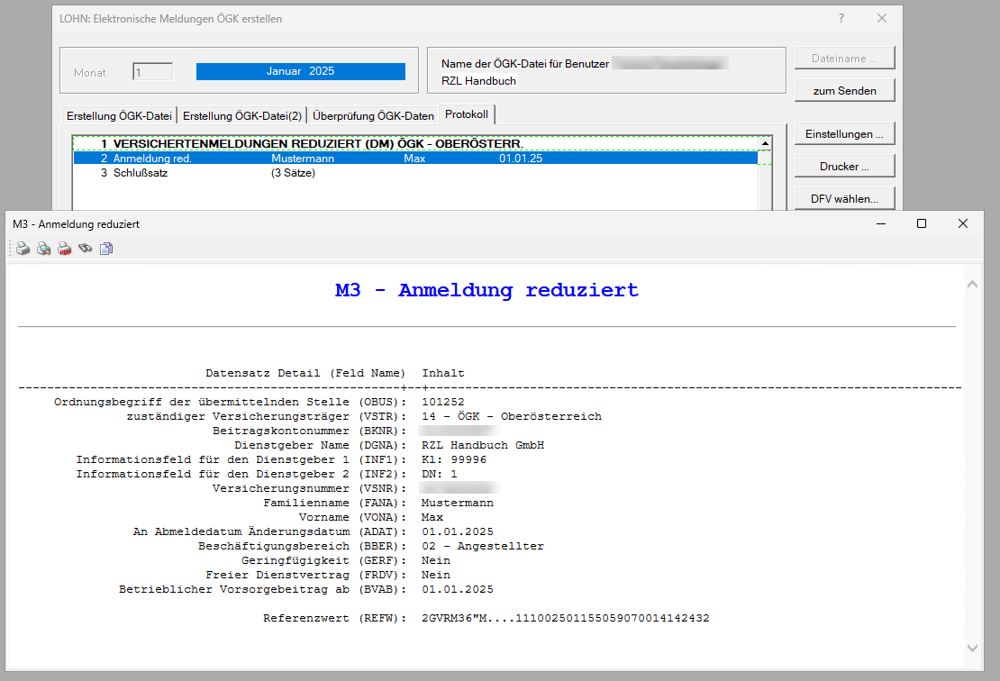
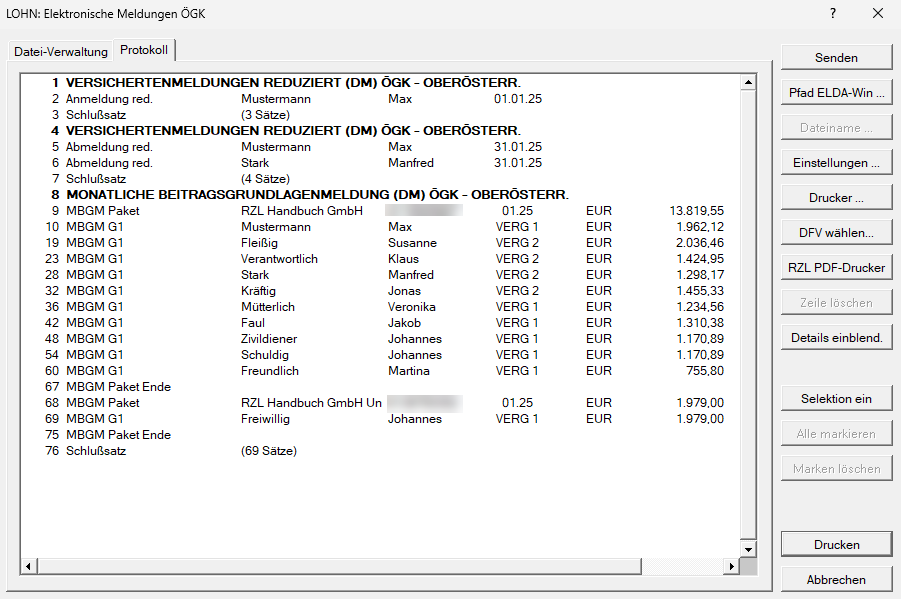
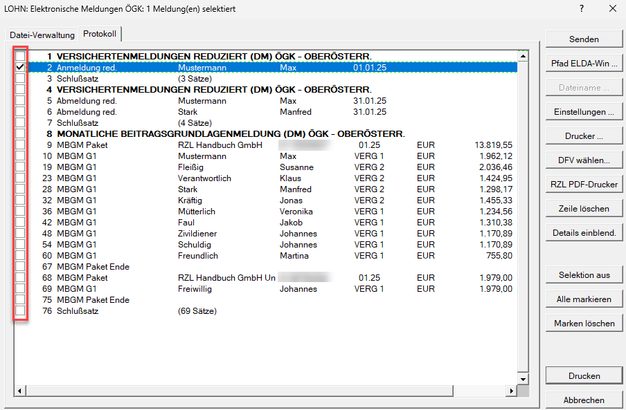

# Protokoll

Im Registerblatt *Protokoll* kann Einsicht in die Liste der in der ÖGK-Datei enthaltenen Meldungen genommen werden.

!!! info "Tipp"
    Bevor die Daten an die Österreichische Gesundheitskasse übermittelt werden, ist es ratsam, das Protokoll zu überprüfen.

## Details einblenden

Über diesen Menüpunkt können Sie sich die Details der monatlichen Beitragsgrundlagenmeldung anzeigen lassen.

## Details einzelner Meldungen anzeigen

Durch einen Doppelklick auf die gewünschte Meldung (z. B. eine Anmeldung) werden Ihnen die Übermittlungsdetails dieser Meldung angezeigt.

{width="500"}

So haben Sie die Möglichkeit, die zu übermittelnden Daten vor dem Versand der Meldung an die ÖGK zu überprüfen.

## Einzelne Meldungen im ÖGK-Dialog auswählen und übermitteln

Im ÖGK-Dialog besteht die Möglichkeit, gezielt einzelne Meldungen zur Übermittlung auszuwählen. Es ist also nicht notwendig, alle Meldungen aus der ÖGK-Datei auf einmal zu versenden.

Um dies zu tun, öffnen Sie den Menüpunkt *Klient / Elektronische Übermittlung / Elektronische Meldung ÖGK absenden*. Im erscheinenden *Protokollfenster* finden Sie den Button *Selektion ein*. 

{width="600"}

Wenn Sie diesen anklicken, erscheinen auf der linken Seite des Bildschirms kleine Auswahlkästchen neben den einzelnen Meldungen.

{width="600"}

Durch das Setzen eines Häkchens in diesen Kästchen wählen Sie aus, welche Meldungen übermittelt werden sollen. Nur die markierten Einträge werden an die ÖGK gesendet. Alle übrigen bleiben in der Datei gespeichert und können zu einem späteren Zeitpunkt übermittelt werden.

!!! warning "Hinweis"
    Wenn keine Auswahlkästchen angezeigt werden, bedeutet das, dass alle im *Protokoll* angezeigten Meldungen übermittelt werden.

!!! info "Tipp"
    Auch direkt im Senden-Dialog haben Sie die Möglichkeit, die Selektion zu aktivieren.
    
    Das bedeutet: Wenn Sie über *Bearbeiten / Elektronische Übermittlung / Elektronische Meldung ÖGK erstellen* in das *Protokoll* gelangen, müssen Sie zunächst auf *Senden* klicken. Erst dann wird die Option *Selektion ein* aktiviert und die Auswahl einzelner Meldungen möglich.