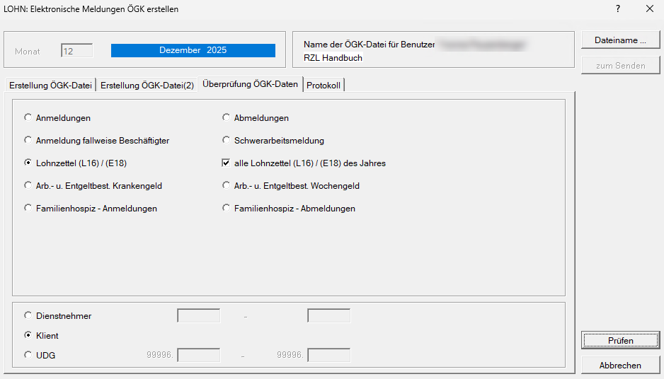

# Überprüfung ÖGK-Daten

In diesem Registerblatt kann für die elektronische Anmeldung, Abmeldung, Lohnzettel L16, Arbeits- und Entgeltbestätigung Kranken- und Wochengeld überprüft werden, ob alle Pflichtfelder angelegt sind, die für eine elektronische Übermittlung nötig sind. Das Anwählen der Schaltfläche *Prüfen* bewirkt unmittelbar den Ausdruck des Prüfberichtes mit einer detaillierten Fehlerbeschreibung.

!!! info "Tipp"
    Wir empfehlen besonders vor dem Versenden der Jahreslohnzettel eine Überprüfung durchzuführen.