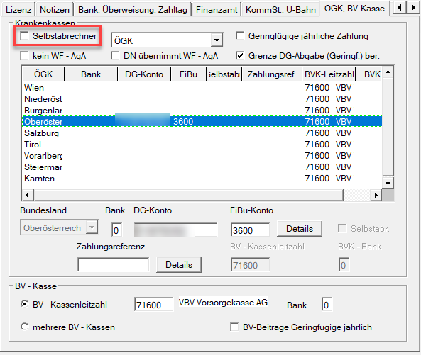

# Erstellung ÖGK-Datei

Die Erstellung der ÖGK-Datei erfolgt im Menüpunkt *Bearbeiten / Elektronische Übermittlung / Elektronische Meldung ÖGK erstellen.*

!!! info "Tipp"
    Die ÖGK-Datei kann auch **klientenübergreifend** im Programmteil *Klient / Elektronische Übermittlung / Elektronische Meldung ÖGK erstellen* erstellt werden. Sämtliche elektronischen Meldungen können im Programmteil *Ausdruck* auch in Papierform ausgegeben werden.

{width="600"}

Im ersten Registerblatt *Erstellung ÖGK-Datei* können Sie *Erstübermittlungen, Richtigstellungen und Stornomeldungen* für folgende Meldungen erstellen:

- Anmeldungen
- Abmeldungen
- Anmeldung fallweise Beschäftigter
- Änderungsmeldungen
- Adresse Versicherter
- monatliche Beitragsgrundlagenmeldung (mBGM)
- Arbeits- und Entgeltbestätigung Krankengeld
- Arbeits- und Entgeltbestätigung Wochengeld

Die einzelnen Meldungen können sowohl für einen oder mehrere bestimmte Dienstnehmer sowie für den gesamten Klienten bzw. Unterdienstgeber durchgeführt werden.

Alle Meldungen bis auf die monatliche Beitragsgrundlagenmeldung (mBGM) werden beim Verlassen der Abrechnung des Dienstnehmers automatisch erstellt. Diese Meldungen können über die *Erstellung ÖGK-Datei* nochmals manuell erstellt werden.

**Änderungsmeldung**

Die Änderungsmeldung wird nur mehr in sehr wenigen Fällen von der ÖGK benötigt:

- Änderung von einem geringfügigen zu einem vollversicherten Beschäftigungsverhältnis
- Umstieg von Abfertigung Alt in das Abfertigungssystem nach dem Betrieblichen Mitarbeiter- und Selbstständigenvorsorgegesetz
- Beginn oder Ende der Betrieblichen Vorsorge
- Korrektur des Beschäftigungsbereiches (Arbeiter, Angestellter bzw. Lehrling)
- Beginn und Ende der Betrieblichen Vorsorge bei einem Unbezahlten Urlaub bis zu einem Monat

**Monatliche Beitragsgrundlagenmeldung (mBGM)**

Aufgrund der unterschiedlichen Meldefristen können die mBGM für die fallweise beschäftigten Dienstnehmer über die entsprechende Option getrennt von den mBGM für die normalen Dienstverhältnisse erstellt werden.

- **Meldungen Vorschreibebetriebe**

    Klienten, die im Bereich der [*Dienstgeberstammdaten*](../../Klientenstammdaten/Stammdaten%20Klient/ÖGK,%20BV-Kasse.md) kein Häkchen bei Selbstabrechner gesetzt haben, werden als Vorschreibebetriebe gekennzeichnet. Durch das Programm wird der mBGM mit der nötigen eigenständigen Satzart für Vorschreibebetriebe versehen.

    {width="500"}

**Berücksichtigung von Aufrollungen im Meldewesen**

Im Zuge einer Aufrollung wird durch das Programm automatisch ein Storno mBGM mit den ursprünglichen Werten sowie eine Neuübermittlung mit den neuen Werten produziert.

{width="600"}

Die Abbildung zeigt die Konsequenzen aus einer Aufrollung vom Februar in den Jänner. Im Zuge der Erstellung des mBGM für den Aufrollmonat Februar, wird automatisch zugleich ein Storno mBGM für den Monat Jänner mit den ursprünglichen Werten erzeugt und schließlich ein neuer mBGM für Jänner mit den neuen Werten.

**Erstellen der Datei**

Wenn die notwendige Meldung ausgewählt wurde, muss die Schaltfläche *Erstellen* angewählt werden. Wurden bereits Daten in die ÖGK-Datei übernommen, zeigt das Programm folgende Meldung an:

{width="400"}

Wird *zu bestehenden Meldungen hinzufügen* ausgewählt, dann werden die in der Datei bereits enthaltenen Daten, im Gegensatz zur Auswahl *vorhandene Datei überschreiben* nicht gelöscht, sondern es werden die neuen Daten angefügt. Wird das Auswahlfeld *vorhandene Datei überschreiben* angewählt, erfolgt vom Programm die Abfrage, ob die bestehenden Daten gelöscht werden sollen.

Für die Übermittlung der im Registerblatt angeführten Meldungen, müssen bestimmte Pflichtfelder in den Stammdaten des Dienstgebers und Dienstnehmers ausgefüllt sein, ohne die eine elektronische Übermittlung nicht durchgeführt werden kann.

Wenn eine elektronische Meldung nicht durchgeführt werden kann (z. B. die elektronische Anmeldung eines Dienstnehmers), so weist das Programm nach Anwahl der Schaltfläche *Erstellen* darauf hin, dass der Dienstnehmer nicht in die ÖGK-Datei übernommen und somit in weiterer Folge auch nicht angemeldet wird.
