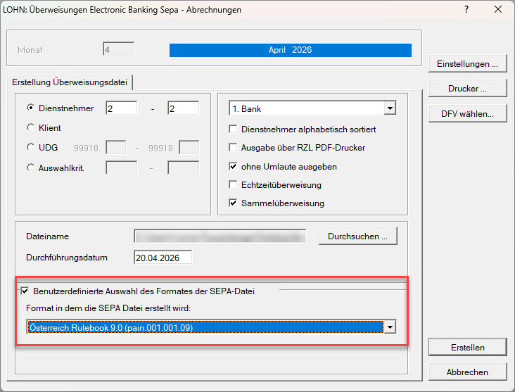

# Häufige Fragen im Support

## SEPA Überweisungen

### Beim Import der SEPA-Datei in das Banktool erscheint eine Meldung zur Datenformat-Version.

"*Achtung: Die von Ihnen verwendete Datenformat-Version (ISO-2009) wird nur mehr bis November 2026 unterstützt. Bitte aktualisieren Sie dieses rechtzeitig.*"

**Was ist zu tun?**

Derzeit müssen Sie nichts unternehmen.

Sie können bei der Erstellung der SEPA-Überweisungsdatei bereits das **Rulebook Österreich 9.0** hinterlegen.

{width="500"}

Dadurch wird die Meldung beim Import in das Banktool nicht mehr angezeigt.

Eine generelle Umstellung seitens RZL auf das **Rulebook Österreich 9.0** erfolgt vor November 2026. Aktuell wird noch das Rulebook Österreich 7.1 verwendet, da einzelne Banken das neue Rulebook noch nicht vollständig unterstützen. Andernfalls könnte es beim Import der Überweisungsdatei zu Problemen kommen.

