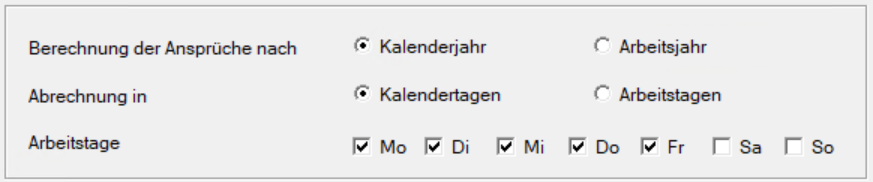

# Krankenstand

{width="500"}

In diesem Bildschirm kann für die Berechnung der Ansprüche zwischen *Kalenderjahr*, *Arbeitsjahr* und *Kalendertagen* oder *Arbeitstagen* gewählt werden. Die Eintragungen, die hier getroffen werden, wirken sich auf den Ausdruck der [Arbeits- und Entgeltbestätigung für Krankengeld](../Abrechnungsbildschirme/Arbeits_und_Entgeltbestaetigung_Krankengeld.md) aus.