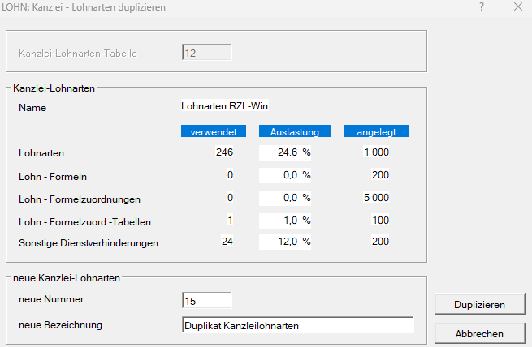

# Freie Lohnarten – Überblick und Verwaltung

Im RZL Lohnprogramm wird zwischen **fixen Lohnarten** und **freien Lohnarten** unterschieden.

| Lohnart         | Beschreibung                                                                                            |
| :-------------- | :------------------------------------------------------------------------------------------------------ |
| Fixe Lohnarten  | Sind vom RZL Lohnprogramm vorgegeben und können in diesem Bereich nicht angelegt oder verwaltet werden. |
| Freie Lohnarten | Können individuell angelegt, bearbeitet und verwaltet werden.                                           |

!!! warning "Hinweis"
    In diesem Kapitel wird ausschließlich die Verwaltung der **freien Lohnarten** beschrieben.

## Wo werden freie Lohnarten verwaltet?

Freie Lohnarten können entweder **klientenbezogen** oder **kanzleibezogen** verwaltet werden.

| Verwaltung      | Verwendung                                                                                                                        | Programmaufruf                                                            |
| :-------------- | :-------------------------------------------------------------------------------------------------------------------------------- | :------------------------------------------------------------------------ |
| Klientenbezogen | Die freien Lohnarten gelten für einen einzelnen Klienten.                                                                         | *Stamm / Lohnarten*                                                       |
| Kanzleibezogen  | Die freien Lohnarten werden zentral in einer Kanzleilohnartentabelle verwaltet und können von mehreren Klienten verwendet werden. | *Klient / Kanzlei / Lohnarten, Lohnformeln, Sonstige Dienstverhinderunge* |

### Klientenbezogene Verwaltung

Verwenden Sie die klientenbezogene Verwaltung, wenn eine freie Lohnart ausschließlich für einen bestimmten Klienten benötigt wird.

Die Verwaltung erfolgt unter: *Stamm / Lohnarten*

Die dort angelegten freien Lohnarten stehen für den jeweiligen Klienten zur Verfügung.

### Kanzleibezogene Verwaltung

Sollen einheitliche freie Lohnarten für mehrere Klienten verwendet werden, können diese zentral in einer Kanzleilohnartentabelle verwaltet werden.

Die Verwaltung erfolgt unter: *Klient / Kanzlei / Lohnarten, Lohnformeln, Sonstige Dienstverhinderungen*

Eine Kanzleilohnartentabelle kann mehreren Klienten zugeordnet werden.

!!! info "Tipp"
    Damit die freien Lohnarten einer Kanzleilohnartentabelle bei einem Klienten verwendet werden können, muss die entsprechende Kanzleilohnartentabelle in den Stammdaten des Klienten hinterlegt sein.

!!! warning "Hinweis"
    Ein Wechsel zwischen klientenbezogenen freien Lohnarten und einer Kanzleilohnartentabelle ist **nicht** während des laufenden Jahres möglich. Der Wechsel kann im Zuge der [Jahresübernahme](../Jahresuebernahme.md) vorgenommen werden.

## Klienten-Lohnarten als Kanzleilohnartentabelle übernehmen

Bestehende freie Lohnarten eines Klienten können als Grundlage für eine neue Kanzleilohnartentabelle verwendet werden.

Rufen Sie dazu folgenden Programmteil auf: *Klient / Kanzlei / Lohnarten von Klient übernehmen*

{width="600"}

**Anzeige nach Auswahl des Klienten**

Nach Eingabe der Klientennummer werden der **Klientenname** und das **Kalenderjahr** angezeigt.

Zusätzlich sehen Sie:

- die Anzahl der verwendeten Lohnarten,
- die Auslastung in Prozent und
- das maximal mögliche Mengengerüst.

Es können maximal **200 Lohnarten** verwaltet werden.

**Vorgehensweise**

1. Geben Sie die *Klientennummer* des Klienten ein, dessen freie Lohnarten übernommen werden sollen.
2. Kontrollieren Sie den angezeigten Klienten und das Kalenderjahr.
3. Vergeben Sie eine *Nummer* für die neue Kanzleilohnartentabelle.
4. Geben Sie eine aussagekräftige Bezeichnung für die Tabelle ein.
5. Wählen Sie *Übernehmen*.

Die freien Lohnarten des ausgewählten Klienten werden daraufhin als Kanzleilohnartentabelle angelegt.

!!! info "Tipp"
    Verwenden Sie für die Bezeichnung der Kanzleilohnartentabelle einen Namen, aus dem der vorgesehene Einsatzbereich klar hervorgeht.

## Kanzleilohnarten auf einen Klienten übernehmen

Freie Lohnarten einer Kanzleilohnartentabelle können auch auf einen einzelnen Klienten übernommen werden.

Rufen Sie dazu folgenden Programmteil auf: *Stamm / Lohnarten von Kanzlei-Tabelle übernehmen*

**Vorgehensweise**

1. Geben Sie im Feld *Kanzlei-Lohnartentabelle* die gewünschte Tabellennummer ein.
2. Kontrollieren Sie die ausgewählte Tabelle.
3. Wählen Sie *Übernehmen*.

Die freien Lohnarten der Kanzleilohnartentabelle werden auf den Klienten übernommen.

{width="600"}

!!! warning "Hinweis"
    Ein Wechsel von klientenbezogenen Lohnarten auf eine Kanzleilohnartentabelle oder umgekehrt ist nur im Zuge der [**Jahresübernahme**](../Jahresuebernahme.md) möglich.

## Kanzleilohnartentabelle duplizieren

Kanzleilohnartentabellen können über den Menüpunkt *Klient / Kanzlei / Lohnarten duplizieren* kopiert werden.

Gehen Sie dabei wie folgt vor:

1. Geben Sie die Nummer der Kanzleilohnartentabelle ein, die dupliziert werden soll.
2. Wählen Sie im Bereich *Neue Kanzlei-Lohnarten* eine noch freie Nummer für die neue Kanzleilohnartentabelle aus.
3. Tragen Sie unter *Neue Bezeichnung* eine passende Bezeichnung für die neue Kanzleilohnartentabelle ein.

!!! warning "Hinweis"
    Eine Auswahl einzelner Lohnarten ist beim Duplizieren **nicht** möglich. Es werden immer alle freien Lohnarten in die neue Kanzleilohnartentabelle übernommen.

## Musterlohnartentabelle

Die in der Musterlohnartentabelle sowie die im Handbuch beschriebenen Musterlohnarten verstehen sich als unverbindliche Vorschläge zur Lohnartenerfassung. Sie basieren auf einschlägigen Fachartikeln.

Bitte beachten Sie, dass die **Letztverantwortung** für die korrekte Anlage und Verwendung der Lohnarten beim Anwender liegt. Aufgrund der Komplexität und Vielschichtigkeit der lohnverrechnungsrechtlichen Bestimmungen kann eine **ungeprüfte** Übernahme der Musterlohnarten **nicht empfohlen** werden.

Wir empfehlen daher, jede Musterlohnart vor dem Einsatz fachlich und unternehmensspezifisch zu prüfen und gegebenenfalls an individuelle Anforderungen anzupassen.