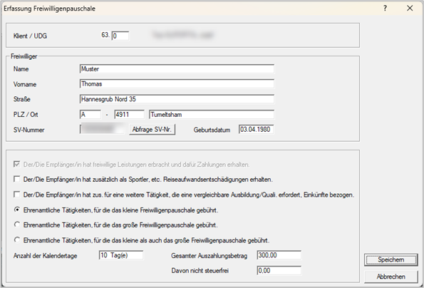

# Freiwilligenpauschale § 3 Abs. 1 Zi. 42 lit a und b

## Gesetzliche Grundlagen

Seit 2024 gibt es die Möglichkeit, an ehrenamtlich tätige Personen in einer gemeinnützigen Organisation eine steuerfreie Freiwilligenpauschale auszubezahlen. Es wird dabei zwischen einer kleinen und einer großen Freiwilligenpauschale unterschieden, die wiederum unterschiedliche Voraussetzungen aufweisen.

**Kleines Freiwilligenpauschale § 3 Abs. 1 Zi. 42 lit a EStG**

Für das kleine Freiwilligenpauschale sieht der Gesetzgeber folgende Vorgaben vor:

- Freiwillige Leistung für eine Körperschaft, die die Voraussetzungen der § 34 bis 47 BAO erfüllt.
- Die betroffene Person darf von dieser Körperschaft keine pauschalen Reiseaufwandsentschädigungen § 3 Abs. 1 16 c erhalten haben.
- Der ehrenamtlich Tätige darf von dieser Körperschaft keine Einkünfte aus selbständiger Arbeit, Gewerbebetrieb, nichtselbständiger Arbeit bzw. sonstige Einkünfte im Sinne des §&nbsp;2&nbsp;Abs. 3 Zi. 2 bis 4 und 7 EStG beziehen.

Beschränkung der Höhe nach: maximal **EUR 30,00** pro Kalendertag bzw. maximal **EUR 1.000,00** im Kalenderjahr.

**Großes Freiwilligenpauschale § 3 Abs. 1 Zi. 42 lit b EStG**

Für das große Freiwilligenpauschale gibt es zusätzlich folgende Kriterien zu erfüllen:

- Es müssen Tätigkeiten die mildtätigen Zwecken dienen (§ 37 BAO) im Bereich Gesundheitspflege, Kinder-, Jugend-, Familien-, Kranken-, Behinderten- und Altenfürsorge sowie im Bereich der Katastrophenhilfe vorliegen.
- Tätigkeiten die Funktionen als Ausbilder oder Übungsleiter umfassen und die Entwicklung geistiger oder körperlicher Fähigkeiten fördern (Chorleiter, Kapellmeister, Wissensvermittler im kulturellen und künstlerischen Bereich) müssen ausgeübt werden.

Beschränkung der Höhe nach: maximal **EUR 50,00** pro Kalendertag und maximal **EUR 3.000,00** im Kalenderjahr.

Falls die Tätigkeiten sowohl der kleinen als auch der großen Freiwilligenpauschale entsprechen, können insgesamt nicht mehr als EUR 3.000,00 pro Jahr steuerfrei bezogen werden.

## Erfassung der Ehrenamtlichen Personen in der RZL-Lohnverrechnung

Nachdem für diese ehrenamtlichen Helfer keine Dienstnehmereigenschaft vorliegen darf, gibt es einen eigenen Erfassungsdialog. Über den Menüpunkt *Abrechnung / Sonderfälle / Erfassung E29 – Freiwilligenpauschale* ist zunächst eine laufende Nummer für den ehrenamtlichen Helfer festzulegen.

{width="500"}

Mit Hilfe der Schaltfläche *Anlegen* gelangen Sie nun in den eigentlichen Erfassungsdialog. Zunächst müssen die Stammdaten des ehrenamtlichen Helfers erfasst werden.

Anschließend werden entsprechend dem Formular E 29 einige fachliche Optionen abgefragt und es ist eine Entscheidung über den Anspruch auf kleines oder großes Freiwilligenpauschale zu treffen. Zum Schluss müssen Sie noch die Anzahl der Tage mit ehrenamtlicher Tätigkeit erfassen, den gesamten Auszahlungsbetrag und den nicht steuerfreien Anteil am Gesamtbetrag. Über den Button *Speichern* wird die Datenerfassung für diese Person dann abgeschlossen.

!!! warning "Hinweis"
    Wenn keine SV-Nummer vorhanden ist, ist eine Übermittlung des E29 dennoch möglich, wenn Name, Vorname, Straße, PLZ/Ort und Geburtsdatum ausgefüllt sind.

**Der/Die Empfänger/in hat freiwillige Leistungen erbracht und dafür Zahlungen erhalten.**

Ist standardmäßig von uns gesetzt, da ohne dieser Auswahl keine Übermittlung des E29 möglich ist.

**Der/Die Empfänger/in hat zusätzlich als Sportler, etc. Reiseaufwandsentschädigungen erhalten.**

Darunter sind pauschale Reiseaufwandsentschädigungen (PRAE) zu verstehen, die von steuerlich begünstigten Rechtsträgern, deren satzungsgemäßer Zweck die Ausübung oder Förderung des Körpersportes ist, an Sportler, Schiedsrichter und Sportbetreuer (z. B. Trainer, Masseure) gewährt werden (Formular L19).

**Der/Die Empfänger/in hat zusätzlich für eine weitere Tätigkeit, die eine vergleichbare Ausbil-dung/Qualifikation erfordert, Einkünfte bezogen.**

Bezieht die ehrenamtlich tätige Person im Erklärungsjahr Einkünfte von dieser Körperschaft oder einer mit ihr verbundenen Körperschaft für eine weitere Tätigkeit, die eine vergleichbare Ausbildung oder Qualifikation erfordert, besteht für die Zahlung(en) aus Anlass der ehrenamtlichen Tätigkeit keine Steuerfreiheit gem. § 3 Abs. 1 Z 42.

*Beispiele:*

- Herr A ist Dienstnehmer eines gemeinnützigen Rettungsdienstes und erhält von diesem für seine Tätigkeit als Sanitäter Einkünfte aus nichtselbständiger Arbeit. Über seine dienstvertragliche Verpflichtung hinaus leistet er in seiner Freizeit freiwillig Rettungseinsätze und erhält dafür Entschädigungen. Da die Tätigkeiten eine vergleichbare Qualifikation erfordern, besteht für die Zahlungen aus Anlass der ehrenamtlichen Tätigkeit keine Steuerfreiheit.
- Frau B ist bei dem gemeinnützigen Rettungsdienst als Buchhalterin beschäftigt. Sie leistet in ihrer Freizeit ebenfalls freiwillig Rettungseinsätze und erhält dafür Entschädigungen. Da die Tätigkeiten keine vergleichbare Qualifikation erfordern, ist die Steuerbefreiung grundsätzlich anwendbar.

**Ehrenamtliche Tätigkeiten, für die das kleine Freiwilligenpauschale gebührt.**

Aktivieren Sie diesen Punkt, wenn die ehrenamtlich tätige Person nur Tätigkeiten ausgeübt hat, für die das kleine Freiwilligenpauschale zusteht. Das kleine Freiwilligenpauschale steht für jede ehrenamtliche Tätigkeit zu, die nicht zu den im unteren Punkt genannten Tätigkeiten gehört, für die das große Freiwilligenpauschale zusteht.

*Beispiel:*

Frau C ist Mitglied bei einem gemeinnützigen Verein. Sie tritt für diesen an 10 Tagen bei öffentlichen Veranstaltungen auf (lit. a) und erhält dafür jeweils EUR 50,00. Die gesamte Jahressumme beträgt EUR 500,00, davon sind EUR 200,00 (10 x EUR 20,00) nicht steuerfrei. Bei *Anzahl der Kalendertage* geben Sie 10 ein, bei *gesamter Auszahlungsbetrag* werden EUR 500,00 und bei *davon nicht steuerfrei* EUR 200,00 eingetragen.

**Ehrenamtliche Tätigkeiten, für die das große Freiwilligenpauschale gebührt.**

Aktivieren Sie diesen Punkt, wenn die ehrenamtlich tätige Person nur Tätigkeiten ausgeübt hat, für die das große Freiwilligenpauschale zusteht. Das große Freiwilligenpauschale steht zu für

- Tätigkeiten, die mildtätigen Zwecken (§ 37 BAO) dienen,
- Tätigkeiten, die der Gesundheitspflege, Kinder-, Jugend-, Familien-, Kranken-, Behinderten-, Blinden- oder Altenfürsorge dienen,
- Tätigkeiten, die der Hilfestellung in Katastrophenfällen (insbesondere Hochwasser-, Erdrutsch-, Vermurungs- und Lawinenschäden) dienen,
- sowie für Funktionen als Ausbildner oder Übungsleiter (z. B. Tätigkeiten als Chorleiter, Kapellmeister, Wissensvermittler im kulturellen und künstlerischen Bereich).

Beispielsweise sind folgende Tätigkeiten vom großen Freiwilligenpauschale umfasst: Ärzte, Sanitäter, Bergretter, Flugretter, Krankenschwestern, Pfleger, Hauskrankenpfleger, Psychologen, Sozialbegleiter, Kindergärtner, Erzieher, Psychologen, Sozialhelfer, „Streetworker“, Familienhelfer, Sozialarbeiter, Therapeuten, Bewährungshelfer, Personen, die Hilfe z. B. bei Behördengängen und Wohnungssuche leisten, Vortragende in Sanitäts- oder Zivilschutzkursen.

*Beispiel:*

Herr D ist im Rahmen eines gemeinnützigen Vereins 45 Tage in der Katastrophenhilfe (lit. b) im Einsatz. Für 30 Tage erhält er ein Pauschale von jeweils EUR 40,00, für 15 Tage erhält er ein Pauschale von jeweils EUR 80,00. Die gesamte Jahressumme beträgt EUR 2.400,00, davon sind EUR 450,00 (15 x EUR 30,00) nicht steuerfrei. Bei *Anzahl der Kalendertage* geben Sie 45 ein, bei *gesamter Auszahlungsbetrag* werden EUR 2.400,00 und bei *davon nicht steuerfrei* EUR 450,00 eingetragen. 

**Ehrenamtliche Tätigkeiten, für die das kleine als auch das große Freiwilligenpauschale gebührt.**

Dieser Punkt ist zu aktivieren, wenn es sowohl Tätigkeiten gibt, wofür das kleine sowie das große Freiwilligenpauschale zusteht.

*Beispiel:*

Herr E ist in einem gemeinnützigen Verein für therapeutisches Reiten tätig. Für 55 Tage als Übungsleiter (lit. b) erhält er jeweils EUR 50,00, in Summe also EUR 2.750,00. Für die Erbringung von Unterstützungsleistungen an 14 Tagen (lit. a) erhält er ein Pauschale von EUR 30,00 pro Tag, insgesamt also EUR 420,00. Die gesamte Jahressumme beträgt EUR 3.170,00. Davon sind EUR&nbsp;170,00 nicht steuerfrei. Bei *Anzahl der Kalendertage* geben Sie 69 ein, bei *gesamter Auszahlungsbetrag* werden EUR 3.170,00 und bei *davon nicht steuerfrei* EUR 170,00 eingetragen.

## Erstellung und Übermittlung der Meldung E 29 an die ÖGK

Wählen Sie hierfür den Menüpunkt *Bearbeiten / Elektronische Übermittlung / Elektronische Meldung Freiwilligenpauschale E 29 erstellen*.

{width="500"}

Hier können Sie wie gewohnt entweder die Meldung für alle freiwilligen Helfer gemeinsam oder für eine bestimmte Person separat erstellen. Im Normalfall wird die Datei in einem Standardordner abgelegt. Falls dies gewünscht ist, kann hier auf einen vom Benutzer festgelegten Ordner gewechselt werden.

!!! warning "Hinweis"
    Das Feld *Eingabe ursprünglicher Referenzwert* kann verwendet werden, wenn mehrere E29 übermittelt wurden.

!!! warning "Hinweis"
    Vergessen Sie nicht, in den Stammdaten des Klienten unter *Stamm / Klient / Registerblatt ZVR-Zahl* die ZVR-Zahl zu hinterlegen. Dies ist ein Pflichtfeld für das E29.

{width="500"}

Im Registerblatt *Protokoll* können Sie Details zur erstellten Meldung nachvollziehen.

!!! warning "Hinweis"
    Diese Meldung wird im XML-Format erstellt und über die ELDA-Software übermittelt. Dadurch landen diese Daten nicht in der sonst verwendeten normalen ÖGK-Datei. Bislang wird diese Meldeschiene sonst nur für die pauschalen Reiseaufwandsentschädigungen L19 verwendet.

Die Übermittlung der Daten erfolgt entweder über den Menüpunkt *Klient / Elektronische Übermittlung / Elektronische Meldung Freiwilligenpauschale absenden* oder aus dem vorherigen Dialog der Erstellung direkt über den Button *Senden*.

{width="500"}

Hier können die erstellten Meldungen über das Registerblatt *Protokoll* geprüft und anschließend über den Button *Senden* mit Hilfe der ELDA Software übertragen werden. Falls nötig, ist es möglich falsche oder doppelt erstellte Meldungen zu löschen.

## Ausdruck Formular E 29

Der Ausdruck ist unter *Ausdruck / Lohnzettel / Freiwilligenpauschale E29* möglich.