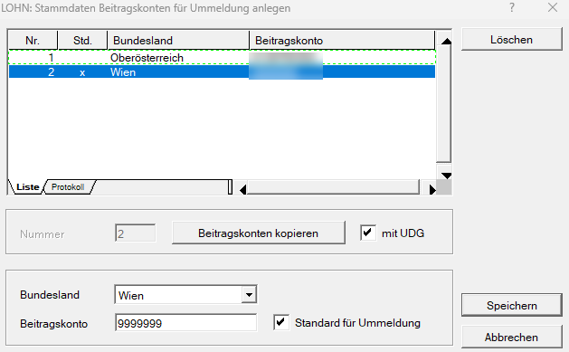

# Beitragskonto für Ummeldung

Unter *Stamm / Beitragskonten für Ummeldung* können Sie das Beitragskonto hinterlegen, das bei einer Ummeldung als neues Beitragskonto verwendet werden soll.

Das hinterlegte Beitragskonto steht anschließend in der Abrechnung des Dienstnehmers im Bereich *Austritt* im Feld [*Zielbeitragskontonummer*](../Abrechnungen_Sonderfälle/Abmeldung_Ummeldung.md) zur Auswahl.

