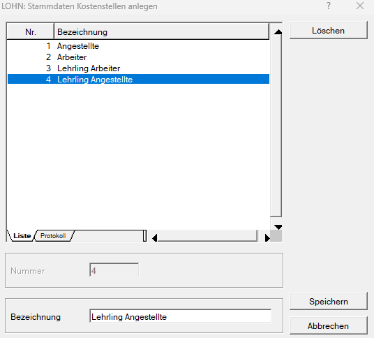

# Kostenstellen und Kostenträger

Es können jeweils bis zu 5.000 Kostenstellen und 5.000 Kostenträger angelegt werden.

Für die Nummernvergabe sind ausschließlich **numerische Zeichen** zulässig. Buchstaben können **nicht** verwendet werden.

Die Nummer darf maximal 9 Zeichen umfassen. Für die Bezeichnung stehen maximal 30 Zeichen zur Verfügung.

Kostenstellen und Kostenträger können über *Stamm / Kostenstellen* bzw. *Stamm / Kostenträger* erfasst werden.

## Kostenstellen und Kostenträger aus der FIBU übernehmen

Kostenstellen und Kostenträger können aus dem zugehörigen FIBU-Klienten in das Lohnprogramm übernommen werden.

Dafür stehen folgende Menüpunkte zur Verfügung:

- *Stamm / Kostenstellen von FIBU übernehmen*
- *Stamm / Kostenträger von FIBU übernehmen*

Durch die Übernahme aus der FIBU ist keine zusätzliche manuelle Erfassung der Kostenstellen bzw. Kostenträger im Lohnprogramm erforderlich.