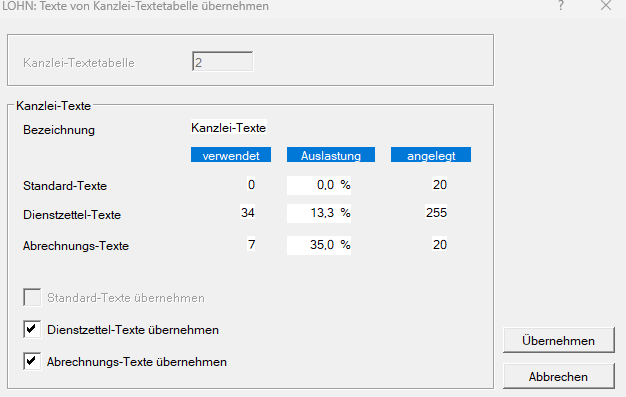

# Standard-, Dienstzettel- und Abrechnungstexte

Im Programm können verschiedene Standard-, Dienstzettel- und Abrechnungstexte hinterlegt werden, die bei der laufenden Lohnverrechnung wiederverwendet werden können. Je nach Verwendungszweck stehen klientenbezogene Standardtexte, Dienstzettel-Texte und Abrechnungstexte zur Verfügung.

Die Texte werden in den jeweiligen Stammdaten erfasst und können anschließend in den dafür vorgesehenen Abrechnungsbereichen verwendet bzw. auf den Abrechnungen der Dienstnehmer angedruckt werden.

## Standardtexte

Klientenbezogene Standardtexte werden unter *Stamm / Standardtexte* angelegt. Pro Klient können bis zu 20 Standardtexte mit jeweils maximal 20 Zeichen erfasst werden.

Die angelegten Standardtexte stehen ausschließlich bei jenem Klienten zur Verfügung, für den sie erfasst wurden.

### Sonstiger Austrittsgrund

Im Abrechnungsbildschirm [*Austritt*](../Abrechnungsbildschirme/Austritt.md) steht eine umfangreiche Auswahl an Austrittsgründen zur Verfügung. Soll ein individuell angelegter Standardtext verwendet werden, ist als Austrittsgrund **Sonstiger Grund** auszuwählen.

Anschließend wird ein weiteres Auswahlfeld eingeblendet. In diesem Feld kann einer der Texte ausgewählt werden, die in der ausgewählten Standardtext-Tabelle hinterlegt sind.

### Grund der Unterbrechung der Beschäftigung

Bei einer Unterbrechung der Beschäftigung ist im Abrechnungsbildschirm [*Austritt*](../Abrechnungsbildschirme/Austritt.md) der Grund der Unterbrechung anzugeben.

Für dieses Auswahlfeld sind im Programm keine fixen Vorschläge hinterlegt. Sofern entsprechende Standardtexte vorhanden und aktiviert sind, werden diese unmittelbar zur Auswahl angeboten.

## Dienstzetteltexte

Dienstzetteltexte werden unter *Stamm / Dienstzetteltexte* angelegt. Pro Klient können bis zu 99 Texte mit jeweils maximal vier Zeilen erfasst werden.

Die angelegten Dienstzetteltexte können ausschließlich bei jenem Klienten verwendet werden, für den sie erfasst wurden.

Sie stehen im Abrechnungsbildschirm [*Dienstzettel*](../Abrechnungsbildschirme/Dienstzettel.md) in den Feldern *Dauer der Kündigungsfrist*, *Kündigungstermin*, *Einzuhaltende Kündigungsverfahren* und *Sonstige Vereinbarungen* zur Verfügung. In diesen Feldern ist lediglich die Nummer des gewünschten Textes einzugeben. Der zugehörige Text wird anschließend automatisch in den Dienstzettel übernommen.

## Abrechnungstexte

Unter *Stamm / Abrechnungstexte* können pro Klient bis zu 20 Abrechnungstexte mit jeweils maximal 30 Zeichen angelegt werden.

In den Klientenstammdaten können im Registerblatt [*Abrechnungstexte*](../Klientenstammdaten/Stammdaten_Klient/Abrechnungstexte_Buchungskreistexte.md) maximal zwei der angelegten Abrechnungstexte ausgewählt und zeitlich begrenzt werden. Diese Texte werden auf den monatlichen Lohnabrechnungen der Dienstnehmer des jeweiligen Klienten links unten im Bereich des Auszahlungsbetrages angedruckt.

Zusätzlich können Abrechnungstexte dienstnehmerbezogen im Abrechnungsbildschirm [*Stammdaten Fristen*](../Abrechnungsbildschirme/Stammdaten_Fristen.md/#abrechnungstexte) erfasst werden.

Damit können auf einer Abrechnung insgesamt bis zu vier Abrechnungstexte ausgegeben werden:

- zwei klientenbezogene Abrechnungstexte aus den [Klientenstammdaten](../Klientenstammdaten/Stammdaten_Klient/Abrechnungstexte_Buchungskreistexte.md),
- zwei dienstnehmerbezogene Abrechnungstexte aus dem Abrechnungsbildschirm [*Stammdaten Fristen*](../Abrechnungsbildschirme/Stammdaten_Fristen.md/#abrechnungstexte).

## Texte von Kanzleitabelle übernehmen

Unter *Stamm / Texte von Kanzleitabelle übernehmen* können bereits vorhandene [Kanzleitexte](../Kanzleitexte_und_Kanzleilohnkontenplaene.md) auf einen Klienten übernommen werden.

Geben Sie im Feld *Kanzlei-Textetabelle* die Nummer der gewünschten Kanzlei-Textetabelle ein. Anschließend werden die Anzahl der verwendeten und angelegten Texte sowie die jeweilige Auslastung angezeigt.

Sie können festlegen, welche Textarten übernommen werden sollen. Zur Auswahl stehen:

- Standard-Texte
- Dienstzettel-Texte
- Abrechnungs-Texte

Es ist nicht erforderlich, alle Textarten zu übernehmen. Aktivieren Sie ausschließlich jene Textarten, die auf den Klienten übertragen werden sollen.

Klicken Sie anschließend auf *Übernehmen*, um die ausgewählten Texte aus der Kanzlei-Textetabelle auf den Klienten zu übertragen.