# Kollektivvertragserhöhung

**Drei Varianten der Kollektivvertragserhöhung**

Die Kollektivverträge sehen drei verschiedene Varianten der Kollektivvertragserhöhung vor.

- Betragsmäßige Überzahlung beibehalten
- Betragsmäßige Überzahlung beibehalten und falls zusätzlich vereinbart eine prozentuelle Überzahlung beibehalten
- Ist-Lohn-Erhöhung

## Variante 1: Betragsmäßige Überzahlung beibehalten

Sieht der Kollektivvertrag vor, dass die Überzahlung erhalten bleiben muss, erfolgt in der Abrechnung nun der Hinweis: „Kollektivvertrag: Abw. Einstellung `Überzahlung beibehalten‘ aktivieren.“

{width="400"}

Durch einen Doppelklick auf diesen Hinweis werden Sie automatisch vom Programm in den entsprechenden Kollektivvertragsbereich geleitet. Dort können Sie die *abweichenden Einstellungen für diesen Dienstnehmer* und das Feld *Überzahlung beibehalten* aktivieren.

Im Bereich *Fristen/Hinweise* erscheint dadurch ein neuer Vorschlag für den KV-Mindestbezug inklusive Überzahlung. Dieser kann in die fixe Lohnart *Lohn/Gehalt* mit rechten Mausklick *KV-Bezug übernehmen* übernommen werden.

!!! warning "Hinweis"
    Falls die Option *Überzahlung beibehalten* im Monat der Kollektivvertragserneuerung nicht sofort gesetzt wurde, weil keine Zeit war oder die Kollektivvertragspartner erst ein paar Monate später zu einer Einigung gelangten, wird in den drei darauffolgenden Monaten immer noch darauf hingewiesen, dass noch Vorkehrungen zu treffen sind:

    

Im Kontextmenü der Abrechnung (rechter Mausklick in den grauen Bereich) gibt es die Möglichkeit, direkt auf den Eintrag der Ist-Lohn-Erhöhung zu navigieren.

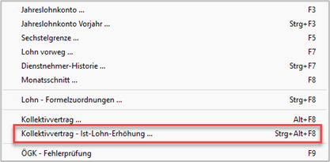{width="400"}

Sie gelangen in die HG-Datenbank. Hier wird die kollektivvertragliche Erhöhung beschrieben.

{width="500"}

!!! warning "Hinweis"
    Wird mehr als eine Lohnart mit der Lohnartendefinition „KV-Bezug“ abgerechnet, erscheint immer der KV-Erhöhung-Berechnungsdialog.

## Variante 2: Betragsmäßige Überzahlung beibehalten, falls zusätzlich vereinbart prozentuelle Überzahlung beibehalten

Sieht der Kollektivvertrag vor, dass die Überzahlung erhalten bleiben muss, erfolgt in der Abrechnung nun der Hinweis: „Kollektivvertrag: Abw. Einstellung `Überzahlung beibehalten‘ aktivieren.“

{width="400"}

Durch einen Doppelklick auf diesen Hinweis werden Sie automatisch vom Programm in den entsprechenden Kollektivvertragsbereich geleitet. Dort können Sie die *abweichenden Einstellungen für diesen Dienstnehmer* und das Feld *Überzahlung beibehalten* aktivieren.

Da diese Kollektivverträge vorsehen, dass eine Vereinbarung (Dienstvertrag, Zusatzvereinbarung etc.) zur prozentuellen Beibehaltung der Überzahlung anzuwenden ist, erscheint zusätzlich folgender Hinweis:

Das heißt, falls eine solche Vereinbarung vorliegt, muss im Gegensatz zu Kollektivverträgen mit Bestimmung aus der Variante 1 auch das Feld *prozentuelle Überzahlung beibehalten* aktiviert werden.

Im Bereich *Fristen/Hinweise* erscheint jetzt ein neuer Vorschlag für den KV-Mindestbezug. Dieser kann in die fixe Lohnart *Lohn/Gehalt* mit rechten Mausklick *KV-Bezug übernehmen* übernommen werden.

!!! warning "Hinweis"
    Falls die Option *Überzahlung beibehalten* im Monat der Kollektivvertragserneuerung nicht sofort gesetzt wurde, weil keine Zeit war oder die Kollektivvertragspartner erst ein paar Monate später zu einer Einigung gelangten, wird in den drei darauffolgenden Monaten immer noch darauf hingewiesen, dass noch Vorkehrungen zu treffen sind:

    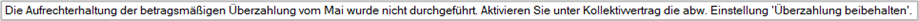

Im Kontextmenü der Abrechnung (rechter Mausklick in den grauen Bereich) gibt es die Möglichkeit, direkt auf den Eintrag der Ist-Lohn-Erhöhung zu navigieren.

{width="400"}

Sie gelangen in die HG-Datenbank. Hier wird die kollektivvertragliche Erhöhung beschrieben.

{width="500"}

## Variante 3: Ist-Lohn-Erhöhung

Sieht der Kollektivvertrag eine Ist-Lohn-Erhöhung vor, erfolgt in der Abrechnung nun der Hinweis: „KV-Erhöhung: {Prozentsatz} %“.

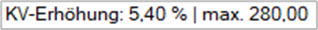{width="200"}

Sie haben jetzt die Möglichkeit, entweder den *KV-Bezug zu übernehmen* oder *KV-Bezug Berechnung* zu öffnen:

{width="400"}

### KV-Bezug Berechnung

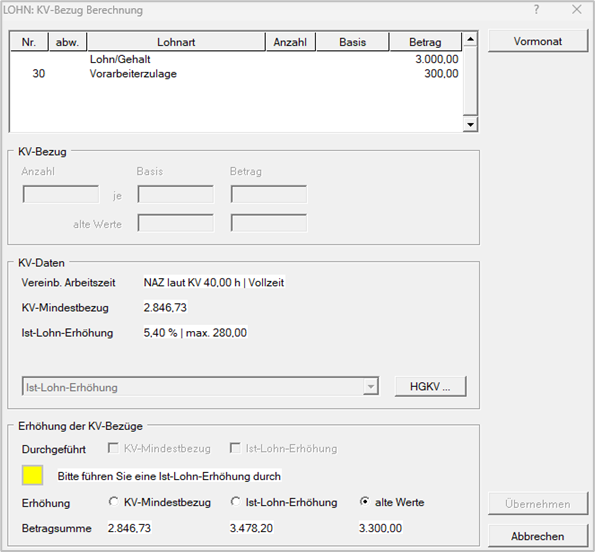{width="400"}

**Bereich KV-Bezug**

Im Bereich *KV-Bezug* haben Sie die Möglichkeit, eine abweichende Aufteilung der vorgeschlagenen KV-Erhöhungsbeträge vorzunehmen. In diesem Bereich werden alle Lohnarten mit der Definition „KV-Bezug“ dargestellt.

- **Aufteilung vom Lohnprogramm**
  
    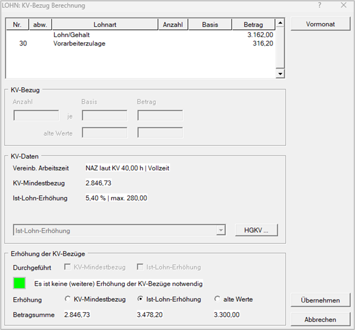{width="400"}

    Es wird die KV-Erhöhung bei beiden Lohnarten vorgenommen.

- **Manuelle Aufteilung der Erhöhung**
  
    Wenn Sie jedoch eine Lohnart (Vorarbeiterzulage) nicht erhöhen möchten, sondern nur zum Beispiel das *Lohn/Gehalt*, dann geben Sie bei der Lohnart wieder den ursprünglichen Betrag (EUR 300,00) ein, somit wird die gesamte Erhöhung auf die Lohnart Lohn/Gehalt verteilt.

    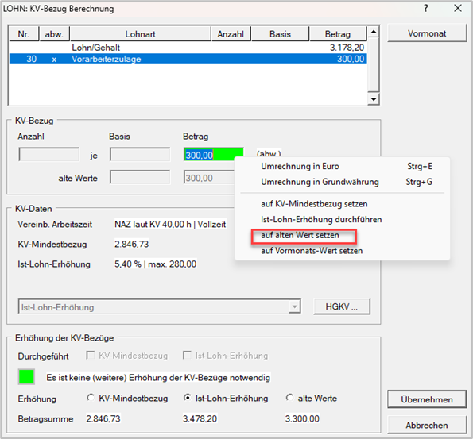{width="400"}

    Die Summe aus den Lohnarten ergibt immer die unten dargestellte *Ist-Lohn-Erhöhung* (EUR 3.478,20).
  
    Mit dem Button **Vormonat** können die Werte auf jene Eingabe vom Vormonat zurückgesetzt werden.
  
    Bei der abweichenden Eingabe der Beträge haben Sie die Möglichkeit, den Wert auf vier Arten zurück zu setzen:

    - *auf KV-Mindestbezug setzen*
    
        Der Wert wird auf den Mindestbezug laut Kollektivvertrag zurückgesetzt.

    - *Ist-Lohn-Erhöhung durchführen*
  
         Es wird der Betrag mit dem Ist-Lohnprozentsatz erhöht.

    - *auf alten Wert setzen*

         Der Betrag wird auf den vorherigen Wert zurückgesetzt.

    - *auf Vormonats-Wert setzen*
  
         Der Betrag wird auf jenen vom Vormonat zurückgesetzt.

### KV-Daten

In diesem Bereich werden die wichtigsten Informationen aus dem hinterlegten Kollektivvertrag dargestellt.

- **Vereinbarte Arbeitszeit**
  
    Es wird immer die Normalarbeitszeit (NAZ) laut KV angeführt. Wenn der Dienstnehmer Vollzeit arbeitet, wird Vollzeit angegeben. Falls der Dienstnehmer Teilzeit arbeitet, wird Teilzeit und das Stundenausmaß angeführt:

    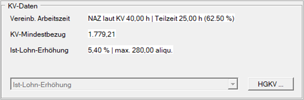{width="400"}

- **KV-Mindestbezug**

    Es wird der KV-Mindestbezug lt. Kollektivvertrag angeführt.

- **Ist-Lohn-Erhöhung**

    Hier sehen Sie die prozentuelle Erhöhung. Falls es eine maximale bzw. minimale Erhöhung gibt, wird auch diese dargestellt.

- **HGKV…**

    Über diesen Menüpunkt gelangen Sie in die KV-Erhöhungsansicht der HGKV.

### Verteilung der KV-Bezüge

In diesem Bereich entscheiden Sie, wie die Lohn-Erhöhung zu erfolgen hat. Es erscheint mit einem gelben Kästchen ein Vorschlag:

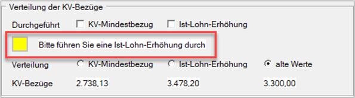{width="400"}

Wenn der Vorschlag aktiviert wurde, erscheint ein grünes Kästchen mit dem Hinweis, dass keine Änderungen vorzunehmen sind.

{width="400"}

Durch Anwahl der Schaltfläche *Übernehmen* wird der Betrag in die Lohnarten übernommen.

Wenn Sie erneut die KV-Bezug Berechnung öffnen, erscheint im Bereich *Verteilung der KV-Bezüge* ein Hinweis, dass bereits eine Ist-Lohn-Erhöhung oder KV-Mindestbezug-Erhöhung stattgefunden hat:

{width="400"}

!!! warning "Hinweis"
    Erfolgt keine Ist-Lohn-Erhöhung, wird in den drei Folgemonaten mit diesem Hinweis darauf hingewiesen: 

    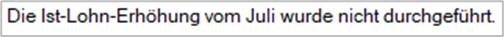{width="300"}

### Sonderfunktion

Haben Sie manuell die KV-Erhöhung vorgenommen, erscheint weiterhin der Hinweis, dass Sie eine Ist-Lohn-Erhöhung durchführen sollen. Dieser Hinweis ist natürlich störend. Deshalb gibt es die Möglichkeit, über rechten Mausklick in das Feld *Lohn/Gehalt* die *Ist-Lohn-Erhöhung (manuell) durchgeführt* zu aktivieren. Dadurch erscheint der Hinweis nicht mehr auf.

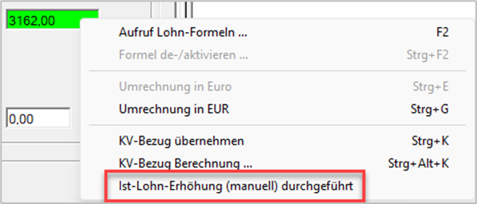{width="400"}

## KV-Erhöhungsvarianten ohne Vorschlagsmöglichkeit

Es gibt natürlich auch KV-Erhöhungsvarianten, welche so komplex sind, dass wir keinen Vorschlag liefern können. Bei diesen Varianten erfolgt dieser Hinweis:

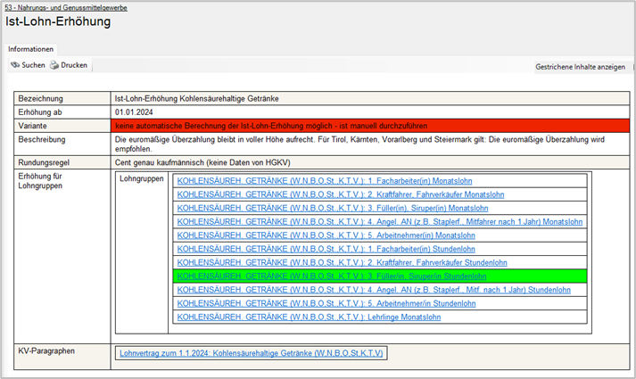{width="400"}

!!! warning "Rechtlicher Hinweis"
    Die neu programmierte Funktion zur Istlohnerhöhung befindet sich in Entwicklung. Zu Testzwecken wird diese Funktion bereits unseren Anwendern zur Verfügung gestellt. Bitte beachten Sie, dass die Funktion fehlerhafte Ergebnisse liefern kann. Überprüfen Sie die zur Verfügung gestellten Informationen.