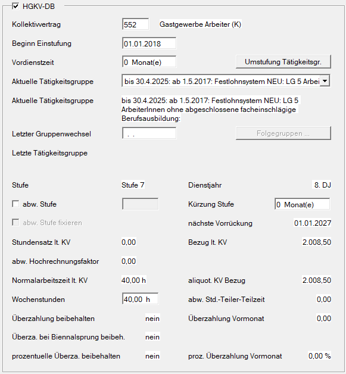
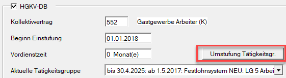
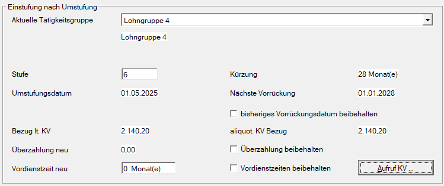
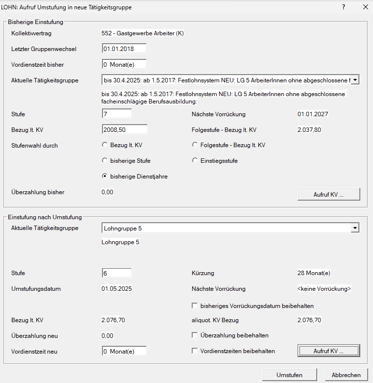
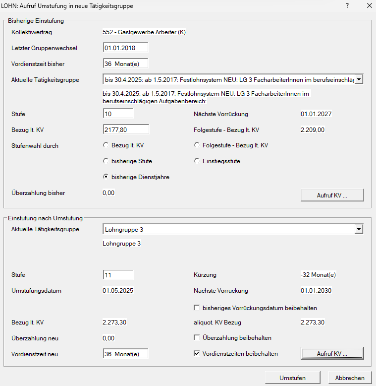

# Umstufung Kollektivvertrag Hotel- und Gastgewerbe ab 01.05.2025

Mit 01.05.2025 kommt es zu einer Neugestaltung der Umstufung im Kollektivvertrag Hotel- und Gastgewerbe (Arbeiter und Angestellte). Um Ihnen die Umstufung zu erleichtern, wurde der Umstufungsdialog im Bereich Kollektivvertrag der Dienstnehmerabrechnung entsprechend erweitert.

{width="500"}

## Umstufung von Lohngruppe 5 in Lohngruppe 4

### Anrechnung von Branchenzeiten

Das Lohnsystem im Hotel- und Gastgewerbe berücksichtigt ab dem 01.05.2025 auch im Bereich der Hilfskräfte die Branchenerfahrung. Die Lohngruppe 4 der Lohn- und Gehaltstabellen umfasst ab diesem Zeitpunkt unter anderem Hilfskräfte, die mindestens 10 Jahre Erfahrung im Hotel- und Gastgewerbe nachweisen können.

Bei der Einstufung in die Lohntabelle ist die Branchenerfahrung von Arbeitern zu berücksichtigen, sofern entsprechende Nachweise erbracht werden. Bei fremdsprachigen Dokumenten ist es aus Sicht des Arbeitgebers ratsam, eine Übersetzung einzufordern.

Kann der Nachweis durch den/die Arbeiter/in erbracht werden, ist wie folgt vorzugehen:

- **Bei weniger als 10 Jahren Branchenerfahrung**: Diese ist zu dokumentieren. Sobald 10 Jahre erreicht sind, erfolgt die Umstufung in Lohngruppe 4.
- **Bei bereits erreichter 10-jähriger Branchenerfahrung**: Es ist die Einstufung in Lohngruppe 4 vorzunehmen:

    - Dienstjahre beim selben Arbeitgeber sind im Rahmen der Lohn- und Gehaltserhöhung gemäß Punkt XVI des Kollektivvertrags vollständig zu berücksichtigen.
    - Extern erworbene Branchenerfahrung wird nicht als Dienstzeit im Betrieb angerechnet.

### Beispiel für die Umstufung von Lohngruppe 5 in Lohngruppe 4

**Ausgangsdaten April 2025**

Der Dienstnehmer verfügt über mehr als 10 Jahre Branchenerfahrung und muss daher mit 01.05.2025 in die Lohngruppe 4 umgestuft werden.

{width="500"}

Durch Auswahl der Schaltfläche *Umstufung Tätigkeitsgruppe* gelangen Sie in den Umstufungsdialog.

{width="500"}

**Umstufungsdialog**

{width="500"}

Im oberen Bereich des Umstufungsdialogs sehen Sie die *bisherige Einstufung*. Für die korrekte Umstufung im Gastro-KV wählen Sie unter *Stufenwahl durch* die Option *bisherige Dienstjahre*.

Zusätzlich stehen auch andere Auswahlmöglichkeiten zur Verfügung, wie etwa *Bezug lt. KV, Folgestufe – Bezug lt. KV, bisherige Stufe* und *Einstiegsstufe*.

!!! warning "Hinweis"
    Die Anzahl der Jahre für die Option *bisherige Dienstjahre* ergibt sich aus dem *Beginn der Einstufung* zuzüglich der im Feld *Vordienstzeiten* eingetragenen Zeiten. Unterbrechungen sowie Dienstjahre vor dem Beginn der Einstufung bleiben unberücksichtigt. Ob die jeweilige Option im konkreten Anlassfall korrekt ist, muss von Ihnen selbst abgewogen und entschieden werden. Bitte beachten Sie, dass es sich bei der neuen Umstufung um ein sehr komplexes Thema handelt.

Anschließend wechseln Sie in den unteren Bereich des Dialogs *Einstufung nach Umstufung*.

{width="500"}

Hier wählen Sie zunächst als *Aktuelle Tätigkeitsgruppe* die Lohngruppe 5 aus. Die zugehörigen Felder werden daraufhin automatisch befüllt. Im nächsten Schritt überprüfen Sie die vorgeschlagenen Werte und können bei Bedarf manuelle Änderungen vornehmen.

***Stufe***

Unter *Stufe* wird die neue Lohngruppenstufe vorgeschlagen. Sie haben die Möglichkeit, diese manuell anzupassen.

***Umstufungsdatum***

Als *Umstufungsdatum* wird automatisch der erste Tag des Abrechnungsmonats eingefügt.

***Kürzung***

Damit der Vorrückstichtag erhalten bleibt, wird automatisch eine *Kürzung* durch das Lohnprogramm generiert.

***Nächste Vorrückung***

Die *nächste Vorrückung* wird angezeigt. Über den Menüpunkt *bisheriges Vorrückungsdatum beibehalten* können Sie das Vorrückungsdatum so anpassen, dass das vorherige Datum erhalten bleibt.

In der Regel findet der Punkt *bisheriges Vorrückungsdatum beibehalten* im Kollektivvertrag für das Hotel- und Gastgewerbe keine Anwendung.

***Bezug lt. KV und aliquotierter KV-Bezug***

Hier wird der neue *Bezug laut Kollektivvertrag* angezeigt. Handelt es sich um einen Teilzeitmitarbeiter, wird der kollektivvertragliche Bezug aliquot dargestellt.

***Vordienstzeiten neu***

Im Bereich *Vordienstzeiten neu* haben Sie die Möglichkeit, durch Auswahl der Option *Vordienstzeiten beibehalten* die bisherigen Vordienstzeiten in den *Kollektivvertragsbildschirm* zu übertragen. Wenn keine Auswahl getroffen wird, werden die bisher erfassten Vordienstzeiten mit **Null** überschrieben.

Über das Feld *Vordienstzeiten neu* haben Sie die Möglichkeit, bisher nicht erfasste Vordienstzeiten nachzutragen. Geben Sie hierzu die Anzahl der Vordienstzeitenmonate ein.

!!! warning "Hinweis"
    Wenn Sie nach der Umstufung eine manuelle Änderung der Vordienstzeiten im *Kollektivvertragsbildschirm* vornehmen, überprüfen Sie den nächsten Vorrückstichtag auf Richtigkeit. Sollte dieser nicht korrekt sein, nehmen Sie die entsprechende Anpassung im Feld *Kürzung Stufe* vor.

## Beispiel Umstufung Lohngruppe 5 alt in Lohngruppe 5 neu

Verbleibt ein Dienstnehmer in der Lohngruppe 5, weil er die 10 Jahre Branchenerfahrung noch nicht erreicht hat, ist dennoch eine Umstufung in die neue Lohngruppe 5 vorzunehmen.

{width="500"}

Erreicht der Dienstnehmer in den kommenden Jahren die 10 Jahre Branchenerfahrung, ist eine Umstufung in Lohngruppe 4 durchzuführen – wie oben beschrieben.

!!! warning "Hinweis"
    Aktuell besteht keine automatische Erinnerungsfunktion zur Umstufung bei Erreichen der 10 Jahre. Sie können jedoch in den *Stammdaten Fristen* eine *Anmerkung* setzen, um rechtzeitig an den Umstufungszeitpunkt erinnert zu werden.

## Beispiel Umstufung Lohngruppe 3 alt in Lohngruppe 3 neu

Dieses Beispiel gilt auch für Umstufungen in die Lohngruppe 1, 2 und 4.

Aufgrund geänderter Einstufungskriterien nach Dienstjahren wurde von der HGKV eine neue Struktur für die Lohngruppen 1 bis 5 eingeführt. Eine Umstufung in die jeweils neue Gruppe ist daher auch hier erforderlich.

Der Ablauf entspricht dem der Umstufung von Lohngruppe 5.

{width="500"}

## Beispiel Umstufung Lohngruppe 3 alt in Lohngruppe 3 Übergangsregelung

Für die Umstufung von Lohngruppe X alt in Lohngruppe X **Übergangsregelung** (für Arbeitnehmer mit mindestens 20 Jahren Dienstzeit zum 30.04.2025) kann derzeit kein automatisierter Vorschlag im Umstufungsdialog bereitgestellt werden. Die Anpassung muss **manuell** erfolgen.

## Einstufungsdatum nicht am Monatsbeginn

Beginnt die Einstufung z. B. am 06.06. statt am 01.06., erfolgt die nächste Vorrückung aufgrund der Vorgabe im Kollektivvertrag am 01.07., nicht bereits am 01.06..