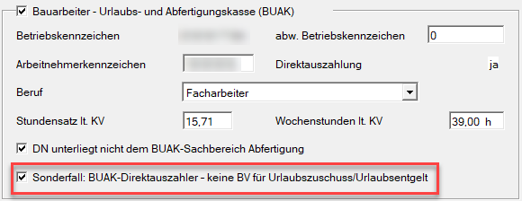
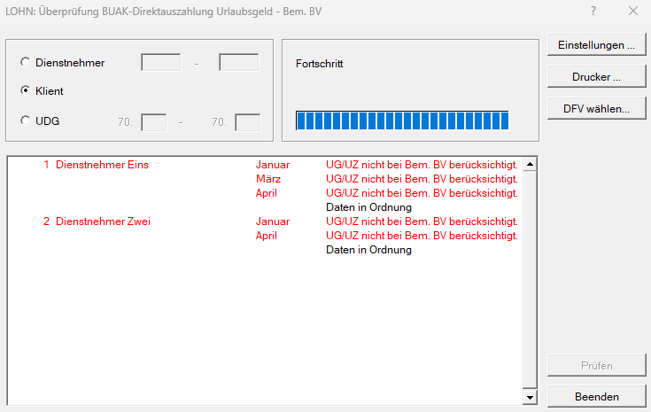
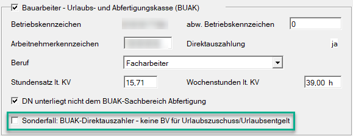

# Sonderfall: BUAK-Direktauszahler in Spenglerbetrieben

Bei Dienstnehmern in Spenglerbetrieben, die der **BUAK-Direktauszahlung** unterliegen, wurde bislang die Betriebliche Vorsorge (BV) nicht vollständig berücksichtigt:

In der Eingabemaske *BUAK-Direktauszahlung* wurde die BV nur für den laufenden Bezug, **nicht** jedoch für Urlaubszuschuss und Urlaubsentgelt berechnet.

Nach Rücksprache mit der BUAK muss der Arbeitgeber auch für den Urlaubszuschuss und das Urlaubsentgelt die Betriebliche Vorsorge bis 31.12.2025 abführen und über den mBGM melden.

Damit dieser Sonderfall über das Lohnprogramm richtiggestellt werden kann, haben wir eine neue Check-Box *Sonderfall: BUAK-Direktauszahler - keine BV für Urlaubszuschuss/Urlaubsentgelt* geschaffen, die im ersten Schritt automatisch vom Programm aktiviert wird und mittels Aufrollung von Ihnen dann **deaktiviert** werden muss.

{width="500"}

## Was ist nun zu tun?

**1. Überprüfung der betroffenen Dienstnehmer**

Führen Sie zunächst ein **Repair** durch, um zu erkennen, welche Dienstverhältnisse betroffen sind.

**Vorgehensweise:**

- Menü: *Bearbeiten / Repair / Überprüfung BUAK-Direktauszahlung Urlaubsgeld - Bem. BV* wählen Sie *Klient*
- Wählen Sie *Klient*
- Klicken Sie auf den Button *Prüfen*

Das System listet alle betroffenen **Dienstnehmer** und **Monate** auf.

{width="500"}

**2. Aufrollen und Korrektur**

Alle betroffenen Abrechnungsmonate müssen aufgerollt und korrigiert werden:

- Öffnen Sie über die Aufrollung den Abrechnungsbildschirm: *Bauarbeiter-Urlaubs-und Abfertigungskasse*
- **Entfernen** Sie das Häkchen bei: *Sonderfall: BUAK-Direktauszahler - keine BV für Urlaubszuschuss/Urlaubsentgelt*

Damit wird die Betriebliche Vorsorge auch für Urlaubsentgelt und Urlaubszuschuss korrekt berechnet.

{width="500"}

**3. mBGM-Korrektur**

Bei der Erstellung des mBGMs wird nun automatisch der alte mBGM storniert und ein neuer mBGM mit der noch fehlenden Betrieblichen Vorsorge übermittelt. Ebenso befindet sich auf dem Auszahlungsjournal (und der Überweisungsliste Abgaben) die Aufrolldifferenz.

!!! warning "Hinweis"
    Nur Dienstnehmer mit BUAK-Direktverrechnung sind betroffen. Dienstnehmer, die über das **Treuhandkonto** abgerechnet werden, sind **nicht** betroffen.

!!! warning "Hinweis"
    Vergessen Sie nicht: Auch Monate des Vorjahres – insbesondere November und Dezember – können betroffen sein und müssen überprüft werden.