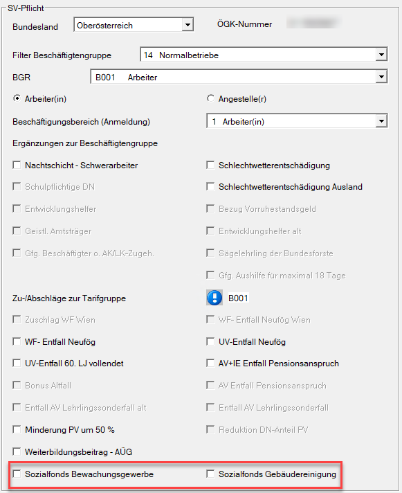
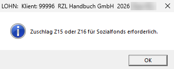

# Sozialfonds ab 01.07.2026

Ab 01.07.2026 muss der Sozialfonds für folgende Kollektivverträge über die mBGM (monatliche Beitragsgrundlagenmeldung) an die ÖGK übermittelt und bezahlt werden:

- Bewachungsgewerbe und
- Denkmal-, Fassaden- und Gebäudereinigung

Dafür wurden seitens ELDA zwei neue Zuschläge geschaffen:

- Z15 Beitrag Sozialfonds Bewachungsgewerbe
- Z16 Beitrag Sozialfonds Gebäudereinigungsgewerbe

Das bedeutet, ab der Abrechnung für Juli 2026 muss für die betroffenen Dienstnehmer im [*Sozialversicherungsbildschirm*](../Abrechnungsbildschirme/Sozialversicherung.md) der jeweilige Zuschlag ausgewählt werden.

## Bemessungsgrundlage für den Sozialfonds ab 01.07.2026

Die Bemessungsgrundlage für den Sozialfonds ab 01.07.2026 ist die **allgemeine Beitragsgrundlage**. Diese ist bis zur **sozialversicherungsrechtlichen Höchstbeitragsgrundlage** gedeckelt.

!!! warning "Hinweis"
    Seit 13.05.2026 gibt es einen Ministerialentwurf (106/ME), wonach ab 01.07.2026 auch die Bemessungsgrundlage der Sonderzahlung für den Sozialfonds herangezogen werden soll. Der Beschluss ist noch abzuwarten. Falls es zu einem Beschluss kommt, muss ELDA diese Änderung zusätzlich in der Schnittstelle umsetzen. Bis dahin wird für die Berechnung des Sozialfonds nur die allgemeine Beitragsgrundlage ohne Sonderzahlungen herangezogen.

Der Sozialfonds ist nur für **Arbeiterinnen und Arbeiter** abzuführen. Angestellte unterliegen nicht den oben genannten Kollektivverträgen und sind daher ausgeschlossen. Ebenfalls ausgeschlossen sind freie Dienstnehmer, da diese keinem Kollektivvertrag unterliegen.

## Vorgang in der RZL Lohnverrechnung

Ab Juli 2026 muss bei jenen Dienstnehmern, für die ein Sozialfonds abzuführen ist, im [*Sozialversicherungsbildschirm*](../Abrechnungsbildschirme/Sozialversicherung.md) der korrekte Zuschlag für den Sozialfonds ausgewählt werden.

Wenn im Vormonat bereits ein *Sozialfonds bis 30.06.2026* abgerechnet wurde und kein neuer Zuschlag ausgewählt ist, erscheint folgender Hinweis:

