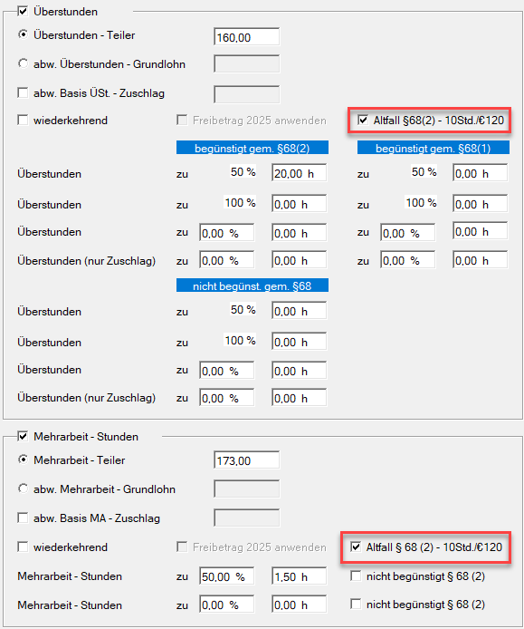
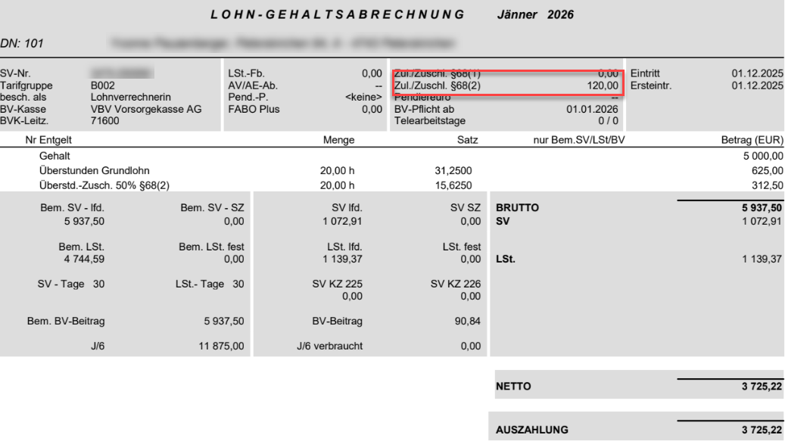
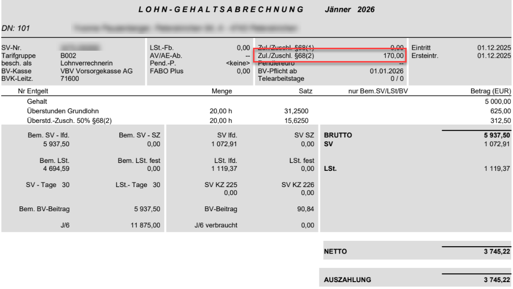

# Änderung der Steuerfreigrenze für Überstunden (§ 68 Abs. 2 EStG) ab 2026

Für das Kalenderjahr 2026 wurde die Steuerbegünstigung für Überstunden gemäß § 68 Abs. 2 EStG angepasst. Die neuen gesetzlichen Regelungen werden ab Programmversion **2.26.2.0** berücksichtigt.

## Neue gesetzliche Regelung

- Steuerfrei sind bis zu **15 Überstunde**n pro Monat
- Zuschlag maximal 50 % des Grundlohns
- Höchstbetrag: **EUR 170,00** pro Monat

## Verhalten in bestehenden Abrechnungen

Bis einschließlich Version 2.26.1.1 erfolgte die Berechnung noch nach der alten Regelung (max. 10 Überstunden / EUR 120,00).

Nach dem Update auf Version **2.26.2.0** erfolgt **keine** automatische Neuberechnung bereits bestehender Abrechnungen.

Abrechnungen, die noch nach der alten Regelung erstellt wurden, sind mit der Option *Altfall § 68(2) – 10 Std./€ 120* gekennzeichnet.

## Vorgehensweise nach dem Update 2.26.2.0

1. Aufrollung durchführen (in der Regel aus der Februar-Abrechnung).
2. Im Zuge der Aufrollung wird die Option *Altfall § 68(2) – 10 Std./€ 120* automatisch entfernt.
3. Das Programm berücksichtigt anschließend die neue Höchstgrenze von EUR 170,00.
4. Ergibt sich dadurch eine geringere Lohnsteuer, wird die Differenz automatisch dem Dienstnehmer gutgeschrieben.

**Beispiel**

- Grundlohn: EUR 5.000,00
- Überstundenteiler: 160
- 20 Überstunden mit 50 % Zuschlag
- Vor Update: Steuerfreier Betrag auf EUR 120,00 begrenzt

Im Zuge der Aufrollung wird die Option *Altfall § 68(2) – 10 Std./€ 120* automatisch entfernt und der Maximalbetrag von EUR 170,00 ausgeschöpft. Dadurch reduziert sich die Lohnsteuer, was zu einer höheren Aufrolldifferenz zugunsten des Dienstnehmers führt.

!!! warning "Hinweis"
    Alle neu angelegten Abrechnungen ab Version 2.26.2 werden automatisch korrekt nach der neuen Regelung erstellt. Die Altfall-Option wird nicht mehr gesetzt, unabhängig davon, ob es sich um eine Neuanlage oder eine laufende Abrechnung handelt.