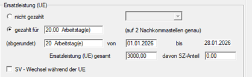
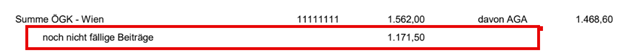
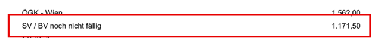
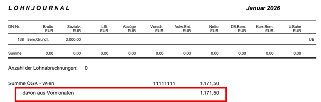
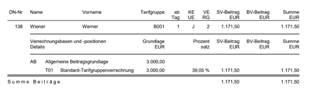
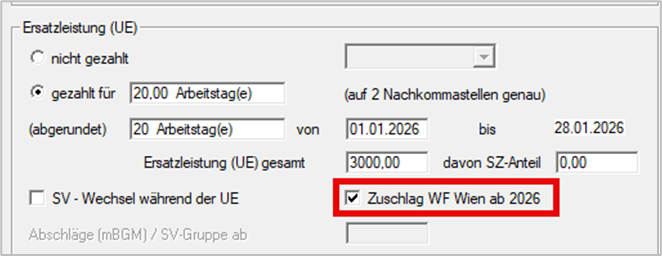
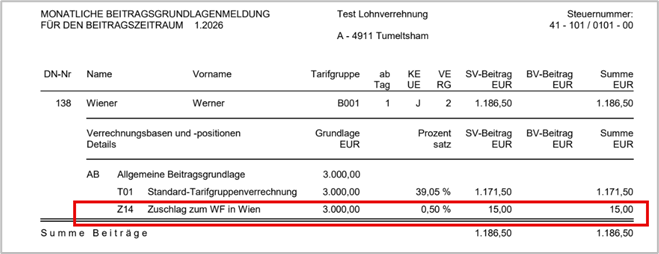

# Korrektur WF-Beitrag Wien - Austritte im Jahr 2025 mit UEL ins Folgejahr 2026

## Ausgangslage Version 2.26.1.0

Bei Austritten im Jahr 2025, bei denen eine Urlaubsersatzleistung (UEL) noch ins Folgejahr (Jänner 2026) wirkt, wurde der WF-Zuschlag Wien noch **nicht** berücksichtig.

**Beispiel**

- Austritt: 31.12.2025
- Laufende UEL: EUR 3.000,00
- Noch nicht fällige Beiträge im Jänner: EUR 1.171,50

Am Lohnjournal und am Buchungsbeleg wurde der Wert „noch nicht fällige Beiträge“ falsch gebildet, weil der Zuschlag (Z14) gefehlt hat.

*Lohnjournal Dezember 2025*

*Buchungsbeleg Dezember 2025*

Auch im Jänner 2026 wird die Urlaubsersatzleistung ohne Zuschlag WF-Beitrag Wien berechnet.

Der mBGM wird ohne Zuschlag Z14 WF-Beitrag Wien erstellt.

!!! warning "Hinweis"
    Ob der mBGM für Jänner 2026 storniert werden muss, hängt davon ab, ob dieser bereits an die ÖGK übermittelt wurde. Wenn Auswertungen oder Überweisungen bereits weitergegeben wurden, verändern sich diese durch die Korrektur ebenfalls.

## Vorgehensweise nach Update auf Version 2.26.2.0

### Korrektur im Klientenjahr 2025

Die fehlende Berücksichtigung des Zuschlags muss im Austrittsjahr nachgezogen werden.

1. Im Klientenjahr 2025 eine Aufrollung durchführen
2. Die Aufrollung erfolgt im Monat 13, und zwar in den Austrittsmonat (meistens Dezember).
3. Im Bereich *Ersatzleistung (UE)* die Option *Zuschlag WF Wien ab 2026* setzen

{width="400"}

Im 13. Monat entstehen dadurch höhere Abgaben und ein negativer Auszahlungsbetrag. Da der Dienstnehmer bereits ausgetreten ist, besteht meist keine Möglichkeit, diesen negativen Betrag vom Dienstnehmer rückzufordern.

### Korrektur im Klientenjahr 2026

Die Werte für Jänner 2026 müssen nach der Korrektur korrekt neu aufgebaut werden.

Wichtig vorab: Eine Aufrollung funktioniert hier **nicht**.

1. Dienstnehmer im Jahr 2026 komplett löschen (*Abrechnung /* [*Löschung Stammdaten*](../Abrechnungen/Loeschung_Stammdaten.md).
2. Dienstnehmer anschließend neu aus dem Jahr 2025 übernehmen. ([erneute Jahresübernahme](../Jahresübernahme/Erneute_Jahresuebernahme.md))

**Sonderfall: mBGM Jänner 2026 wurde bereits gesendet**

Falls der mBGM bereits übermittelt wurde:

1. Zuerst Storno mBGM durchführen
2. Dabei muss im Storno der gleiche ursprüngliche Betrag und die ursprüngliche Referenznummer aufscheinen.

Nach der erneuten Übernahme erscheinen am mBGM und in allen weiteren Auswertungen die durch den Zuschlag erhöhten Abgaben korrekt.

!!! warning "Hinweis"
    Wenn der Jänner bereits an den Kunden übergeben wurde, verändern sich die Auswertungen auch hier entsprechend. Eine erneute Weitergabe der Unterlagen ist nötig. Differenzen müssen gegebenenfalls nachgezahlt werden.

